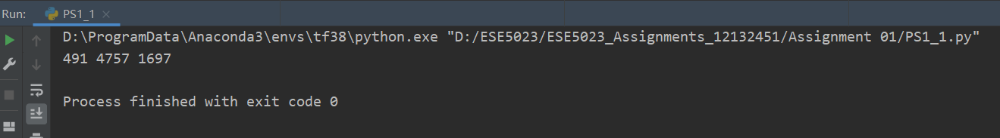
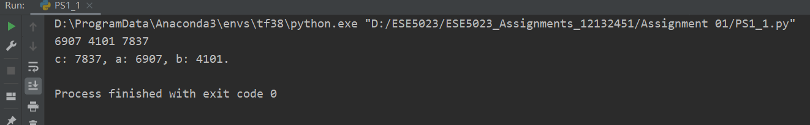
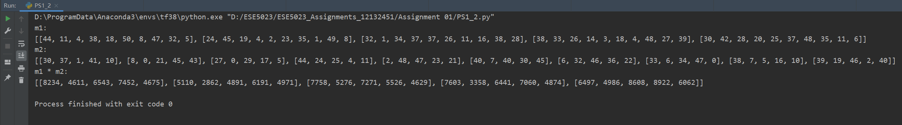
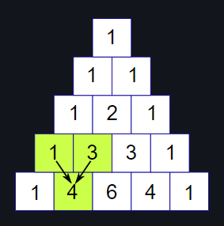
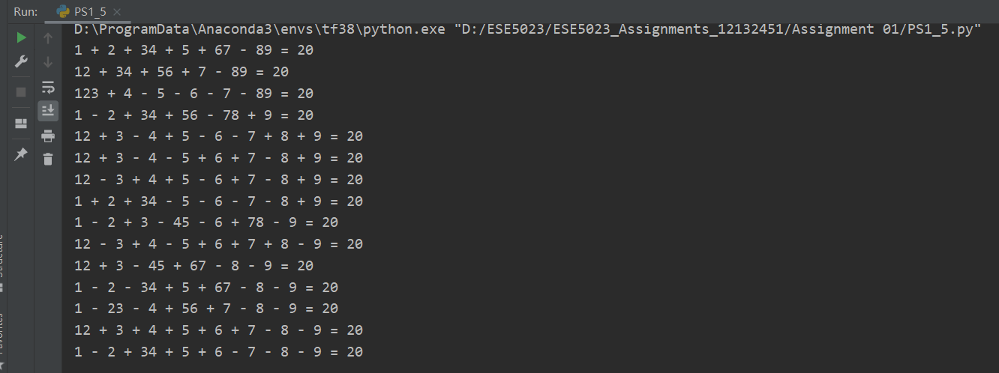
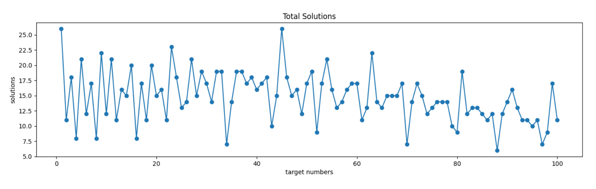

# ESE5023 Assignment 01 Report

李骏垚 12132451

---

## 1. Flowchart

依照Flowchart的流程编写的 Print_values() 函数代码如下：

```python
def Print_values(a, b, c):
    if a > b:
        if b > c:
            print('a: %s, b: %s, c: %s.' % (a, b, c))
        elif a > c:
            print('a: %s, c: %s, b: %s.' % (a, c, b))
        else:
            print('c: %s, a: %s, b: %s.' % (c, a, b))
    elif not b > c:
        print('c: %s, b: %s, a: %s.' % (c, b, a))
    return
```

测试：

```python
if __name__ == "__main__":
    a = random.randint(0, 10000)
    b = random.randint(0, 10000)
    c = random.randint(0, 10000)
    print(a, b, c)
    Print_values(a, b, c)
```

**输出结果1：**

<p style="text-align:center;"></p>

可以看到该次实验的 abc 大小关系是 b>c>a ，由于flowchart里没有对应的输出流程所以不输出结果

**输出结果2：**

<p style="text-align:center;"></p>

可以看到该次实验的 abc 大小关系是 c>a>b ，由于flowchart里有对应的输出流程所以输出了结果


## 2. Matrix multiplication

首先编写矩阵生成函数

参数 rows, cols 分别表示要生成矩阵的行数与列数

返回值 matrix 表示生成的随机数值的矩阵

```python
def matrix_gen(rows, cols):
    matrix = [[random.randint(0, 50) for i in range(cols)] for i in range(rows)]
    return matrix
```

接下来实现矩阵乘法函数

参数 m1, m2 分别表示进行乘法的两个矩阵，如果行列不匹配应该报错

返回值 res_m 表示矩阵乘法结果

```python
def Matrix_multip(m1, m2):
    if len(m1[0]) != len(m2):
        raise ValueError("Matrix_multip: cols of m1 must be equal to rows of m2!")
    res_m = matrix_gen(len(m1), len(m2[0]))
    for i in range(len(m1)):
        for j in range(len(m2[0])):
            res = 0
            for k in range(len(m2)):
                res += m1[i][k] * m2[k][j]
            res_m[i][j] = res

    return res_m
```

测试：

```python
if __name__ == "__main__":
    m1 = matrix_gen(5, 10)
    m2 = matrix_gen(10, 5)
    res = Matrix_multip(m1, m2)
    print('m1:')
    print(m1)
    print('m2:')
    print(m2)
    print('m1 * m2:')
    print(res)
```

**输出结果：**

<p style="text-align:center;"></p>


## 3. Pascal triangle

Pascal triangle 实例：

<p style="text-align:center;"></p>

根据一定的数学知识可以得到第 k 行的 Pascal triangle 数值排列是


据此可以编程如下：

```python
import math


def combination(n, k):
    com = math.factorial(n) / (math.factorial(k) * math.factorial(n - k))
    return com


def Pascal_triangle(k):
    kthentry = []
    for i in range(k + 1):
        kthentry.append(int(combination(k, i)))
    print(kthentry)
```

测试：

```python
if __name__ == "__main__":
    Pascal_triangle(100)
    Pascal_triangle(200)
```

**输出结果：**

```python
[1, 100, 4950, 161700, 3921225, 75287520, 1192052400, 16007560800, 186087894300, 1902231808400, 17310309456440, 141629804643600, 1050421051106700, 7110542499799200, 44186942677323600, 253338471349988640, 1345860629046814720, 6650134872937201664, 30664510802988208128, 132341572939212259328, 535983370403809656832, 2041841411062132113408, 7332066885177656213504, 24865270306254660567040, 79776075565900366872576, 242519269720337124687872, 699574816500972471189504, 1917353200780443069186048, 4998813702034726544474112, 12410847811948286148870144, 29372339821610946892136448, 66324638306863419876179968, 143012501349174252866109440, 294692427022540895105843200, 580717429720889435197800448, 1095067153187962938871250944, 1977204582144932965722882048, 3420029547493938162305073152, 5670048986634687416247517184, 9013924030034630826029744128, 13746234145802810415403499520, 20116440213369968070607503360, 28258808871162573880278646784, 38116532895986725922963193856, 49378235797073715126587097088, 61448471214136181560759549952, 73470998190815001604406640640, 84413487283064040653534003200, 93206558875049879687625965568, 98913082887808039177110421504, 100891344545564202071714955264, 98913082887808039177110421504, 93206558875049879687625965568, 84413487283064040653534003200, 73470998190815001604406640640, 61448471214136181560759549952, 49378235797073715126587097088, 38116532895986725922963193856, 28258808871162573880278646784, 20116440213369968070607503360, 13746234145802810415403499520, 9013924030034630826029744128, 5670048986634687416247517184, 3420029547493938162305073152, 1977204582144932965722882048, 1095067153187962938871250944, 580717429720889435197800448, 294692427022540895105843200, 143012501349174252866109440, 66324638306863419876179968, 29372339821610946892136448, 12410847811948286148870144, 4998813702034726544474112, 1917353200780443069186048, 699574816500972471189504, 242519269720337124687872, 79776075565900366872576, 24865270306254660567040, 7332066885177656213504, 2041841411062132113408, 535983370403809656832, 132341572939212259328, 30664510802988208128, 6650134872937201664, 1345860629046814720, 253338471349988640, 44186942677323600, 7110542499799200, 1050421051106700, 141629804643600, 17310309456440, 1902231808400, 186087894300, 16007560800, 1192052400, 75287520, 3921225, 161700, 4950, 100, 1]
[1, 200, 19900, 1313400, 64684950, 2535650040, 82408626300, 2283896214600, 55098996177225, 1175445251780800, 22451004309013280, 387790074428411200, 6107693672247476224, 88326646952501968896, 1179791641436990603264, 14629416353818682064896, 169152626591028530380800, 1830828428985249944305664, 18613422361350041145180160, 178296993145563555639066624, 1613587787967350053120507904, 13830752468291571569743888384, 112532031446554153397992292352, 870900069455940880644377149440, 6422888012237563766053862899712, 45217131606152444949851522727936, 304346078118333797689320930279424, 1961341392318151060600519286325248, 12118287888251433513707365396905984, 71873983337215397498764782787887104, 409681705022127806325796224051970048, 2246641608185862016148155735769874432, 11865075993231584593662558759609696256, 60404023238269880911039860167426441216, 296690349435031465830776489456493920256, 1407159943034720642764925607563440947200, 6449483072242469788974257728465858985984, 28586897941831487582596621324591464185856, 122622746434698229668942625151349394767872, 509356023651823394717193704961225552560128, 2050157995198589208225174824287286478241792, 8000616566628640148325539209941458261901312, 30288048430808423241812392825438338434465792, 111290968652737932097215922473561480365080576, 397106410874542160499189341555090246361677824, 1376635557698412833627611385959557866526343168, 4638663292244651991067926961992643415606558720, 15199024404376094890761403441117062741807333376, 48446890288948804365777873810904739734565683200, 150284231100412596514190755775965894251921801216, 453858377923246020784798286718713168214607527936, 1334877582127194369672085348247230955428857774080, 3824937687249075759628017280835770793827393077248, 10680958070054022998402219447777898361312728055808, 29075941412924842620111633699223952267537234788352, 77183408114309581095067931230341190703536005971968, 199849896010265882773623986046135928965171358203904, 504883947815408489112431829208967255578157300842496, 1244800078234541712811491111260397434817115110506496, 2995959510327202110990842942099869638098939084275712, 7040504849268925027289880703180487294722859862065152, 16158535719633598031057038923225942770371693371195392, 36226394597243066939403747329949867054035362316812288, 79353054832056242373637921117000993700765864229339136, 169865132999870393332608176471736799801774280510799872, 355410124430498066175466668267462392285476843075665920, 726975254516927818162917962469896599802020980548698112, 1453950509033855636325835924939793199604041961097396224, 2843756142669158765564284196281450429145650041064521728, 5440229142497521264680529297642106674615420701066133504, 10181000252388218007032202654880995401212845169840226304, 18641268067753077447960628119013752805119545358023655424, 33398938621390929520176480257397071206840232281743818752, 58562522514219709947069713594060184697037337022343151616, 100505950801431127065359999172788131550533316673005420544, 168849997346404296083173376563091460403612957086628970496, 277713811425007063347289851630603652572997970462238572544, 447227436580530859785884225055010902669446056460366643200, 705243265376990897490421643405000799373903817659864055808, 1089109852860669460799197191559040227906869337895183843328, 1647278652451762594303700124937147003358699674579530416128, 2440412818447055875942074710224433049825420708333714669568, 3541574699941459349506878986204351978707377619490786246656, 5035009814374604556065944241267018063370933763500073287680, 7013049384307484320036175946837369582845632581793990311936, 9570749747996096888026621544135632695334196106688047611904, 12798095593250593687226400095088337591377984160433107369984, 16769918363569744317342812136562340093105050166409130147840, 21534099716856603593437695691824183052235966148265537175552, 27099091778516175245953209189344412544567400454423031316480, 33422213193503281874144574728082144574311532533440009207808, 40400477486652320648205258337377640110726210897837392134144, 47865783109185899516552746430774024822082848936859919187968, 55586070707441687243331957311312383813547374434119090962432, 63273506018045335635323680483550829871539898616502034628608, 70599911978029524646523353471008676796889750062666168139776, 77218653725969790491440055496669820727624576070257230217216, 82791133891761431179177925064389667504177406279759725330432, 87015171335218648534797653796746797682780016520710219366400, 89651994709013148305391025435606943347408868277745967169536, 90548514656103280680474743631187938442311687866457887080448, 89651994709013148305391025435606943347408868277745967169536, 87015171335218648534797653796746797682780016520710219366400, 82791133891761431179177925064389667504177406279759725330432, 77218653725969790491440055496669820727624576070257230217216, 70599911978029524646523353471008676796889750062666168139776, 63273506018045335635323680483550829871539898616502034628608, 55586070707441687243331957311312383813547374434119090962432, 47865783109185899516552746430774024822082848936859919187968, 40400477486652320648205258337377640110726210897837392134144, 33422213193503281874144574728082144574311532533440009207808, 27099091778516175245953209189344412544567400454423031316480, 21534099716856603593437695691824183052235966148265537175552, 16769918363569744317342812136562340093105050166409130147840, 12798095593250593687226400095088337591377984160433107369984, 9570749747996096888026621544135632695334196106688047611904, 7013049384307484320036175946837369582845632581793990311936, 5035009814374604556065944241267018063370933763500073287680, 3541574699941459349506878986204351978707377619490786246656, 2440412818447055875942074710224433049825420708333714669568, 1647278652451762594303700124937147003358699674579530416128, 1089109852860669460799197191559040227906869337895183843328, 705243265376990897490421643405000799373903817659864055808, 447227436580530859785884225055010902669446056460366643200, 277713811425007063347289851630603652572997970462238572544, 168849997346404296083173376563091460403612957086628970496, 100505950801431127065359999172788131550533316673005420544, 58562522514219709947069713594060184697037337022343151616, 33398938621390929520176480257397071206840232281743818752, 18641268067753077447960628119013752805119545358023655424, 10181000252388218007032202654880995401212845169840226304, 5440229142497521264680529297642106674615420701066133504, 2843756142669158765564284196281450429145650041064521728, 1453950509033855636325835924939793199604041961097396224, 726975254516927818162917962469896599802020980548698112, 355410124430498066175466668267462392285476843075665920, 169865132999870393332608176471736799801774280510799872, 79353054832056242373637921117000993700765864229339136, 36226394597243066939403747329949867054035362316812288, 16158535719633598031057038923225942770371693371195392, 7040504849268925027289880703180487294722859862065152, 2995959510327202110990842942099869638098939084275712, 1244800078234541712811491111260397434817115110506496, 504883947815408489112431829208967255578157300842496, 199849896010265882773623986046135928965171358203904, 77183408114309581095067931230341190703536005971968, 29075941412924842620111633699223952267537234788352, 10680958070054022998402219447777898361312728055808, 3824937687249075759628017280835770793827393077248, 1334877582127194369672085348247230955428857774080, 453858377923246020784798286718713168214607527936, 150284231100412596514190755775965894251921801216, 48446890288948804365777873810904739734565683200, 15199024404376094890761403441117062741807333376, 4638663292244651991067926961992643415606558720, 1376635557698412833627611385959557866526343168, 397106410874542160499189341555090246361677824, 111290968652737932097215922473561480365080576, 30288048430808423241812392825438338434465792, 8000616566628640148325539209941458261901312, 2050157995198589208225174824287286478241792, 509356023651823394717193704961225552560128, 122622746434698229668942625151349394767872, 28586897941831487582596621324591464185856, 6449483072242469788974257728465858985984, 1407159943034720642764925607563440947200, 296690349435031465830776489456493920256, 60404023238269880911039860167426441216, 11865075993231584593662558759609696256, 2246641608185862016148155735769874432, 409681705022127806325796224051970048, 71873983337215397498764782787887104, 12118287888251433513707365396905984, 1961341392318151060600519286325248, 304346078118333797689320930279424, 45217131606152444949851522727936, 6422888012237563766053862899712, 870900069455940880644377149440, 112532031446554153397992292352, 13830752468291571569743888384, 1613587787967350053120507904, 178296993145563555639066624, 18613422361350041145180160, 1830828428985249944305664, 169152626591028530380800, 14629416353818682064896, 1179791641436990603264, 88326646952501968896, 6107693672247476224, 387790074428411200, 22451004309013280, 1175445251780800, 55098996177225, 2283896214600, 82408626300, 2535650040, 64684950, 1313400, 19900, 200, 1]
```


## 4. Add or double

本题的解决思路是将目标数字不断对 2 取模，每取一次模或者取模结果不为0，则步骤计数 +1，直到目标数字小于等于 1 为止

由此编写代码如下：

```python
import math


def Least_moves(x):
    cnt = 0
    while x > 1:
        cnt += x % 2
        x = math.floor(x / 2)
        cnt += 1
    return cnt
```

测试：

```python
if __name__ == "__main__":
    print(Least_moves(10))
    print(Least_moves(50))
    print(Least_moves(99))
```

**输出结果：**

```python
4
7
9
```

验证如下：

1 -> 2 -> 4 -> 5 -> 10

1 -> 2 -> 3 -> 6 -> 12 -> 24 -> 25 -> 50

1 -> 2 -> 3 -> 6 -> 12 -> 24 -> 48 -> 49 -> 98 -> 99


## 5. Dynamic programming

本题使用穷举的方法，在数字 123456789 之间可以插入 3 种操作符：连接、+、-，故总共有


种可能

由此编写代码如下：

```python
import copy
import math


def del_specified_value(list, value):
    list_res = copy.deepcopy(list)
    j = 0
    for i in range(len(list_res)):
        if list_res[j] == value:
            list_res.pop(j)
        else:
            j += 1
    return list_res


def segment(ops):
    numbers = [1, 2, 3, 4, 5, 6, 7, 8, 9]
    op_nums = []  # oprate numbers indeed
    i = 0
    flag = 0
    temp = 0
    while i < len(ops):
        if flag == 0:
            temp = numbers[i]
        if ops[i] == 0:
            flag = 1
            temp = temp * 10 + numbers[i + 1]
            if i == len(ops) - 1:
                op_nums.append(temp)
        else:
            flag = 0
            op_nums.append(temp)
            if i == len(ops) - 1:
                op_nums.append(numbers[i + 1])
        i += 1
    return op_nums


def compute(ops):
    op_nums = segment(ops)

    ops_cur = del_specified_value(ops, 0)

    res = op_nums[0]
    for index, op in enumerate(ops_cur):
        if op == 1:
            res += op_nums[index + 1]
        elif op == 2:
            res -= op_nums[index + 1]
    return res


def print_expression(ops, res):
    op_nums = segment(ops)
    ops_cur = del_specified_value(ops, 0)
    print(op_nums[0], end='')
    for index, op in enumerate(ops_cur):
        if op == 1:
            print(' + ', end='')
        elif op == 2:
            print(' - ', end='')
        print(op_nums[index + 1], end='')
    print(' = %s' % res)


def Find_expression(value):
    # ops represents each operator
    ops = [0, 0, 0, 0, 0, 0, 0, 0]
    cnt = 0
    loop = True
    while loop:
        res = compute(ops)
        if res == value:
            print_expression(ops, res)
            cnt += 1
        for i in range(len(ops)):
            if ops[i] != 2:
                ops[i] += 1
                break
            else:
                ops[i] = 0
                if i == len(ops) - 1:
                    loop = False
    return cnt
```

测试：

```python
if __name__ == "__main__":
    Find_expression(20)
```

**输出结果：**

<p style="text-align:center;"></p>

统计目标结果1-100的数据，使用如下代码：

```python
if __name__ == "__main__":
    table = []
    for i in range(1, 101):
        cnt = Find_expression(i)
        table.append(cnt)
    max_temp = 0
    min_temp = math.inf
    max = []
    min = []
    for index, t in enumerate(table):
        if t > max_temp:
            max_temp = t
            max.clear()
            max.append(index + 1)
        elif t == max_temp:
            max.append(index + 1)
        if t < min_temp:
            min_temp = t
            min.clear()
            min.append(index + 1)
        elif t == min_temp:
            min.append(index + 1)
    print('Total_solutions: %s' % table)
    print('max solutions: %s' % max)
    print('max solutions count: %s' % table[max[0]-1])
    print('min solutions: %s' % min)
    print('min solutions count: %s' % table[min[0] - 1])
```

**输出结果：**

```python
Total_solutions: [26, 11, 18, 8, 21, 12, 17, 8, 22, 12, 21, 11, 16, 15, 20, 8, 17, 11, 20, 15, 16, 11, 23, 18, 13, 14, 21, 15, 19, 17, 14, 19, 19, 7, 14, 19, 19, 17, 18, 16, 17, 18, 10, 15, 26, 18, 15, 16, 12, 17, 19, 9, 17, 21, 16, 13, 14, 16, 17, 17, 11, 13, 22, 14, 13, 15, 15, 15, 17, 7, 14, 17, 15, 12, 13, 14, 14, 14, 10, 9, 19, 12, 13, 13, 12, 11, 12, 6, 12, 14, 16, 13, 11, 11, 10, 11, 7, 9, 17, 11]
max solutions: [1, 45]
max solutions count: 26
min solutions: [88]
min solutions count: 6
```

可以得到 solutions 最多的数字是 1 和 45，共有 26 solutions

solutions 最少的数字是 88，共有 6 solutions

将 Total_solutions 绘制成折线图

[matplotlib 参考链接](https://matplotlib.org/stable/gallery/subplots_axes_and_figures/subplot.html#sphx-glr-gallery-subplots-axes-and-figures-subplot-py)

[numpy.linspace() 参考链接](https://numpy.org/doc/stable/reference/generated/numpy.linspace.html)

```python
def plotTotalSolutions(total_solutions):
    x = np.linspace(1, 100, num=100, dtype=int)
    print(x)
    y = total_solutions
    print(y)
    plt.subplot(2, 1, 1)
    plt.title('Total Solutions')
    plt.plot(x, y, 'o-')
    plt.xlabel('target numbers')
    plt.ylabel('solutions')
    plt.show()
```

<p style="text-align:center;"></p>

1-100 所有的 solutions 如下表所示：

<table>
<tr align="center">
  <th>目标数字</th>
  <td>Solutions</td>
</tr>
<tr align="center">
<th rowspan="27">1</th>
</tr>
<tr align="center">
<td>1 + 23 - 45 - 67 + 89 = 1</td>
</tr>
<tr align="center">
<td>1 - 23 - 4 + 5 - 67 + 89 = 1</td>
</tr>
<tr align="center">
<td>1 - 23 + 45 + 67 - 89 = 1</td>
</tr>
<tr align="center">
<td>1 + 23 + 4 - 5 + 67 - 89 = 1</td>
</tr>
<tr align="center">
<td>1 + 2 + 3 + 45 - 67 + 8 + 9 = 1</td>
</tr>
<tr align="center">
<td>12 + 34 + 5 - 67 + 8 + 9 = 1</td>
</tr>
<tr align="center">
<td>1 - 2 + 34 - 56 + 7 + 8 + 9 = 1</td>
</tr>
<tr align="center">
<td>12 - 34 + 5 - 6 + 7 + 8 + 9 = 1</td>
</tr>
<tr align="center">
<td>1 - 2 - 3 - 4 + 5 - 6 - 7 + 8 + 9 = 1</td>
</tr>
<tr align="center">
<td>1 + 2 + 3 - 4 - 5 - 6 - 7 + 8 + 9 = 1</td>
</tr>
<tr align="center">
<td>1 - 23 - 45 + 67 - 8 + 9 = 1</td>
</tr>
<tr align="center">
<td>1 - 23 + 4 + 5 + 6 + 7 - 8 + 9 = 1</td>
</tr>
<tr align="center">
<td>1 - 2 - 3 - 4 - 5 + 6 + 7 - 8 + 9 = 1</td>
</tr>
<tr align="center">
<td>1 + 2 - 3 + 4 - 5 - 6 + 7 - 8 + 9 = 1</td>
</tr>
<tr align="center">
<td>1 + 2 - 3 - 4 + 5 + 6 - 7 - 8 + 9 = 1</td>
</tr>
<tr align="center">
<td>1 - 2 + 3 + 4 - 5 + 6 - 7 - 8 + 9 = 1</td>
</tr>
<tr align="center">
<td>1 + 23 + 45 - 67 + 8 - 9 = 1</td>
</tr>
<tr align="center">
<td>1 + 2 - 3 - 4 + 5 - 6 + 7 + 8 - 9 = 1</td>
</tr>
<tr align="center">
<td>1 - 2 + 3 + 4 - 5 - 6 + 7 + 8 - 9 = 1</td>
</tr>
<tr align="center">
<td>1 - 2 + 3 - 4 + 5 + 6 - 7 + 8 - 9 = 1</td>
</tr>
<tr align="center">
<td>1 + 2 + 3 + 4 + 5 - 6 - 7 + 8 - 9 = 1</td>
</tr>
<tr align="center">
<td>1 + 23 - 4 - 5 - 6 - 7 + 8 - 9 = 1</td>
</tr>
<tr align="center">
<td>1 - 2 - 3 - 45 + 67 - 8 - 9 = 1</td>
</tr>
<tr align="center">
<td>1 - 2 - 3 + 4 + 5 + 6 + 7 - 8 - 9 = 1</td>
</tr>
<tr align="center">
<td>1 + 2 + 3 + 4 - 5 + 6 + 7 - 8 - 9 = 1</td>
</tr>
<tr align="center">
<td>1 + 2 - 34 + 56 - 7 - 8 - 9 = 1</td>
</tr>
<tr align="center">
<th rowspan="12">2</th>
</tr>
<tr align="center">
<td>12 + 3 + 4 + 5 + 67 - 89 = 2</td>
</tr>
<tr align="center">
<td>1 + 23 + 4 + 56 + 7 - 89 = 2</td>
</tr>
<tr align="center">
<td>123 - 45 + 6 + 7 - 89 = 2</td>
</tr>
<tr align="center">
<td>123 + 4 - 56 - 78 + 9 = 2</td>
</tr>
<tr align="center">
<td>12 - 3 - 4 - 5 - 6 + 7 - 8 + 9 = 2</td>
</tr>
<tr align="center">
<td>12 + 3 + 4 - 5 - 6 - 7 - 8 + 9 = 2</td>
</tr>
<tr align="center">
<td>1 - 2 + 34 + 56 - 78 - 9 = 2</td>
</tr>
<tr align="center">
<td>12 + 3 - 4 + 5 - 6 - 7 + 8 - 9 = 2</td>
</tr>
<tr align="center">
<td>12 + 3 - 4 - 5 + 6 + 7 - 8 - 9 = 2</td>
</tr>
<tr align="center">
<td>12 - 3 + 4 + 5 - 6 + 7 - 8 - 9 = 2</td>
</tr>
<tr align="center">
<td>1 + 2 + 34 - 5 - 6 - 7 - 8 - 9 = 2</td>
</tr>
<tr align="center">
<th rowspan="19">3</th>
</tr>
<tr align="center">
<td>1 + 23 - 4 + 5 + 67 - 89 = 3</td>
</tr>
<tr align="center">
<td>123 - 45 - 6 - 78 + 9 = 3</td>
</tr>
<tr align="center">
<td>12 - 34 - 5 + 6 + 7 + 8 + 9 = 3</td>
</tr>
<tr align="center">
<td>1 - 23 + 4 + 5 + 6 - 7 + 8 + 9 = 3</td>
</tr>
<tr align="center">
<td>1 - 2 - 3 - 4 - 5 + 6 - 7 + 8 + 9 = 3</td>
</tr>
<tr align="center">
<td>1 + 2 - 3 + 4 - 5 - 6 - 7 + 8 + 9 = 3</td>
</tr>
<tr align="center">
<td>1 + 23 + 45 - 67 - 8 + 9 = 3</td>
</tr>
<tr align="center">
<td>1 + 2 - 3 - 4 + 5 - 6 + 7 - 8 + 9 = 3</td>
</tr>
<tr align="center">
<td>1 - 2 + 3 + 4 - 5 - 6 + 7 - 8 + 9 = 3</td>
</tr>
<tr align="center">
<td>1 - 2 + 3 - 4 + 5 + 6 - 7 - 8 + 9 = 3</td>
</tr>
<tr align="center">
<td>1 + 2 + 3 + 4 + 5 - 6 - 7 - 8 + 9 = 3</td>
</tr>
<tr align="center">
<td>1 + 23 - 4 - 5 - 6 - 7 - 8 + 9 = 3</td>
</tr>
<tr align="center">
<td>1 + 2 - 3 - 4 - 5 + 6 + 7 + 8 - 9 = 3</td>
</tr>
<tr align="center">
<td>1 - 2 + 3 - 4 + 5 - 6 + 7 + 8 - 9 = 3</td>
</tr>
<tr align="center">
<td>1 - 2 - 3 + 4 + 5 + 6 - 7 + 8 - 9 = 3</td>
</tr>
<tr align="center">
<td>1 + 2 + 3 + 4 - 5 + 6 - 7 + 8 - 9 = 3</td>
</tr>
<tr align="center">
<td>1 + 2 + 3 - 4 + 5 + 6 + 7 - 8 - 9 = 3</td>
</tr>
<tr align="center">
<td>1 + 23 + 4 + 5 - 6 - 7 - 8 - 9 = 3</td>
</tr>
<tr align="center">
<th rowspan="9">4</th>
</tr>
<tr align="center">
<td>12 - 34 - 56 - 7 + 89 = 4</td>
</tr>
<tr align="center">
<td>12 - 3 + 45 - 67 + 8 + 9 = 4</td>
</tr>
<tr align="center">
<td>1 + 2 - 34 + 5 + 6 + 7 + 8 + 9 = 4</td>
</tr>
<tr align="center">
<td>12 - 3 - 4 - 5 - 6 - 7 + 8 + 9 = 4</td>
</tr>
<tr align="center">
<td>12 + 3 - 4 + 5 - 6 - 7 - 8 + 9 = 4</td>
</tr>
<tr align="center">
<td>12 + 3 - 4 - 5 + 6 - 7 + 8 - 9 = 4</td>
</tr>
<tr align="center">
<td>12 - 3 + 4 + 5 - 6 - 7 + 8 - 9 = 4</td>
</tr>
<tr align="center">
<td>12 - 3 + 4 - 5 + 6 + 7 - 8 - 9 = 4</td>
</tr>
<tr align="center">
<th rowspan="22">5</th>
</tr>
<tr align="center">
<td>12 - 34 + 5 - 67 + 89 = 5</td>
</tr>
<tr align="center">
<td>1 - 2 - 34 - 56 + 7 + 89 = 5</td>
</tr>
<tr align="center">
<td>1 - 23 - 4 - 56 + 78 + 9 = 5</td>
</tr>
<tr align="center">
<td>1 + 2 + 34 - 56 + 7 + 8 + 9 = 5</td>
</tr>
<tr align="center">
<td>1 - 23 + 4 + 5 - 6 + 7 + 8 + 9 = 5</td>
</tr>
<tr align="center">
<td>1 - 2 - 3 - 4 - 5 - 6 + 7 + 8 + 9 = 5</td>
</tr>
<tr align="center">
<td>1 + 2 - 3 - 4 + 5 - 6 - 7 + 8 + 9 = 5</td>
</tr>
<tr align="center">
<td>1 - 2 + 3 + 4 - 5 - 6 - 7 + 8 + 9 = 5</td>
</tr>
<tr align="center">
<td>1 + 2 - 3 - 4 - 5 + 6 + 7 - 8 + 9 = 5</td>
</tr>
<tr align="center">
<td>1 - 2 + 3 - 4 + 5 - 6 + 7 - 8 + 9 = 5</td>
</tr>
<tr align="center">
<td>1 - 2 - 3 + 4 + 5 + 6 - 7 - 8 + 9 = 5</td>
</tr>
<tr align="center">
<td>1 + 2 + 3 + 4 - 5 + 6 - 7 - 8 + 9 = 5</td>
</tr>
<tr align="center">
<td>1 - 2 - 3 - 4 - 56 + 78 - 9 = 5</td>
</tr>
<tr align="center">
<td>1 - 2 + 3 - 4 - 5 + 6 + 7 + 8 - 9 = 5</td>
</tr>
<tr align="center">
<td>1 - 2 - 3 + 4 + 5 - 6 + 7 + 8 - 9 = 5</td>
</tr>
<tr align="center">
<td>1 + 2 + 3 + 4 - 5 - 6 + 7 + 8 - 9 = 5</td>
</tr>
<tr align="center">
<td>1 + 2 + 3 - 4 + 5 + 6 - 7 + 8 - 9 = 5</td>
</tr>
<tr align="center">
<td>1 + 2 - 3 - 45 + 67 - 8 - 9 = 5</td>
</tr>
<tr align="center">
<td>1 + 2 - 3 + 4 + 5 + 6 + 7 - 8 - 9 = 5</td>
</tr>
<tr align="center">
<td>1 - 23 + 45 + 6 - 7 - 8 - 9 = 5</td>
</tr>
<tr align="center">
<td>1 + 23 + 4 - 5 + 6 - 7 - 8 - 9 = 5</td>
</tr>
<tr align="center">
<th rowspan="13">6</th>
</tr>
<tr align="center">
<td>1 - 2 + 34 - 5 + 67 - 89 = 6</td>
</tr>
<tr align="center">
<td>12 + 34 + 56 - 7 - 89 = 6</td>
</tr>
<tr align="center">
<td>12 + 3 + 4 + 56 - 78 + 9 = 6</td>
</tr>
<tr align="center">
<td>1 + 23 + 45 + 6 - 78 + 9 = 6</td>
</tr>
<tr align="center">
<td>12 + 3 - 4 - 5 + 6 - 7 - 8 + 9 = 6</td>
</tr>
<tr align="center">
<td>12 - 3 + 4 + 5 - 6 - 7 - 8 + 9 = 6</td>
</tr>
<tr align="center">
<td>1 + 2 + 34 + 56 - 78 - 9 = 6</td>
</tr>
<tr align="center">
<td>12 + 3 - 4 - 5 - 6 + 7 + 8 - 9 = 6</td>
</tr>
<tr align="center">
<td>12 - 3 + 4 - 5 + 6 - 7 + 8 - 9 = 6</td>
</tr>
<tr align="center">
<td>12 - 3 - 4 + 5 + 6 + 7 - 8 - 9 = 6</td>
</tr>
<tr align="center">
<td>1 - 23 - 4 + 56 - 7 - 8 - 9 = 6</td>
</tr>
<tr align="center">
<td>12 + 3 + 4 + 5 + 6 - 7 - 8 - 9 = 6</td>
</tr>
<tr align="center">
<th rowspan="18">7</th>
</tr>
<tr align="center">
<td>1 - 2 + 34 + 56 + 7 - 89 = 7</td>
</tr>
<tr align="center">
<td>1 + 23 - 4 + 56 - 78 + 9 = 7</td>
</tr>
<tr align="center">
<td>1 - 23 + 4 - 5 + 6 + 7 + 8 + 9 = 7</td>
</tr>
<tr align="center">
<td>1 + 2 - 3 - 4 - 5 + 6 - 7 + 8 + 9 = 7</td>
</tr>
<tr align="center">
<td>1 - 2 + 3 - 4 + 5 - 6 - 7 + 8 + 9 = 7</td>
</tr>
<tr align="center">
<td>1 - 2 + 3 - 4 - 5 + 6 + 7 - 8 + 9 = 7</td>
</tr>
<tr align="center">
<td>1 - 2 - 3 + 4 + 5 - 6 + 7 - 8 + 9 = 7</td>
</tr>
<tr align="center">
<td>1 + 2 + 3 + 4 - 5 - 6 + 7 - 8 + 9 = 7</td>
</tr>
<tr align="center">
<td>1 + 2 + 3 - 4 + 5 + 6 - 7 - 8 + 9 = 7</td>
</tr>
<tr align="center">
<td>1 - 2 - 3 + 4 - 5 + 6 + 7 + 8 - 9 = 7</td>
</tr>
<tr align="center">
<td>1 + 2 + 3 - 4 + 5 - 6 + 7 + 8 - 9 = 7</td>
</tr>
<tr align="center">
<td>1 + 2 - 3 + 4 + 5 + 6 - 7 + 8 - 9 = 7</td>
</tr>
<tr align="center">
<td>1 - 2 + 3 - 45 + 67 - 8 - 9 = 7</td>
</tr>
<tr align="center">
<td>1 - 2 + 3 + 4 + 5 + 6 + 7 - 8 - 9 = 7</td>
</tr>
<tr align="center">
<td>1 - 23 + 45 - 6 + 7 - 8 - 9 = 7</td>
</tr>
<tr align="center">
<td>1 + 23 + 4 - 5 - 6 + 7 - 8 - 9 = 7</td>
</tr>
<tr align="center">
<td>1 + 23 - 4 + 5 + 6 - 7 - 8 - 9 = 7</td>
</tr>
<tr align="center">
<th rowspan="9">8</th>
</tr>
<tr align="center">
<td>1 - 23 + 4 - 56 - 7 + 89 = 8</td>
</tr>
<tr align="center">
<td>12 + 3 - 4 - 5 - 6 + 7 - 8 + 9 = 8</td>
</tr>
<tr align="center">
<td>12 - 3 + 4 - 5 + 6 - 7 - 8 + 9 = 8</td>
</tr>
<tr align="center">
<td>1 - 23 - 45 + 6 + 78 - 9 = 8</td>
</tr>
<tr align="center">
<td>12 - 3 + 4 - 5 - 6 + 7 + 8 - 9 = 8</td>
</tr>
<tr align="center">
<td>12 - 3 - 4 + 5 + 6 - 7 + 8 - 9 = 8</td>
</tr>
<tr align="center">
<td>12 + 3 + 4 + 5 - 6 + 7 - 8 - 9 = 8</td>
</tr>
<tr align="center">
<td>1 - 2 + 34 + 5 - 6 - 7 - 8 - 9 = 8</td>
</tr>
<tr align="center">
<th rowspan="23">9</th>
</tr>
<tr align="center">
<td>1 - 23 + 4 + 5 - 67 + 89 = 9</td>
</tr>
<tr align="center">
<td>1 - 2 - 3 - 4 - 5 - 67 + 89 = 9</td>
</tr>
<tr align="center">
<td>1 + 2 - 34 - 56 + 7 + 89 = 9</td>
</tr>
<tr align="center">
<td>1 - 23 - 45 - 6 - 7 + 89 = 9</td>
</tr>
<tr align="center">
<td>12 - 34 - 56 + 78 + 9 = 9</td>
</tr>
<tr align="center">
<td>1 + 23 - 45 + 6 + 7 + 8 + 9 = 9</td>
</tr>
<tr align="center">
<td>1 - 23 - 4 + 5 + 6 + 7 + 8 + 9 = 9</td>
</tr>
<tr align="center">
<td>1 + 2 - 3 - 4 - 5 - 6 + 7 + 8 + 9 = 9</td>
</tr>
<tr align="center">
<td>1 - 2 + 3 - 4 - 5 + 6 - 7 + 8 + 9 = 9</td>
</tr>
<tr align="center">
<td>1 - 2 - 3 + 4 + 5 - 6 - 7 + 8 + 9 = 9</td>
</tr>
<tr align="center">
<td>1 + 2 + 3 + 4 - 5 - 6 - 7 + 8 + 9 = 9</td>
</tr>
<tr align="center">
<td>1 - 2 - 3 + 4 - 5 + 6 + 7 - 8 + 9 = 9</td>
</tr>
<tr align="center">
<td>1 + 2 + 3 - 4 + 5 - 6 + 7 - 8 + 9 = 9</td>
</tr>
<tr align="center">
<td>1 + 2 - 3 + 4 + 5 + 6 - 7 - 8 + 9 = 9</td>
</tr>
<tr align="center">
<td>1 + 2 - 3 - 4 - 56 + 78 - 9 = 9</td>
</tr>
<tr align="center">
<td>1 - 2 - 3 - 4 + 5 + 6 + 7 + 8 - 9 = 9</td>
</tr>
<tr align="center">
<td>1 + 2 + 3 - 4 - 5 + 6 + 7 + 8 - 9 = 9</td>
</tr>
<tr align="center">
<td>1 + 2 - 3 + 4 + 5 - 6 + 7 + 8 - 9 = 9</td>
</tr>
<tr align="center">
<td>1 - 2 + 3 + 4 + 5 + 6 - 7 + 8 - 9 = 9</td>
</tr>
<tr align="center">
<td>1 - 23 + 45 - 6 - 7 + 8 - 9 = 9</td>
</tr>
<tr align="center">
<td>1 + 23 + 4 - 5 - 6 - 7 + 8 - 9 = 9</td>
</tr>
<tr align="center">
<td>1 + 23 - 4 + 5 - 6 + 7 - 8 - 9 = 9</td>
</tr>
<tr align="center">
<th rowspan="13">10</th>
</tr>
<tr align="center">
<td>1 + 2 + 34 - 5 + 67 - 89 = 10</td>
</tr>
<tr align="center">
<td>12 + 3 + 45 - 67 + 8 + 9 = 10</td>
</tr>
<tr align="center">
<td>12 + 3 - 4 - 5 - 6 - 7 + 8 + 9 = 10</td>
</tr>
<tr align="center">
<td>12 - 3 + 4 - 5 - 6 + 7 - 8 + 9 = 10</td>
</tr>
<tr align="center">
<td>12 - 3 - 4 + 5 + 6 - 7 - 8 + 9 = 10</td>
</tr>
<tr align="center">
<td>123 - 45 - 67 + 8 - 9 = 10</td>
</tr>
<tr align="center">
<td>12 - 3 - 4 + 5 - 6 + 7 + 8 - 9 = 10</td>
</tr>
<tr align="center">
<td>12 + 3 + 4 + 5 - 6 - 7 + 8 - 9 = 10</td>
</tr>
<tr align="center">
<td>1 - 2 - 34 - 5 + 67 - 8 - 9 = 10</td>
</tr>
<tr align="center">
<td>12 + 3 + 4 - 5 + 6 + 7 - 8 - 9 = 10</td>
</tr>
<tr align="center">
<td>12 - 34 + 56 - 7 - 8 - 9 = 10</td>
</tr>
<tr align="center">
<td>1 - 2 + 34 - 5 + 6 - 7 - 8 - 9 = 10</td>
</tr>
<tr align="center">
<th rowspan="22">11</th>
</tr>
<tr align="center">
<td>1 + 23 + 4 + 5 + 67 - 89 = 11</td>
</tr>
<tr align="center">
<td>1 + 2 + 34 + 56 + 7 - 89 = 11</td>
</tr>
<tr align="center">
<td>1 - 2 + 3 - 4 - 5 - 6 + 7 + 8 + 9 = 11</td>
</tr>
<tr align="center">
<td>1 - 2 - 3 + 4 - 5 + 6 - 7 + 8 + 9 = 11</td>
</tr>
<tr align="center">
<td>1 + 2 + 3 - 4 + 5 - 6 - 7 + 8 + 9 = 11</td>
</tr>
<tr align="center">
<td>1 - 2 - 3 - 4 + 5 + 6 + 7 - 8 + 9 = 11</td>
</tr>
<tr align="center">
<td>1 + 2 + 3 - 4 - 5 + 6 + 7 - 8 + 9 = 11</td>
</tr>
<tr align="center">
<td>1 + 2 - 3 + 4 + 5 - 6 + 7 - 8 + 9 = 11</td>
</tr>
<tr align="center">
<td>1 - 2 + 3 + 4 + 5 + 6 - 7 - 8 + 9 = 11</td>
</tr>
<tr align="center">
<td>1 - 23 + 45 - 6 - 7 - 8 + 9 = 11</td>
</tr>
<tr align="center">
<td>1 + 23 + 4 - 5 - 6 - 7 - 8 + 9 = 11</td>
</tr>
<tr align="center">
<td>1 - 2 + 3 - 4 - 56 + 78 - 9 = 11</td>
</tr>
<tr align="center">
<td>1 + 2 - 3 + 4 - 5 + 6 + 7 + 8 - 9 = 11</td>
</tr>
<tr align="center">
<td>1 - 2 + 3 + 4 + 5 - 6 + 7 + 8 - 9 = 11</td>
</tr>
<tr align="center">
<td>1 + 23 - 4 + 5 - 6 - 7 + 8 - 9 = 11</td>
</tr>
<tr align="center">
<td>1 + 2 + 3 - 45 + 67 - 8 - 9 = 11</td>
</tr>
<tr align="center">
<td>1 - 2 - 34 + 56 + 7 - 8 - 9 = 11</td>
</tr>
<tr align="center">
<td>1 + 2 + 3 + 4 + 5 + 6 + 7 - 8 - 9 = 11</td>
</tr>
<tr align="center">
<td>1 + 23 - 4 - 5 + 6 + 7 - 8 - 9 = 11</td>
</tr>
<tr align="center">
<td>1 - 2 - 3 + 45 - 6 - 7 - 8 - 9 = 11</td>
</tr>
<tr align="center">
<td>12 + 34 - 5 - 6 - 7 - 8 - 9 = 11</td>
</tr>
<tr align="center">
<th rowspan="12">12</th>
</tr>
<tr align="center">
<td>123 + 45 - 67 - 89 = 12</td>
</tr>
<tr align="center">
<td>123 - 4 - 5 - 6 - 7 - 89 = 12</td>
</tr>
<tr align="center">
<td>12 - 3 + 4 - 5 - 6 - 7 + 8 + 9 = 12</td>
</tr>
<tr align="center">
<td>123 - 45 - 67 - 8 + 9 = 12</td>
</tr>
<tr align="center">
<td>12 - 3 - 4 + 5 - 6 + 7 - 8 + 9 = 12</td>
</tr>
<tr align="center">
<td>12 + 3 + 4 + 5 - 6 - 7 - 8 + 9 = 12</td>
</tr>
<tr align="center">
<td>12 - 3 - 4 - 5 + 6 + 7 + 8 - 9 = 12</td>
</tr>
<tr align="center">
<td>12 + 3 + 4 - 5 + 6 - 7 + 8 - 9 = 12</td>
</tr>
<tr align="center">
<td>12 + 3 - 4 + 5 + 6 + 7 - 8 - 9 = 12</td>
</tr>
<tr align="center">
<td>1 - 2 + 34 - 5 - 6 + 7 - 8 - 9 = 12</td>
</tr>
<tr align="center">
<td>1 + 2 + 34 + 5 - 6 - 7 - 8 - 9 = 12</td>
</tr>
<tr align="center">
<th rowspan="17">13</th>
</tr>
<tr align="center">
<td>1 + 2 - 3 - 4 - 5 - 67 + 89 = 13</td>
</tr>
<tr align="center">
<td>1 - 23 + 4 - 56 + 78 + 9 = 13</td>
</tr>
<tr align="center">
<td>12 - 34 + 5 + 6 + 7 + 8 + 9 = 13</td>
</tr>
<tr align="center">
<td>1 - 2 - 3 + 4 - 5 - 6 + 7 + 8 + 9 = 13</td>
</tr>
<tr align="center">
<td>1 - 2 - 3 - 4 + 5 + 6 - 7 + 8 + 9 = 13</td>
</tr>
<tr align="center">
<td>1 + 2 + 3 - 4 - 5 + 6 - 7 + 8 + 9 = 13</td>
</tr>
<tr align="center">
<td>1 + 2 - 3 + 4 + 5 - 6 - 7 + 8 + 9 = 13</td>
</tr>
<tr align="center">
<td>1 + 2 - 3 + 4 - 5 + 6 + 7 - 8 + 9 = 13</td>
</tr>
<tr align="center">
<td>1 - 2 + 3 + 4 + 5 - 6 + 7 - 8 + 9 = 13</td>
</tr>
<tr align="center">
<td>1 + 23 - 4 + 5 - 6 - 7 - 8 + 9 = 13</td>
</tr>
<tr align="center">
<td>1 - 2 - 3 + 4 - 56 + 78 - 9 = 13</td>
</tr>
<tr align="center">
<td>1 + 2 - 3 - 4 + 5 + 6 + 7 + 8 - 9 = 13</td>
</tr>
<tr align="center">
<td>1 - 2 + 3 + 4 - 5 + 6 + 7 + 8 - 9 = 13</td>
</tr>
<tr align="center">
<td>1 - 2 - 34 + 56 - 7 + 8 - 9 = 13</td>
</tr>
<tr align="center">
<td>1 + 2 + 3 + 4 + 5 + 6 - 7 + 8 - 9 = 13</td>
</tr>
<tr align="center">
<td>1 + 23 - 4 - 5 + 6 - 7 + 8 - 9 = 13</td>
</tr>
<tr align="center">
<th rowspan="16">14</th>
</tr>
<tr align="center">
<td>1 - 23 - 4 - 56 + 7 + 89 = 14</td>
</tr>
<tr align="center">
<td>1 - 23 - 45 - 6 + 78 + 9 = 14</td>
</tr>
<tr align="center">
<td>12 + 34 - 56 + 7 + 8 + 9 = 14</td>
</tr>
<tr align="center">
<td>12 - 3 - 4 + 5 - 6 - 7 + 8 + 9 = 14</td>
</tr>
<tr align="center">
<td>12 - 3 - 4 - 5 + 6 + 7 - 8 + 9 = 14</td>
</tr>
<tr align="center">
<td>12 + 3 + 4 - 5 + 6 - 7 - 8 + 9 = 14</td>
</tr>
<tr align="center">
<td>1 - 2 - 3 - 45 - 6 + 78 - 9 = 14</td>
</tr>
<tr align="center">
<td>12 + 3 + 4 - 5 - 6 + 7 + 8 - 9 = 14</td>
</tr>
<tr align="center">
<td>12 + 3 - 4 + 5 + 6 - 7 + 8 - 9 = 14</td>
</tr>
<tr align="center">
<td>1 - 2 + 34 - 5 - 6 - 7 + 8 - 9 = 14</td>
</tr>
<tr align="center">
<td>12 - 3 - 45 + 67 - 8 - 9 = 14</td>
</tr>
<tr align="center">
<td>1 + 2 - 34 - 5 + 67 - 8 - 9 = 14</td>
</tr>
<tr align="center">
<td>12 - 3 + 4 + 5 + 6 + 7 - 8 - 9 = 14</td>
</tr>
<tr align="center">
<td>1 - 23 + 4 + 56 - 7 - 8 - 9 = 14</td>
</tr>
<tr align="center">
<td>1 + 2 + 34 - 5 + 6 - 7 - 8 - 9 = 14</td>
</tr>
<tr align="center">
<th rowspan="21">15</th>
</tr>
<tr align="center">
<td>1 - 2 + 3 - 4 - 5 - 67 + 89 = 15</td>
</tr>
<tr align="center">
<td>1 + 23 + 4 + 56 - 78 + 9 = 15</td>
</tr>
<tr align="center">
<td>123 - 45 + 6 - 78 + 9 = 15</td>
</tr>
<tr align="center">
<td>1 - 2 - 3 - 4 + 5 - 6 + 7 + 8 + 9 = 15</td>
</tr>
<tr align="center">
<td>1 + 2 + 3 - 4 - 5 - 6 + 7 + 8 + 9 = 15</td>
</tr>
<tr align="center">
<td>1 + 2 - 3 + 4 - 5 + 6 - 7 + 8 + 9 = 15</td>
</tr>
<tr align="center">
<td>1 - 2 + 3 + 4 + 5 - 6 - 7 + 8 + 9 = 15</td>
</tr>
<tr align="center">
<td>1 + 2 - 3 - 4 + 5 + 6 + 7 - 8 + 9 = 15</td>
</tr>
<tr align="center">
<td>1 - 2 + 3 + 4 - 5 + 6 + 7 - 8 + 9 = 15</td>
</tr>
<tr align="center">
<td>1 - 2 - 34 + 56 - 7 - 8 + 9 = 15</td>
</tr>
<tr align="center">
<td>1 + 2 + 3 + 4 + 5 + 6 - 7 - 8 + 9 = 15</td>
</tr>
<tr align="center">
<td>1 + 23 - 4 - 5 + 6 - 7 - 8 + 9 = 15</td>
</tr>
<tr align="center">
<td>1 + 2 + 3 - 4 - 56 + 78 - 9 = 15</td>
</tr>
<tr align="center">
<td>12 + 34 + 56 - 78 - 9 = 15</td>
</tr>
<tr align="center">
<td>1 - 2 + 3 - 4 + 5 + 6 + 7 + 8 - 9 = 15</td>
</tr>
<tr align="center">
<td>1 + 2 + 3 + 4 + 5 - 6 + 7 + 8 - 9 = 15</td>
</tr>
<tr align="center">
<td>1 + 23 - 4 - 5 - 6 + 7 + 8 - 9 = 15</td>
</tr>
<tr align="center">
<td>1 + 2 - 34 + 56 + 7 - 8 - 9 = 15</td>
</tr>
<tr align="center">
<td>1 + 23 + 4 + 5 + 6 - 7 - 8 - 9 = 15</td>
</tr>
<tr align="center">
<td>1 + 2 - 3 + 45 - 6 - 7 - 8 - 9 = 15</td>
</tr>
<tr align="center">
<th rowspan="9">16</th>
</tr>
<tr align="center">
<td>1 - 2 + 34 + 5 + 67 - 89 = 16</td>
</tr>
<tr align="center">
<td>12 - 3 - 4 - 5 + 6 - 7 + 8 + 9 = 16</td>
</tr>
<tr align="center">
<td>12 + 3 + 4 - 5 - 6 + 7 - 8 + 9 = 16</td>
</tr>
<tr align="center">
<td>12 + 3 - 4 + 5 + 6 - 7 - 8 + 9 = 16</td>
</tr>
<tr align="center">
<td>1 - 2 + 34 - 5 - 6 - 7 - 8 + 9 = 16</td>
</tr>
<tr align="center">
<td>12 + 3 - 4 + 5 - 6 + 7 + 8 - 9 = 16</td>
</tr>
<tr align="center">
<td>12 - 3 + 4 + 5 + 6 - 7 + 8 - 9 = 16</td>
</tr>
<tr align="center">
<td>1 + 2 + 34 - 5 - 6 + 7 - 8 - 9 = 16</td>
</tr>
<tr align="center">
<th rowspan="18">17</th>
</tr>
<tr align="center">
<td>1 - 2 - 3 + 4 - 5 - 67 + 89 = 17</td>
</tr>
<tr align="center">
<td>1 - 23 - 45 + 67 + 8 + 9 = 17</td>
</tr>
<tr align="center">
<td>1 - 23 + 4 + 5 + 6 + 7 + 8 + 9 = 17</td>
</tr>
<tr align="center">
<td>1 - 2 - 3 - 4 - 5 + 6 + 7 + 8 + 9 = 17</td>
</tr>
<tr align="center">
<td>1 + 2 - 3 + 4 - 5 - 6 + 7 + 8 + 9 = 17</td>
</tr>
<tr align="center">
<td>1 + 2 - 3 - 4 + 5 + 6 - 7 + 8 + 9 = 17</td>
</tr>
<tr align="center">
<td>1 - 2 + 3 + 4 - 5 + 6 - 7 + 8 + 9 = 17</td>
</tr>
<tr align="center">
<td>1 - 2 + 3 - 4 + 5 + 6 + 7 - 8 + 9 = 17</td>
</tr>
<tr align="center">
<td>1 + 2 + 3 + 4 + 5 - 6 + 7 - 8 + 9 = 17</td>
</tr>
<tr align="center">
<td>1 + 23 - 4 - 5 - 6 + 7 - 8 + 9 = 17</td>
</tr>
<tr align="center">
<td>1 + 2 - 3 + 4 - 56 + 78 - 9 = 17</td>
</tr>
<tr align="center">
<td>1 - 2 - 3 - 45 + 67 + 8 - 9 = 17</td>
</tr>
<tr align="center">
<td>1 - 2 - 3 + 4 + 5 + 6 + 7 + 8 - 9 = 17</td>
</tr>
<tr align="center">
<td>1 + 2 + 3 + 4 - 5 + 6 + 7 + 8 - 9 = 17</td>
</tr>
<tr align="center">
<td>1 + 2 - 34 + 56 - 7 + 8 - 9 = 17</td>
</tr>
<tr align="center">
<td>1 + 23 + 4 + 5 - 6 + 7 - 8 - 9 = 17</td>
</tr>
<tr align="center">
<td>1 - 2 + 3 + 45 - 6 - 7 - 8 - 9 = 17</td>
</tr>
<tr align="center">
<th rowspan="12">18</th>
</tr>
<tr align="center">
<td>12 - 34 - 56 + 7 + 89 = 18</td>
</tr>
<tr align="center">
<td>1 - 2 - 3 - 4 - 56 - 7 + 89 = 18</td>
</tr>
<tr align="center">
<td>12 - 3 - 4 - 5 - 6 + 7 + 8 + 9 = 18</td>
</tr>
<tr align="center">
<td>12 + 3 + 4 - 5 - 6 - 7 + 8 + 9 = 18</td>
</tr>
<tr align="center">
<td>12 + 3 - 4 + 5 - 6 + 7 - 8 + 9 = 18</td>
</tr>
<tr align="center">
<td>12 - 3 + 4 + 5 + 6 - 7 - 8 + 9 = 18</td>
</tr>
<tr align="center">
<td>12 - 3 - 4 - 56 + 78 - 9 = 18</td>
</tr>
<tr align="center">
<td>1 + 2 - 3 - 45 - 6 + 78 - 9 = 18</td>
</tr>
<tr align="center">
<td>12 + 3 - 4 - 5 + 6 + 7 + 8 - 9 = 18</td>
</tr>
<tr align="center">
<td>12 - 3 + 4 + 5 - 6 + 7 + 8 - 9 = 18</td>
</tr>
<tr align="center">
<td>1 + 2 + 34 - 5 - 6 - 7 + 8 - 9 = 18</td>
</tr>
<tr align="center">
<th rowspan="21">19</th>
</tr>
<tr align="center">
<td>1 - 2 - 3 - 4 + 5 - 67 + 89 = 19</td>
</tr>
<tr align="center">
<td>1 + 2 + 3 - 4 - 5 - 67 + 89 = 19</td>
</tr>
<tr align="center">
<td>1 - 2 - 3 + 45 + 67 - 89 = 19</td>
</tr>
<tr align="center">
<td>12 + 34 - 5 + 67 - 89 = 19</td>
</tr>
<tr align="center">
<td>1 + 23 + 45 - 67 + 8 + 9 = 19</td>
</tr>
<tr align="center">
<td>1 + 2 - 3 - 4 + 5 - 6 + 7 + 8 + 9 = 19</td>
</tr>
<tr align="center">
<td>1 - 2 + 3 + 4 - 5 - 6 + 7 + 8 + 9 = 19</td>
</tr>
<tr align="center">
<td>1 - 2 + 3 - 4 + 5 + 6 - 7 + 8 + 9 = 19</td>
</tr>
<tr align="center">
<td>1 + 2 + 3 + 4 + 5 - 6 - 7 + 8 + 9 = 19</td>
</tr>
<tr align="center">
<td>1 + 23 - 4 - 5 - 6 - 7 + 8 + 9 = 19</td>
</tr>
<tr align="center">
<td>1 - 2 - 3 - 45 + 67 - 8 + 9 = 19</td>
</tr>
<tr align="center">
<td>1 - 2 - 3 + 4 + 5 + 6 + 7 - 8 + 9 = 19</td>
</tr>
<tr align="center">
<td>1 + 2 + 3 + 4 - 5 + 6 + 7 - 8 + 9 = 19</td>
</tr>
<tr align="center">
<td>1 + 2 - 34 + 56 - 7 - 8 + 9 = 19</td>
</tr>
<tr align="center">
<td>1 - 2 + 3 + 4 - 56 + 78 - 9 = 19</td>
</tr>
<tr align="center">
<td>1 + 2 + 3 - 4 + 5 + 6 + 7 + 8 - 9 = 19</td>
</tr>
<tr align="center">
<td>1 + 23 + 4 + 5 - 6 - 7 + 8 - 9 = 19</td>
</tr>
<tr align="center">
<td>1 - 23 - 4 - 5 + 67 - 8 - 9 = 19</td>
</tr>
<tr align="center">
<td>1 - 23 + 45 + 6 + 7 - 8 - 9 = 19</td>
</tr>
<tr align="center">
<td>1 + 23 + 4 - 5 + 6 + 7 - 8 - 9 = 19</td>
</tr>
<tr align="center">
<th rowspan="16">20</th>
</tr>
<tr align="center">
<td>1 + 2 + 34 + 5 + 67 - 89 = 20</td>
</tr>
<tr align="center">
<td>12 + 34 + 56 + 7 - 89 = 20</td>
</tr>
<tr align="center">
<td>123 + 4 - 5 - 6 - 7 - 89 = 20</td>
</tr>
<tr align="center">
<td>1 - 2 + 34 + 56 - 78 + 9 = 20</td>
</tr>
<tr align="center">
<td>12 + 3 - 4 + 5 - 6 - 7 + 8 + 9 = 20</td>
</tr>
<tr align="center">
<td>12 + 3 - 4 - 5 + 6 + 7 - 8 + 9 = 20</td>
</tr>
<tr align="center">
<td>12 - 3 + 4 + 5 - 6 + 7 - 8 + 9 = 20</td>
</tr>
<tr align="center">
<td>1 + 2 + 34 - 5 - 6 - 7 - 8 + 9 = 20</td>
</tr>
<tr align="center">
<td>1 - 2 + 3 - 45 - 6 + 78 - 9 = 20</td>
</tr>
<tr align="center">
<td>12 - 3 + 4 - 5 + 6 + 7 + 8 - 9 = 20</td>
</tr>
<tr align="center">
<td>12 + 3 - 45 + 67 - 8 - 9 = 20</td>
</tr>
<tr align="center">
<td>1 - 2 - 34 + 5 + 67 - 8 - 9 = 20</td>
</tr>
<tr align="center">
<td>1 - 23 - 4 + 56 + 7 - 8 - 9 = 20</td>
</tr>
<tr align="center">
<td>12 + 3 + 4 + 5 + 6 + 7 - 8 - 9 = 20</td>
</tr>
<tr align="center">
<td>1 - 2 + 34 + 5 + 6 - 7 - 8 - 9 = 20</td>
</tr>
<tr align="center">
<th rowspan="17">21</th>
</tr>
<tr align="center">
<td>1 + 2 - 3 + 4 - 5 - 67 + 89 = 21</td>
</tr>
<tr align="center">
<td>1 - 23 - 45 + 6 - 7 + 89 = 21</td>
</tr>
<tr align="center">
<td>1 + 2 - 3 - 4 - 5 + 6 + 7 + 8 + 9 = 21</td>
</tr>
<tr align="center">
<td>1 - 2 + 3 - 4 + 5 - 6 + 7 + 8 + 9 = 21</td>
</tr>
<tr align="center">
<td>1 - 2 - 3 + 4 + 5 + 6 - 7 + 8 + 9 = 21</td>
</tr>
<tr align="center">
<td>1 + 2 + 3 + 4 - 5 + 6 - 7 + 8 + 9 = 21</td>
</tr>
<tr align="center">
<td>1 + 2 + 3 - 4 + 5 + 6 + 7 - 8 + 9 = 21</td>
</tr>
<tr align="center">
<td>1 + 23 + 4 + 5 - 6 - 7 - 8 + 9 = 21</td>
</tr>
<tr align="center">
<td>123 - 4 - 5 - 6 - 78 - 9 = 21</td>
</tr>
<tr align="center">
<td>1 + 2 - 3 - 45 + 67 + 8 - 9 = 21</td>
</tr>
<tr align="center">
<td>1 + 2 - 3 + 4 + 5 + 6 + 7 + 8 - 9 = 21</td>
</tr>
<tr align="center">
<td>1 - 23 + 45 + 6 - 7 + 8 - 9 = 21</td>
</tr>
<tr align="center">
<td>1 + 23 + 4 - 5 + 6 - 7 + 8 - 9 = 21</td>
</tr>
<tr align="center">
<td>1 + 23 - 4 + 5 + 6 + 7 - 8 - 9 = 21</td>
</tr>
<tr align="center">
<td>1 + 2 + 3 + 45 - 6 - 7 - 8 - 9 = 21</td>
</tr>
<tr align="center">
<td>12 + 34 + 5 - 6 - 7 - 8 - 9 = 21</td>
</tr>
<tr align="center">
<th rowspan="12">22</th>
</tr>
<tr align="center">
<td>12 - 3 - 4 - 5 - 67 + 89 = 22</td>
</tr>
<tr align="center">
<td>1 - 23 + 4 - 56 + 7 + 89 = 22</td>
</tr>
<tr align="center">
<td>1 + 2 - 3 - 4 - 56 - 7 + 89 = 22</td>
</tr>
<tr align="center">
<td>123 - 4 + 5 - 6 - 7 - 89 = 22</td>
</tr>
<tr align="center">
<td>12 + 3 - 4 - 5 + 6 - 7 + 8 + 9 = 22</td>
</tr>
<tr align="center">
<td>12 - 3 + 4 + 5 - 6 - 7 + 8 + 9 = 22</td>
</tr>
<tr align="center">
<td>12 - 3 + 4 - 5 + 6 + 7 - 8 + 9 = 22</td>
</tr>
<tr align="center">
<td>12 - 3 - 4 + 5 + 6 + 7 + 8 - 9 = 22</td>
</tr>
<tr align="center">
<td>1 - 23 - 4 + 56 - 7 + 8 - 9 = 22</td>
</tr>
<tr align="center">
<td>12 + 3 + 4 + 5 + 6 - 7 + 8 - 9 = 22</td>
</tr>
<tr align="center">
<td>1 - 2 + 34 + 5 - 6 + 7 - 8 - 9 = 22</td>
</tr>
<tr align="center">
<th rowspan="24">23</th>
</tr>
<tr align="center">
<td>1 + 2 - 3 - 4 + 5 - 67 + 89 = 23</td>
</tr>
<tr align="center">
<td>1 - 2 + 3 + 4 - 5 - 67 + 89 = 23</td>
</tr>
<tr align="center">
<td>1 - 23 - 45 - 6 + 7 + 89 = 23</td>
</tr>
<tr align="center">
<td>1 + 2 - 3 + 45 + 67 - 89 = 23</td>
</tr>
<tr align="center">
<td>1 - 2 - 3 - 4 - 56 + 78 + 9 = 23</td>
</tr>
<tr align="center">
<td>1 - 2 + 3 - 4 - 5 + 6 + 7 + 8 + 9 = 23</td>
</tr>
<tr align="center">
<td>1 - 2 - 3 + 4 + 5 - 6 + 7 + 8 + 9 = 23</td>
</tr>
<tr align="center">
<td>1 + 2 + 3 + 4 - 5 - 6 + 7 + 8 + 9 = 23</td>
</tr>
<tr align="center">
<td>1 + 2 + 3 - 4 + 5 + 6 - 7 + 8 + 9 = 23</td>
</tr>
<tr align="center">
<td>1 + 2 - 3 - 45 + 67 - 8 + 9 = 23</td>
</tr>
<tr align="center">
<td>1 + 2 - 3 + 4 + 5 + 6 + 7 - 8 + 9 = 23</td>
</tr>
<tr align="center">
<td>1 - 23 + 45 + 6 - 7 - 8 + 9 = 23</td>
</tr>
<tr align="center">
<td>1 + 23 + 4 - 5 + 6 - 7 - 8 + 9 = 23</td>
</tr>
<tr align="center">
<td>1 + 2 + 3 + 4 - 56 + 78 - 9 = 23</td>
</tr>
<tr align="center">
<td>1 - 2 - 34 - 5 - 6 + 78 - 9 = 23</td>
</tr>
<tr align="center">
<td>1 - 2 + 3 - 45 + 67 + 8 - 9 = 23</td>
</tr>
<tr align="center">
<td>1 - 2 + 3 + 4 + 5 + 6 + 7 + 8 - 9 = 23</td>
</tr>
<tr align="center">
<td>1 - 23 + 45 - 6 + 7 + 8 - 9 = 23</td>
</tr>
<tr align="center">
<td>1 + 23 + 4 - 5 - 6 + 7 + 8 - 9 = 23</td>
</tr>
<tr align="center">
<td>1 + 23 - 4 + 5 + 6 - 7 + 8 - 9 = 23</td>
</tr>
<tr align="center">
<td>12 - 34 - 5 + 67 - 8 - 9 = 23</td>
</tr>
<tr align="center">
<td>1 - 2 - 3 + 45 + 6 - 7 - 8 - 9 = 23</td>
</tr>
<tr align="center">
<td>12 + 34 - 5 + 6 - 7 - 8 - 9 = 23</td>
</tr>
<tr align="center">
<th rowspan="19">24</th>
</tr>
<tr align="center">
<td>1 - 2 + 3 - 4 - 56 - 7 + 89 = 24</td>
</tr>
<tr align="center">
<td>123 - 4 - 5 + 6 - 7 - 89 = 24</td>
</tr>
<tr align="center">
<td>1 + 2 + 34 + 56 - 78 + 9 = 24</td>
</tr>
<tr align="center">
<td>12 + 3 - 4 - 5 - 6 + 7 + 8 + 9 = 24</td>
</tr>
<tr align="center">
<td>12 - 3 + 4 - 5 + 6 - 7 + 8 + 9 = 24</td>
</tr>
<tr align="center">
<td>12 - 3 - 4 + 5 + 6 + 7 - 8 + 9 = 24</td>
</tr>
<tr align="center">
<td>1 - 23 - 4 + 56 - 7 - 8 + 9 = 24</td>
</tr>
<tr align="center">
<td>12 + 3 + 4 + 5 + 6 - 7 - 8 + 9 = 24</td>
</tr>
<tr align="center">
<td>12 + 3 - 4 - 56 + 78 - 9 = 24</td>
</tr>
<tr align="center">
<td>1 + 2 + 3 - 45 - 6 + 78 - 9 = 24</td>
</tr>
<tr align="center">
<td>12 + 3 + 4 + 5 - 6 + 7 + 8 - 9 = 24</td>
</tr>
<tr align="center">
<td>1 - 2 + 34 + 5 - 6 - 7 + 8 - 9 = 24</td>
</tr>
<tr align="center">
<td>1 + 2 - 34 + 5 + 67 - 8 - 9 = 24</td>
</tr>
<tr align="center">
<td>12 - 34 + 56 + 7 - 8 - 9 = 24</td>
</tr>
<tr align="center">
<td>1 - 2 + 34 - 5 + 6 + 7 - 8 - 9 = 24</td>
</tr>
<tr align="center">
<td>1 - 2 - 3 - 4 + 56 - 7 - 8 - 9 = 24</td>
</tr>
<tr align="center">
<td>1 + 2 + 34 + 5 + 6 - 7 - 8 - 9 = 24</td>
</tr>
<tr align="center">
<td>12 - 3 + 45 - 6 - 7 - 8 - 9 = 24</td>
</tr>
<tr align="center">
<th rowspan="14">25</th>
</tr>
<tr align="center">
<td>1 - 2 + 3 - 4 + 5 - 67 + 89 = 25</td>
</tr>
<tr align="center">
<td>1 - 2 + 3 + 45 + 67 - 89 = 25</td>
</tr>
<tr align="center">
<td>1 - 2 - 3 + 4 - 5 + 6 + 7 + 8 + 9 = 25</td>
</tr>
<tr align="center">
<td>1 + 2 + 3 - 4 + 5 - 6 + 7 + 8 + 9 = 25</td>
</tr>
<tr align="center">
<td>1 + 2 - 3 + 4 + 5 + 6 - 7 + 8 + 9 = 25</td>
</tr>
<tr align="center">
<td>1 - 2 + 3 - 45 + 67 - 8 + 9 = 25</td>
</tr>
<tr align="center">
<td>1 - 2 + 3 + 4 + 5 + 6 + 7 - 8 + 9 = 25</td>
</tr>
<tr align="center">
<td>1 - 23 + 45 - 6 + 7 - 8 + 9 = 25</td>
</tr>
<tr align="center">
<td>1 + 23 + 4 - 5 - 6 + 7 - 8 + 9 = 25</td>
</tr>
<tr align="center">
<td>1 + 23 - 4 + 5 + 6 - 7 - 8 + 9 = 25</td>
</tr>
<tr align="center">
<td>1 + 23 - 4 + 5 - 6 + 7 + 8 - 9 = 25</td>
</tr>
<tr align="center">
<td>1 - 2 - 3 + 45 - 6 + 7 - 8 - 9 = 25</td>
</tr>
<tr align="center">
<td>12 + 34 - 5 - 6 + 7 - 8 - 9 = 25</td>
</tr>
<tr align="center">
<th rowspan="15">26</th>
</tr>
<tr align="center">
<td>1 - 2 - 3 + 4 - 56 - 7 + 89 = 26</td>
</tr>
<tr align="center">
<td>123 - 4 - 5 - 6 + 7 - 89 = 26</td>
</tr>
<tr align="center">
<td>1 - 23 - 45 + 6 + 78 + 9 = 26</td>
</tr>
<tr align="center">
<td>12 - 3 + 4 - 5 - 6 + 7 + 8 + 9 = 26</td>
</tr>
<tr align="center">
<td>12 - 3 - 4 + 5 + 6 - 7 + 8 + 9 = 26</td>
</tr>
<tr align="center">
<td>12 + 3 + 4 + 5 - 6 + 7 - 8 + 9 = 26</td>
</tr>
<tr align="center">
<td>1 - 2 + 34 + 5 - 6 - 7 - 8 + 9 = 26</td>
</tr>
<tr align="center">
<td>12 - 3 + 4 - 56 + 78 - 9 = 26</td>
</tr>
<tr align="center">
<td>1 - 2 - 3 - 45 + 6 + 78 - 9 = 26</td>
</tr>
<tr align="center">
<td>1 - 2 - 34 - 5 + 67 + 8 - 9 = 26</td>
</tr>
<tr align="center">
<td>12 + 3 + 4 - 5 + 6 + 7 + 8 - 9 = 26</td>
</tr>
<tr align="center">
<td>12 - 34 + 56 - 7 + 8 - 9 = 26</td>
</tr>
<tr align="center">
<td>1 - 2 + 34 - 5 + 6 - 7 + 8 - 9 = 26</td>
</tr>
<tr align="center">
<td>1 + 2 + 34 + 5 - 6 + 7 - 8 - 9 = 26</td>
</tr>
<tr align="center">
<th rowspan="22">27</th>
</tr>
<tr align="center">
<td>1 - 2 - 3 + 4 + 5 - 67 + 89 = 27</td>
</tr>
<tr align="center">
<td>1 + 2 + 3 + 4 - 5 - 67 + 89 = 27</td>
</tr>
<tr align="center">
<td>1 - 2 - 3 - 45 - 6 - 7 + 89 = 27</td>
</tr>
<tr align="center">
<td>1 + 2 - 3 - 4 - 56 + 78 + 9 = 27</td>
</tr>
<tr align="center">
<td>1 - 2 - 3 - 4 + 5 + 6 + 7 + 8 + 9 = 27</td>
</tr>
<tr align="center">
<td>1 + 2 + 3 - 4 - 5 + 6 + 7 + 8 + 9 = 27</td>
</tr>
<tr align="center">
<td>1 + 2 - 3 + 4 + 5 - 6 + 7 + 8 + 9 = 27</td>
</tr>
<tr align="center">
<td>1 - 2 + 3 + 4 + 5 + 6 - 7 + 8 + 9 = 27</td>
</tr>
<tr align="center">
<td>1 - 23 + 45 - 6 - 7 + 8 + 9 = 27</td>
</tr>
<tr align="center">
<td>1 + 23 + 4 - 5 - 6 - 7 + 8 + 9 = 27</td>
</tr>
<tr align="center">
<td>1 + 23 - 4 + 5 - 6 + 7 - 8 + 9 = 27</td>
</tr>
<tr align="center">
<td>12 - 3 - 45 - 6 + 78 - 9 = 27</td>
</tr>
<tr align="center">
<td>1 + 2 - 34 - 5 - 6 + 78 - 9 = 27</td>
</tr>
<tr align="center">
<td>1 + 2 + 3 - 45 + 67 + 8 - 9 = 27</td>
</tr>
<tr align="center">
<td>1 - 2 - 34 + 56 + 7 + 8 - 9 = 27</td>
</tr>
<tr align="center">
<td>1 + 2 + 3 + 4 + 5 + 6 + 7 + 8 - 9 = 27</td>
</tr>
<tr align="center">
<td>1 + 23 - 4 - 5 + 6 + 7 + 8 - 9 = 27</td>
</tr>
<tr align="center">
<td>1 - 2 - 3 + 45 - 6 - 7 + 8 - 9 = 27</td>
</tr>
<tr align="center">
<td>12 + 34 - 5 - 6 - 7 + 8 - 9 = 27</td>
</tr>
<tr align="center">
<td>1 - 23 + 4 - 5 + 67 - 8 - 9 = 27</td>
</tr>
<tr align="center">
<td>1 + 2 - 3 + 45 + 6 - 7 - 8 - 9 = 27</td>
</tr>
<tr align="center">
<th rowspan="16">28</th>
</tr>
<tr align="center">
<td>12 + 3 - 4 - 5 - 67 + 89 = 28</td>
</tr>
<tr align="center">
<td>1 + 2 + 3 - 4 - 56 - 7 + 89 = 28</td>
</tr>
<tr align="center">
<td>123 - 45 - 67 + 8 + 9 = 28</td>
</tr>
<tr align="center">
<td>12 - 3 - 4 + 5 - 6 + 7 + 8 + 9 = 28</td>
</tr>
<tr align="center">
<td>12 + 3 + 4 + 5 - 6 - 7 + 8 + 9 = 28</td>
</tr>
<tr align="center">
<td>1 - 2 - 34 - 5 + 67 - 8 + 9 = 28</td>
</tr>
<tr align="center">
<td>12 + 3 + 4 - 5 + 6 + 7 - 8 + 9 = 28</td>
</tr>
<tr align="center">
<td>12 - 34 + 56 - 7 - 8 + 9 = 28</td>
</tr>
<tr align="center">
<td>1 - 2 + 34 - 5 + 6 - 7 - 8 + 9 = 28</td>
</tr>
<tr align="center">
<td>12 + 3 - 4 + 5 + 6 + 7 + 8 - 9 = 28</td>
</tr>
<tr align="center">
<td>1 - 2 + 34 - 5 - 6 + 7 + 8 - 9 = 28</td>
</tr>
<tr align="center">
<td>1 + 2 + 34 + 5 - 6 - 7 + 8 - 9 = 28</td>
</tr>
<tr align="center">
<td>1 - 23 + 4 + 56 + 7 - 8 - 9 = 28</td>
</tr>
<tr align="center">
<td>1 + 2 + 34 - 5 + 6 + 7 - 8 - 9 = 28</td>
</tr>
<tr align="center">
<td>1 + 2 - 3 - 4 + 56 - 7 - 8 - 9 = 28</td>
</tr>
<tr align="center">
<th rowspan="20">29</th>
</tr>
<tr align="center">
<td>1 + 2 + 3 - 4 + 5 - 67 + 89 = 29</td>
</tr>
<tr align="center">
<td>1 + 2 + 3 + 45 + 67 - 89 = 29</td>
</tr>
<tr align="center">
<td>12 + 34 + 5 + 67 - 89 = 29</td>
</tr>
<tr align="center">
<td>1 - 2 + 3 - 4 - 56 + 78 + 9 = 29</td>
</tr>
<tr align="center">
<td>1 + 2 - 3 + 4 - 5 + 6 + 7 + 8 + 9 = 29</td>
</tr>
<tr align="center">
<td>1 - 2 + 3 + 4 + 5 - 6 + 7 + 8 + 9 = 29</td>
</tr>
<tr align="center">
<td>1 + 23 - 4 + 5 - 6 - 7 + 8 + 9 = 29</td>
</tr>
<tr align="center">
<td>1 + 2 + 3 - 45 + 67 - 8 + 9 = 29</td>
</tr>
<tr align="center">
<td>1 - 2 - 34 + 56 + 7 - 8 + 9 = 29</td>
</tr>
<tr align="center">
<td>1 + 2 + 3 + 4 + 5 + 6 + 7 - 8 + 9 = 29</td>
</tr>
<tr align="center">
<td>1 + 23 - 4 - 5 + 6 + 7 - 8 + 9 = 29</td>
</tr>
<tr align="center">
<td>1 - 2 - 3 + 45 - 6 - 7 - 8 + 9 = 29</td>
</tr>
<tr align="center">
<td>12 + 34 - 5 - 6 - 7 - 8 + 9 = 29</td>
</tr>
<tr align="center">
<td>123 + 4 - 5 - 6 - 78 - 9 = 29</td>
</tr>
<tr align="center">
<td>1 + 23 - 45 + 67 - 8 - 9 = 29</td>
</tr>
<tr align="center">
<td>1 - 23 - 4 + 5 + 67 - 8 - 9 = 29</td>
</tr>
<tr align="center">
<td>1 + 23 + 4 + 5 + 6 + 7 - 8 - 9 = 29</td>
</tr>
<tr align="center">
<td>1 + 2 - 3 + 45 - 6 + 7 - 8 - 9 = 29</td>
</tr>
<tr align="center">
<td>1 - 2 + 3 + 45 + 6 - 7 - 8 - 9 = 29</td>
</tr>
<tr align="center">
<th rowspan="18">30</th>
</tr>
<tr align="center">
<td>12 - 3 + 4 - 5 - 67 + 89 = 30</td>
</tr>
<tr align="center">
<td>1 + 2 - 3 + 4 - 56 - 7 + 89 = 30</td>
</tr>
<tr align="center">
<td>123 + 4 + 5 - 6 - 7 - 89 = 30</td>
</tr>
<tr align="center">
<td>12 - 3 - 4 - 5 + 6 + 7 + 8 + 9 = 30</td>
</tr>
<tr align="center">
<td>12 + 3 + 4 - 5 + 6 - 7 + 8 + 9 = 30</td>
</tr>
<tr align="center">
<td>12 + 3 - 4 + 5 + 6 + 7 - 8 + 9 = 30</td>
</tr>
<tr align="center">
<td>1 - 2 + 34 - 5 - 6 + 7 - 8 + 9 = 30</td>
</tr>
<tr align="center">
<td>1 + 2 + 34 + 5 - 6 - 7 - 8 + 9 = 30</td>
</tr>
<tr align="center">
<td>1 + 2 - 3 - 45 + 6 + 78 - 9 = 30</td>
</tr>
<tr align="center">
<td>12 - 3 - 45 + 67 + 8 - 9 = 30</td>
</tr>
<tr align="center">
<td>1 + 2 - 34 - 5 + 67 + 8 - 9 = 30</td>
</tr>
<tr align="center">
<td>12 - 3 + 4 + 5 + 6 + 7 + 8 - 9 = 30</td>
</tr>
<tr align="center">
<td>1 - 23 + 4 + 56 - 7 + 8 - 9 = 30</td>
</tr>
<tr align="center">
<td>1 + 2 + 34 - 5 + 6 - 7 + 8 - 9 = 30</td>
</tr>
<tr align="center">
<td>123 - 4 - 5 - 67 - 8 - 9 = 30</td>
</tr>
<tr align="center">
<td>1 - 2 + 3 - 4 + 56 - 7 - 8 - 9 = 30</td>
</tr>
<tr align="center">
<td>12 + 3 + 45 - 6 - 7 - 8 - 9 = 30</td>
</tr>
<tr align="center">
<th rowspan="15">31</th>
</tr>
<tr align="center">
<td>1 + 2 - 3 + 4 + 5 - 67 + 89 = 31</td>
</tr>
<tr align="center">
<td>12 - 3 - 4 - 56 - 7 + 89 = 31</td>
</tr>
<tr align="center">
<td>1 + 2 - 3 - 45 - 6 - 7 + 89 = 31</td>
</tr>
<tr align="center">
<td>1 - 2 - 3 + 4 - 56 + 78 + 9 = 31</td>
</tr>
<tr align="center">
<td>1 + 2 - 3 - 4 + 5 + 6 + 7 + 8 + 9 = 31</td>
</tr>
<tr align="center">
<td>1 - 2 + 3 + 4 - 5 + 6 + 7 + 8 + 9 = 31</td>
</tr>
<tr align="center">
<td>1 - 2 - 34 + 56 - 7 + 8 + 9 = 31</td>
</tr>
<tr align="center">
<td>1 + 2 + 3 + 4 + 5 + 6 - 7 + 8 + 9 = 31</td>
</tr>
<tr align="center">
<td>1 + 23 - 4 - 5 + 6 - 7 + 8 + 9 = 31</td>
</tr>
<tr align="center">
<td>123 - 4 + 5 - 6 - 78 - 9 = 31</td>
</tr>
<tr align="center">
<td>1 + 2 - 34 + 56 + 7 + 8 - 9 = 31</td>
</tr>
<tr align="center">
<td>1 + 23 + 4 + 5 + 6 - 7 + 8 - 9 = 31</td>
</tr>
<tr align="center">
<td>1 + 2 - 3 + 45 - 6 - 7 + 8 - 9 = 31</td>
</tr>
<tr align="center">
<td>1 - 2 + 3 + 45 - 6 + 7 - 8 - 9 = 31</td>
</tr>
<tr align="center">
<th rowspan="20">32</th>
</tr>
<tr align="center">
<td>12 - 3 - 4 + 5 - 67 + 89 = 32</td>
</tr>
<tr align="center">
<td>1 - 2 - 3 - 4 - 56 + 7 + 89 = 32</td>
</tr>
<tr align="center">
<td>1 - 2 + 3 + 4 - 56 - 7 + 89 = 32</td>
</tr>
<tr align="center">
<td>12 - 3 + 45 + 67 - 89 = 32</td>
</tr>
<tr align="center">
<td>123 + 4 - 5 + 6 - 7 - 89 = 32</td>
</tr>
<tr align="center">
<td>1 - 2 - 3 - 45 - 6 + 78 + 9 = 32</td>
</tr>
<tr align="center">
<td>12 + 3 + 4 - 5 - 6 + 7 + 8 + 9 = 32</td>
</tr>
<tr align="center">
<td>12 + 3 - 4 + 5 + 6 - 7 + 8 + 9 = 32</td>
</tr>
<tr align="center">
<td>1 - 2 + 34 - 5 - 6 - 7 + 8 + 9 = 32</td>
</tr>
<tr align="center">
<td>12 - 3 - 45 + 67 - 8 + 9 = 32</td>
</tr>
<tr align="center">
<td>1 + 2 - 34 - 5 + 67 - 8 + 9 = 32</td>
</tr>
<tr align="center">
<td>12 - 3 + 4 + 5 + 6 + 7 - 8 + 9 = 32</td>
</tr>
<tr align="center">
<td>1 - 23 + 4 + 56 - 7 - 8 + 9 = 32</td>
</tr>
<tr align="center">
<td>1 + 2 + 34 - 5 + 6 - 7 - 8 + 9 = 32</td>
</tr>
<tr align="center">
<td>12 + 3 + 4 - 56 + 78 - 9 = 32</td>
</tr>
<tr align="center">
<td>1 - 2 + 3 - 45 + 6 + 78 - 9 = 32</td>
</tr>
<tr align="center">
<td>1 - 23 - 4 - 5 - 6 + 78 - 9 = 32</td>
</tr>
<tr align="center">
<td>1 + 2 + 34 - 5 - 6 + 7 + 8 - 9 = 32</td>
</tr>
<tr align="center">
<td>1 - 2 - 3 + 4 + 56 - 7 - 8 - 9 = 32</td>
</tr>
<tr align="center">
<th rowspan="20">33</th>
</tr>
<tr align="center">
<td>1 - 2 + 3 + 4 + 5 - 67 + 89 = 33</td>
</tr>
<tr align="center">
<td>1 - 2 + 3 - 45 - 6 - 7 + 89 = 33</td>
</tr>
<tr align="center">
<td>1 + 2 + 3 - 4 - 56 + 78 + 9 = 33</td>
</tr>
<tr align="center">
<td>12 + 34 + 56 - 78 + 9 = 33</td>
</tr>
<tr align="center">
<td>1 - 2 + 3 - 4 + 5 + 6 + 7 + 8 + 9 = 33</td>
</tr>
<tr align="center">
<td>1 + 2 + 3 + 4 + 5 - 6 + 7 + 8 + 9 = 33</td>
</tr>
<tr align="center">
<td>1 + 23 - 4 - 5 - 6 + 7 + 8 + 9 = 33</td>
</tr>
<tr align="center">
<td>1 + 2 - 34 + 56 + 7 - 8 + 9 = 33</td>
</tr>
<tr align="center">
<td>1 + 23 + 4 + 5 + 6 - 7 - 8 + 9 = 33</td>
</tr>
<tr align="center">
<td>1 + 2 - 3 + 45 - 6 - 7 - 8 + 9 = 33</td>
</tr>
<tr align="center">
<td>1 + 23 - 4 - 56 + 78 - 9 = 33</td>
</tr>
<tr align="center">
<td>12 + 3 - 45 - 6 + 78 - 9 = 33</td>
</tr>
<tr align="center">
<td>1 - 2 - 34 + 5 - 6 + 78 - 9 = 33</td>
</tr>
<tr align="center">
<td>123 - 4 - 5 + 6 - 78 - 9 = 33</td>
</tr>
<tr align="center">
<td>1 + 23 + 4 + 5 - 6 + 7 + 8 - 9 = 33</td>
</tr>
<tr align="center">
<td>1 - 2 + 3 + 45 - 6 - 7 + 8 - 9 = 33</td>
</tr>
<tr align="center">
<td>12 - 34 + 5 + 67 - 8 - 9 = 33</td>
</tr>
<tr align="center">
<td>1 + 2 + 3 + 45 + 6 - 7 - 8 - 9 = 33</td>
</tr>
<tr align="center">
<td>12 + 34 + 5 + 6 - 7 - 8 - 9 = 33</td>
</tr>
<tr align="center">
<th rowspan="8">34</th>
</tr>
<tr align="center">
<td>123 + 4 - 5 - 6 + 7 - 89 = 34</td>
</tr>
<tr align="center">
<td>123 - 4 + 5 + 6 - 7 - 89 = 34</td>
</tr>
<tr align="center">
<td>12 + 3 - 4 + 5 - 6 + 7 + 8 + 9 = 34</td>
</tr>
<tr align="center">
<td>12 - 3 + 4 + 5 + 6 - 7 + 8 + 9 = 34</td>
</tr>
<tr align="center">
<td>1 + 2 + 34 - 5 - 6 + 7 - 8 + 9 = 34</td>
</tr>
<tr align="center">
<td>1 - 2 + 34 + 5 + 6 + 7 - 8 - 9 = 34</td>
</tr>
<tr align="center">
<td>1 + 2 + 3 - 4 + 56 - 7 - 8 - 9 = 34</td>
</tr>
<tr align="center">
<th rowspan="15">35</th>
</tr>
<tr align="center">
<td>1 - 23 - 45 + 6 + 7 + 89 = 35</td>
</tr>
<tr align="center">
<td>1 + 2 - 3 + 4 - 56 + 78 + 9 = 35</td>
</tr>
<tr align="center">
<td>1 - 2 - 3 - 45 + 67 + 8 + 9 = 35</td>
</tr>
<tr align="center">
<td>1 - 2 - 3 + 4 + 5 + 6 + 7 + 8 + 9 = 35</td>
</tr>
<tr align="center">
<td>1 + 2 + 3 + 4 - 5 + 6 + 7 + 8 + 9 = 35</td>
</tr>
<tr align="center">
<td>1 + 2 - 34 + 56 - 7 + 8 + 9 = 35</td>
</tr>
<tr align="center">
<td>1 + 23 + 4 + 5 - 6 + 7 - 8 + 9 = 35</td>
</tr>
<tr align="center">
<td>1 - 2 + 3 + 45 - 6 - 7 - 8 + 9 = 35</td>
</tr>
<tr align="center">
<td>1 - 2 - 34 - 5 + 6 + 78 - 9 = 35</td>
</tr>
<tr align="center">
<td>1 - 23 - 4 - 5 + 67 + 8 - 9 = 35</td>
</tr>
<tr align="center">
<td>1 - 23 + 45 + 6 + 7 + 8 - 9 = 35</td>
</tr>
<tr align="center">
<td>1 + 23 + 4 - 5 + 6 + 7 + 8 - 9 = 35</td>
</tr>
<tr align="center">
<td>1 + 2 + 3 + 45 - 6 + 7 - 8 - 9 = 35</td>
</tr>
<tr align="center">
<td>12 + 34 + 5 - 6 + 7 - 8 - 9 = 35</td>
</tr>
<tr align="center">
<th rowspan="20">36</th>
</tr>
<tr align="center">
<td>12 + 3 + 4 - 5 - 67 + 89 = 36</td>
</tr>
<tr align="center">
<td>1 + 2 - 3 - 4 - 56 + 7 + 89 = 36</td>
</tr>
<tr align="center">
<td>1 + 2 + 3 + 4 - 56 - 7 + 89 = 36</td>
</tr>
<tr align="center">
<td>1 - 2 - 34 - 5 - 6 - 7 + 89 = 36</td>
</tr>
<tr align="center">
<td>123 - 4 + 5 - 6 + 7 - 89 = 36</td>
</tr>
<tr align="center">
<td>12 - 3 - 4 - 56 + 78 + 9 = 36</td>
</tr>
<tr align="center">
<td>1 + 2 - 3 - 45 - 6 + 78 + 9 = 36</td>
</tr>
<tr align="center">
<td>12 + 3 - 4 - 5 + 6 + 7 + 8 + 9 = 36</td>
</tr>
<tr align="center">
<td>12 - 3 + 4 + 5 - 6 + 7 + 8 + 9 = 36</td>
</tr>
<tr align="center">
<td>1 + 2 + 34 - 5 - 6 - 7 + 8 + 9 = 36</td>
</tr>
<tr align="center">
<td>1 + 2 + 3 - 45 + 6 + 78 - 9 = 36</td>
</tr>
<tr align="center">
<td>12 - 34 - 5 - 6 + 78 - 9 = 36</td>
</tr>
<tr align="center">
<td>12 + 3 - 45 + 67 + 8 - 9 = 36</td>
</tr>
<tr align="center">
<td>1 - 2 - 34 + 5 + 67 + 8 - 9 = 36</td>
</tr>
<tr align="center">
<td>1 - 23 - 4 + 56 + 7 + 8 - 9 = 36</td>
</tr>
<tr align="center">
<td>12 + 3 + 4 + 5 + 6 + 7 + 8 - 9 = 36</td>
</tr>
<tr align="center">
<td>1 - 2 + 34 + 5 + 6 - 7 + 8 - 9 = 36</td>
</tr>
<tr align="center">
<td>1 + 2 - 3 + 4 + 56 - 7 - 8 - 9 = 36</td>
</tr>
<tr align="center">
<td>12 - 3 + 45 + 6 - 7 - 8 - 9 = 36</td>
</tr>
<tr align="center">
<th rowspan="20">37</th>
</tr>
<tr align="center">
<td>1 + 2 + 3 + 4 + 5 - 67 + 89 = 37</td>
</tr>
<tr align="center">
<td>1 + 23 - 4 - 5 - 67 + 89 = 37</td>
</tr>
<tr align="center">
<td>12 + 3 - 4 - 56 - 7 + 89 = 37</td>
</tr>
<tr align="center">
<td>1 + 2 + 3 - 45 - 6 - 7 + 89 = 37</td>
</tr>
<tr align="center">
<td>1 - 2 + 3 + 4 - 56 + 78 + 9 = 37</td>
</tr>
<tr align="center">
<td>1 + 2 + 3 - 4 + 5 + 6 + 7 + 8 + 9 = 37</td>
</tr>
<tr align="center">
<td>1 + 23 + 4 + 5 - 6 - 7 + 8 + 9 = 37</td>
</tr>
<tr align="center">
<td>1 - 23 - 4 - 5 + 67 - 8 + 9 = 37</td>
</tr>
<tr align="center">
<td>1 - 23 + 45 + 6 + 7 - 8 + 9 = 37</td>
</tr>
<tr align="center">
<td>1 + 23 + 4 - 5 + 6 + 7 - 8 + 9 = 37</td>
</tr>
<tr align="center">
<td>1 + 2 - 34 + 5 - 6 + 78 - 9 = 37</td>
</tr>
<tr align="center">
<td>1 + 23 - 4 + 5 + 6 + 7 + 8 - 9 = 37</td>
</tr>
<tr align="center">
<td>1 + 2 + 3 + 45 - 6 - 7 + 8 - 9 = 37</td>
</tr>
<tr align="center">
<td>12 + 34 + 5 - 6 - 7 + 8 - 9 = 37</td>
</tr>
<tr align="center">
<td>1 - 23 + 4 + 5 + 67 - 8 - 9 = 37</td>
</tr>
<tr align="center">
<td>1 - 2 - 3 - 4 - 5 + 67 - 8 - 9 = 37</td>
</tr>
<tr align="center">
<td>1 - 2 - 3 + 45 + 6 + 7 - 8 - 9 = 37</td>
</tr>
<tr align="center">
<td>12 + 34 - 5 + 6 + 7 - 8 - 9 = 37</td>
</tr>
<tr align="center">
<td>12 - 3 - 4 + 56 - 7 - 8 - 9 = 37</td>
</tr>
<tr align="center">
<th rowspan="18">38</th>
</tr>
<tr align="center">
<td>12 + 3 - 4 + 5 - 67 + 89 = 38</td>
</tr>
<tr align="center">
<td>1 - 2 + 3 - 4 - 56 + 7 + 89 = 38</td>
</tr>
<tr align="center">
<td>12 + 3 + 45 + 67 - 89 = 38</td>
</tr>
<tr align="center">
<td>123 - 4 - 5 + 6 + 7 - 89 = 38</td>
</tr>
<tr align="center">
<td>1 - 2 + 3 - 45 - 6 + 78 + 9 = 38</td>
</tr>
<tr align="center">
<td>12 - 3 + 4 - 5 + 6 + 7 + 8 + 9 = 38</td>
</tr>
<tr align="center">
<td>12 + 3 - 45 + 67 - 8 + 9 = 38</td>
</tr>
<tr align="center">
<td>1 - 2 - 34 + 5 + 67 - 8 + 9 = 38</td>
</tr>
<tr align="center">
<td>1 - 23 - 4 + 56 + 7 - 8 + 9 = 38</td>
</tr>
<tr align="center">
<td>12 + 3 + 4 + 5 + 6 + 7 - 8 + 9 = 38</td>
</tr>
<tr align="center">
<td>1 - 2 + 34 + 5 + 6 - 7 - 8 + 9 = 38</td>
</tr>
<tr align="center">
<td>1 - 2 + 34 + 5 - 6 + 7 + 8 - 9 = 38</td>
</tr>
<tr align="center">
<td>123 + 4 - 5 - 67 - 8 - 9 = 38</td>
</tr>
<tr align="center">
<td>1 - 2 - 3 - 4 + 56 + 7 - 8 - 9 = 38</td>
</tr>
<tr align="center">
<td>1 + 2 + 34 + 5 + 6 + 7 - 8 - 9 = 38</td>
</tr>
<tr align="center">
<td>12 - 3 + 45 - 6 + 7 - 8 - 9 = 38</td>
</tr>
<tr align="center">
<td>1 - 2 + 3 + 4 + 56 - 7 - 8 - 9 = 38</td>
</tr>
<tr align="center">
<th rowspan="19">39</th>
</tr>
<tr align="center">
<td>12 - 3 + 4 - 56 - 7 + 89 = 39</td>
</tr>
<tr align="center">
<td>1 - 2 - 3 - 45 + 6 - 7 + 89 = 39</td>
</tr>
<tr align="center">
<td>123 - 4 - 5 - 6 - 78 + 9 = 39</td>
</tr>
<tr align="center">
<td>1 + 2 - 3 - 45 + 67 + 8 + 9 = 39</td>
</tr>
<tr align="center">
<td>1 + 2 - 3 + 4 + 5 + 6 + 7 + 8 + 9 = 39</td>
</tr>
<tr align="center">
<td>1 - 23 + 45 + 6 - 7 + 8 + 9 = 39</td>
</tr>
<tr align="center">
<td>1 + 23 + 4 - 5 + 6 - 7 + 8 + 9 = 39</td>
</tr>
<tr align="center">
<td>1 + 23 - 4 + 5 + 6 + 7 - 8 + 9 = 39</td>
</tr>
<tr align="center">
<td>1 + 2 + 3 + 45 - 6 - 7 - 8 + 9 = 39</td>
</tr>
<tr align="center">
<td>12 + 34 + 5 - 6 - 7 - 8 + 9 = 39</td>
</tr>
<tr align="center">
<td>12 - 3 - 45 + 6 + 78 - 9 = 39</td>
</tr>
<tr align="center">
<td>1 + 2 - 34 - 5 + 6 + 78 - 9 = 39</td>
</tr>
<tr align="center">
<td>123 + 4 + 5 - 6 - 78 - 9 = 39</td>
</tr>
<tr align="center">
<td>12 - 34 - 5 + 67 + 8 - 9 = 39</td>
</tr>
<tr align="center">
<td>1 - 2 - 3 + 45 + 6 - 7 + 8 - 9 = 39</td>
</tr>
<tr align="center">
<td>12 + 34 - 5 + 6 - 7 + 8 - 9 = 39</td>
</tr>
<tr align="center">
<td>123 - 4 - 56 - 7 - 8 - 9 = 39</td>
</tr>
<tr align="center">
<td>1 + 23 + 45 - 6 - 7 - 8 - 9 = 39</td>
</tr>
<tr align="center">
<th rowspan="17">40</th>
</tr>
<tr align="center">
<td>12 - 3 + 4 + 5 - 67 + 89 = 40</td>
</tr>
<tr align="center">
<td>1 - 2 - 3 + 4 - 56 + 7 + 89 = 40</td>
</tr>
<tr align="center">
<td>12 - 3 - 45 - 6 - 7 + 89 = 40</td>
</tr>
<tr align="center">
<td>1 + 2 - 34 - 5 - 6 - 7 + 89 = 40</td>
</tr>
<tr align="center">
<td>12 - 3 - 4 + 5 + 6 + 7 + 8 + 9 = 40</td>
</tr>
<tr align="center">
<td>1 - 23 - 4 + 56 - 7 + 8 + 9 = 40</td>
</tr>
<tr align="center">
<td>12 + 3 + 4 + 5 + 6 - 7 + 8 + 9 = 40</td>
</tr>
<tr align="center">
<td>1 - 2 + 34 + 5 - 6 + 7 - 8 + 9 = 40</td>
</tr>
<tr align="center">
<td>1 - 23 + 4 - 5 - 6 + 78 - 9 = 40</td>
</tr>
<tr align="center">
<td>1 + 2 - 34 + 5 + 67 + 8 - 9 = 40</td>
</tr>
<tr align="center">
<td>12 - 34 + 56 + 7 + 8 - 9 = 40</td>
</tr>
<tr align="center">
<td>1 - 2 + 34 - 5 + 6 + 7 + 8 - 9 = 40</td>
</tr>
<tr align="center">
<td>1 - 2 - 3 - 4 + 56 - 7 + 8 - 9 = 40</td>
</tr>
<tr align="center">
<td>1 + 2 + 34 + 5 + 6 - 7 + 8 - 9 = 40</td>
</tr>
<tr align="center">
<td>12 - 3 + 45 - 6 - 7 + 8 - 9 = 40</td>
</tr>
<tr align="center">
<td>123 - 4 + 5 - 67 - 8 - 9 = 40</td>
</tr>
<tr align="center">
<th rowspan="18">41</th>
</tr>
<tr align="center">
<td>1 - 2 - 3 - 45 - 6 + 7 + 89 = 41</td>
</tr>
<tr align="center">
<td>1 + 2 + 3 + 4 - 56 + 78 + 9 = 41</td>
</tr>
<tr align="center">
<td>1 - 2 - 34 - 5 - 6 + 78 + 9 = 41</td>
</tr>
<tr align="center">
<td>1 - 2 + 3 - 45 + 67 + 8 + 9 = 41</td>
</tr>
<tr align="center">
<td>1 - 2 + 3 + 4 + 5 + 6 + 7 + 8 + 9 = 41</td>
</tr>
<tr align="center">
<td>1 - 23 + 45 - 6 + 7 + 8 + 9 = 41</td>
</tr>
<tr align="center">
<td>1 + 23 + 4 - 5 - 6 + 7 + 8 + 9 = 41</td>
</tr>
<tr align="center">
<td>1 + 23 - 4 + 5 + 6 - 7 + 8 + 9 = 41</td>
</tr>
<tr align="center">
<td>12 - 34 - 5 + 67 - 8 + 9 = 41</td>
</tr>
<tr align="center">
<td>1 - 2 - 3 + 45 + 6 - 7 - 8 + 9 = 41</td>
</tr>
<tr align="center">
<td>12 + 34 - 5 + 6 - 7 - 8 + 9 = 41</td>
</tr>
<tr align="center">
<td>1 + 23 + 4 - 56 + 78 - 9 = 41</td>
</tr>
<tr align="center">
<td>123 + 4 - 5 + 6 - 78 - 9 = 41</td>
</tr>
<tr align="center">
<td>1 - 2 - 3 + 45 - 6 + 7 + 8 - 9 = 41</td>
</tr>
<tr align="center">
<td>12 + 34 - 5 - 6 + 7 + 8 - 9 = 41</td>
</tr>
<tr align="center">
<td>1 + 2 - 3 - 4 - 5 + 67 - 8 - 9 = 41</td>
</tr>
<tr align="center">
<td>1 + 2 - 3 + 45 + 6 + 7 - 8 - 9 = 41</td>
</tr>
<tr align="center">
<th rowspan="19">42</th>
</tr>
<tr align="center">
<td>1 + 2 + 3 - 4 - 56 + 7 + 89 = 42</td>
</tr>
<tr align="center">
<td>123 + 4 + 5 + 6 - 7 - 89 = 42</td>
</tr>
<tr align="center">
<td>12 + 3 - 4 - 56 + 78 + 9 = 42</td>
</tr>
<tr align="center">
<td>1 + 2 + 3 - 45 - 6 + 78 + 9 = 42</td>
</tr>
<tr align="center">
<td>12 + 3 + 4 + 5 - 6 + 7 + 8 + 9 = 42</td>
</tr>
<tr align="center">
<td>1 - 2 + 34 + 5 - 6 - 7 + 8 + 9 = 42</td>
</tr>
<tr align="center">
<td>1 + 2 - 34 + 5 + 67 - 8 + 9 = 42</td>
</tr>
<tr align="center">
<td>12 - 34 + 56 + 7 - 8 + 9 = 42</td>
</tr>
<tr align="center">
<td>1 - 2 + 34 - 5 + 6 + 7 - 8 + 9 = 42</td>
</tr>
<tr align="center">
<td>1 - 2 - 3 - 4 + 56 - 7 - 8 + 9 = 42</td>
</tr>
<tr align="center">
<td>1 + 2 + 34 + 5 + 6 - 7 - 8 + 9 = 42</td>
</tr>
<tr align="center">
<td>12 - 3 + 45 - 6 - 7 - 8 + 9 = 42</td>
</tr>
<tr align="center">
<td>1 + 23 - 45 - 6 + 78 - 9 = 42</td>
</tr>
<tr align="center">
<td>1 - 23 - 4 + 5 - 6 + 78 - 9 = 42</td>
</tr>
<tr align="center">
<td>1 + 2 + 34 + 5 - 6 + 7 + 8 - 9 = 42</td>
</tr>
<tr align="center">
<td>1 + 2 - 3 - 4 + 56 + 7 - 8 - 9 = 42</td>
</tr>
<tr align="center">
<td>1 + 2 + 3 + 4 + 56 - 7 - 8 - 9 = 42</td>
</tr>
<tr align="center">
<td>12 + 3 + 45 + 6 - 7 - 8 - 9 = 42</td>
</tr>
<tr align="center">
<th rowspan="11">43</th>
</tr>
<tr align="center">
<td>1 + 2 - 3 - 45 + 6 - 7 + 89 = 43</td>
</tr>
<tr align="center">
<td>1 + 23 - 4 + 5 - 6 + 7 + 8 + 9 = 43</td>
</tr>
<tr align="center">
<td>1 - 2 - 3 + 45 - 6 + 7 - 8 + 9 = 43</td>
</tr>
<tr align="center">
<td>12 + 34 - 5 - 6 + 7 - 8 + 9 = 43</td>
</tr>
<tr align="center">
<td>123 - 4 + 5 + 6 - 78 - 9 = 43</td>
</tr>
<tr align="center">
<td>1 - 23 + 4 - 5 + 67 + 8 - 9 = 43</td>
</tr>
<tr align="center">
<td>1 + 2 - 3 + 45 + 6 - 7 + 8 - 9 = 43</td>
</tr>
<tr align="center">
<td>1 - 2 + 3 - 4 - 5 + 67 - 8 - 9 = 43</td>
</tr>
<tr align="center">
<td>1 - 2 + 3 + 45 + 6 + 7 - 8 - 9 = 43</td>
</tr>
<tr align="center">
<td>12 + 3 - 4 + 56 - 7 - 8 - 9 = 43</td>
</tr>
<tr align="center">
<th rowspan="16">44</th>
</tr>
<tr align="center">
<td>1 + 2 - 3 + 4 - 56 + 7 + 89 = 44</td>
</tr>
<tr align="center">
<td>123 + 4 + 5 - 6 + 7 - 89 = 44</td>
</tr>
<tr align="center">
<td>12 - 3 + 4 - 56 + 78 + 9 = 44</td>
</tr>
<tr align="center">
<td>1 - 2 - 3 - 45 + 6 + 78 + 9 = 44</td>
</tr>
<tr align="center">
<td>1 - 2 - 34 - 5 + 67 + 8 + 9 = 44</td>
</tr>
<tr align="center">
<td>12 + 3 + 4 - 5 + 6 + 7 + 8 + 9 = 44</td>
</tr>
<tr align="center">
<td>12 - 34 + 56 - 7 + 8 + 9 = 44</td>
</tr>
<tr align="center">
<td>1 - 2 + 34 - 5 + 6 - 7 + 8 + 9 = 44</td>
</tr>
<tr align="center">
<td>1 + 2 + 34 + 5 - 6 + 7 - 8 + 9 = 44</td>
</tr>
<tr align="center">
<td>1 - 23 - 4 - 5 + 6 + 78 - 9 = 44</td>
</tr>
<tr align="center">
<td>1 - 23 + 4 + 56 + 7 + 8 - 9 = 44</td>
</tr>
<tr align="center">
<td>1 + 2 + 34 - 5 + 6 + 7 + 8 - 9 = 44</td>
</tr>
<tr align="center">
<td>1 + 2 - 3 - 4 + 56 - 7 + 8 - 9 = 44</td>
</tr>
<tr align="center">
<td>1 - 2 + 3 - 4 + 56 + 7 - 8 - 9 = 44</td>
</tr>
<tr align="center">
<td>12 + 3 + 45 - 6 + 7 - 8 - 9 = 44</td>
</tr>
<tr align="center">
<th rowspan="27">45</th>
</tr>
<tr align="center">
<td>1 - 23 + 45 - 67 + 89 = 45</td>
</tr>
<tr align="center">
<td>1 + 23 + 4 - 5 - 67 + 89 = 45</td>
</tr>
<tr align="center">
<td>12 - 3 - 4 - 56 + 7 + 89 = 45</td>
</tr>
<tr align="center">
<td>1 + 2 - 3 - 45 - 6 + 7 + 89 = 45</td>
</tr>
<tr align="center">
<td>12 + 3 + 4 - 56 - 7 + 89 = 45</td>
</tr>
<tr align="center">
<td>1 - 2 + 3 - 45 + 6 - 7 + 89 = 45</td>
</tr>
<tr align="center">
<td>1 - 23 - 4 - 5 - 6 - 7 + 89 = 45</td>
</tr>
<tr align="center">
<td>12 - 3 - 45 - 6 + 78 + 9 = 45</td>
</tr>
<tr align="center">
<td>1 + 2 - 34 - 5 - 6 + 78 + 9 = 45</td>
</tr>
<tr align="center">
<td>1 + 2 + 3 - 45 + 67 + 8 + 9 = 45</td>
</tr>
<tr align="center">
<td>1 - 2 - 34 + 56 + 7 + 8 + 9 = 45</td>
</tr>
<tr align="center">
<td>1 + 2 + 3 + 4 + 5 + 6 + 7 + 8 + 9 = 45</td>
</tr>
<tr align="center">
<td>1 + 23 - 4 - 5 + 6 + 7 + 8 + 9 = 45</td>
</tr>
<tr align="center">
<td>1 - 2 - 3 + 45 - 6 - 7 + 8 + 9 = 45</td>
</tr>
<tr align="center">
<td>12 + 34 - 5 - 6 - 7 + 8 + 9 = 45</td>
</tr>
<tr align="center">
<td>1 - 23 + 4 - 5 + 67 - 8 + 9 = 45</td>
</tr>
<tr align="center">
<td>1 + 2 - 3 + 45 + 6 - 7 - 8 + 9 = 45</td>
</tr>
<tr align="center">
<td>12 + 3 - 45 + 6 + 78 - 9 = 45</td>
</tr>
<tr align="center">
<td>1 - 2 - 34 + 5 + 6 + 78 - 9 = 45</td>
</tr>
<tr align="center">
<td>1 + 23 - 45 + 67 + 8 - 9 = 45</td>
</tr>
<tr align="center">
<td>1 - 23 - 4 + 5 + 67 + 8 - 9 = 45</td>
</tr>
<tr align="center">
<td>1 + 23 + 4 + 5 + 6 + 7 + 8 - 9 = 45</td>
</tr>
<tr align="center">
<td>1 + 2 - 3 + 45 - 6 + 7 + 8 - 9 = 45</td>
</tr>
<tr align="center">
<td>1 - 2 + 3 + 45 + 6 - 7 + 8 - 9 = 45</td>
</tr>
<tr align="center">
<td>1 - 2 - 3 + 4 - 5 + 67 - 8 - 9 = 45</td>
</tr>
<tr align="center">
<td>12 - 3 + 4 + 56 - 7 - 8 - 9 = 45</td>
</tr>
<tr align="center">
<th rowspan="19">46</th>
</tr>
<tr align="center">
<td>12 + 3 + 4 + 5 - 67 + 89 = 46</td>
</tr>
<tr align="center">
<td>1 - 2 + 3 + 4 - 56 + 7 + 89 = 46</td>
</tr>
<tr align="center">
<td>1 + 23 - 4 - 56 - 7 + 89 = 46</td>
</tr>
<tr align="center">
<td>12 + 3 - 45 - 6 - 7 + 89 = 46</td>
</tr>
<tr align="center">
<td>1 - 2 - 34 + 5 - 6 - 7 + 89 = 46</td>
</tr>
<tr align="center">
<td>123 + 4 - 5 + 6 + 7 - 89 = 46</td>
</tr>
<tr align="center">
<td>12 + 3 - 4 + 5 + 6 + 7 + 8 + 9 = 46</td>
</tr>
<tr align="center">
<td>1 - 2 + 34 - 5 - 6 + 7 + 8 + 9 = 46</td>
</tr>
<tr align="center">
<td>1 + 2 + 34 + 5 - 6 - 7 + 8 + 9 = 46</td>
</tr>
<tr align="center">
<td>1 - 23 + 4 + 56 + 7 - 8 + 9 = 46</td>
</tr>
<tr align="center">
<td>1 + 2 + 34 - 5 + 6 + 7 - 8 + 9 = 46</td>
</tr>
<tr align="center">
<td>1 + 2 - 3 - 4 + 56 - 7 - 8 + 9 = 46</td>
</tr>
<tr align="center">
<td>1 - 2 + 34 - 56 + 78 - 9 = 46</td>
</tr>
<tr align="center">
<td>12 - 34 + 5 - 6 + 78 - 9 = 46</td>
</tr>
<tr align="center">
<td>123 - 4 - 5 - 67 + 8 - 9 = 46</td>
</tr>
<tr align="center">
<td>1 - 2 + 3 - 4 + 56 - 7 + 8 - 9 = 46</td>
</tr>
<tr align="center">
<td>12 + 3 + 45 - 6 - 7 + 8 - 9 = 46</td>
</tr>
<tr align="center">
<td>1 - 2 - 3 + 4 + 56 + 7 - 8 - 9 = 46</td>
</tr>
<tr align="center">
<th rowspan="16">47</th>
</tr>
<tr align="center">
<td>1 + 23 - 4 + 5 - 67 + 89 = 47</td>
</tr>
<tr align="center">
<td>1 - 2 + 3 - 45 - 6 + 7 + 89 = 47</td>
</tr>
<tr align="center">
<td>1 + 23 + 45 + 67 - 89 = 47</td>
</tr>
<tr align="center">
<td>123 + 4 - 5 - 6 - 78 + 9 = 47</td>
</tr>
<tr align="center">
<td>1 + 23 - 45 + 67 - 8 + 9 = 47</td>
</tr>
<tr align="center">
<td>1 - 23 - 4 + 5 + 67 - 8 + 9 = 47</td>
</tr>
<tr align="center">
<td>1 + 23 + 4 + 5 + 6 + 7 - 8 + 9 = 47</td>
</tr>
<tr align="center">
<td>1 + 2 - 3 + 45 - 6 + 7 - 8 + 9 = 47</td>
</tr>
<tr align="center">
<td>1 - 2 + 3 + 45 + 6 - 7 - 8 + 9 = 47</td>
</tr>
<tr align="center">
<td>1 - 2 + 3 + 45 - 6 + 7 + 8 - 9 = 47</td>
</tr>
<tr align="center">
<td>1 - 2 - 3 - 4 + 5 + 67 - 8 - 9 = 47</td>
</tr>
<tr align="center">
<td>1 + 2 + 3 - 4 - 5 + 67 - 8 - 9 = 47</td>
</tr>
<tr align="center">
<td>1 + 2 + 3 + 45 + 6 + 7 - 8 - 9 = 47</td>
</tr>
<tr align="center">
<td>12 + 34 + 5 + 6 + 7 - 8 - 9 = 47</td>
</tr>
<tr align="center">
<td>123 + 4 - 56 - 7 - 8 - 9 = 47</td>
</tr>
<tr align="center">
<th rowspan="17">48</th>
</tr>
<tr align="center">
<td>1 - 2 - 34 - 5 + 6 - 7 + 89 = 48</td>
</tr>
<tr align="center">
<td>123 - 4 + 5 + 6 + 7 - 89 = 48</td>
</tr>
<tr align="center">
<td>1 + 2 - 3 - 45 + 6 + 78 + 9 = 48</td>
</tr>
<tr align="center">
<td>12 - 3 - 45 + 67 + 8 + 9 = 48</td>
</tr>
<tr align="center">
<td>1 + 2 - 34 - 5 + 67 + 8 + 9 = 48</td>
</tr>
<tr align="center">
<td>12 - 3 + 4 + 5 + 6 + 7 + 8 + 9 = 48</td>
</tr>
<tr align="center">
<td>1 - 23 + 4 + 56 - 7 + 8 + 9 = 48</td>
</tr>
<tr align="center">
<td>1 + 2 + 34 - 5 + 6 - 7 + 8 + 9 = 48</td>
</tr>
<tr align="center">
<td>123 - 4 - 5 - 67 - 8 + 9 = 48</td>
</tr>
<tr align="center">
<td>1 - 2 + 3 - 4 + 56 - 7 - 8 + 9 = 48</td>
</tr>
<tr align="center">
<td>12 + 3 + 45 - 6 - 7 - 8 + 9 = 48</td>
</tr>
<tr align="center">
<td>12 - 34 - 5 + 6 + 78 - 9 = 48</td>
</tr>
<tr align="center">
<td>1 - 2 - 3 + 4 + 56 - 7 + 8 - 9 = 48</td>
</tr>
<tr align="center">
<td>123 + 4 + 5 - 67 - 8 - 9 = 48</td>
</tr>
<tr align="center">
<td>1 + 2 + 3 - 4 + 56 + 7 - 8 - 9 = 48</td>
</tr>
<tr align="center">
<td>123 - 45 - 6 - 7 - 8 - 9 = 48</td>
</tr>
<tr align="center">
<th rowspan="13">49</th>
</tr>
<tr align="center">
<td>1 + 2 + 3 - 45 + 6 - 7 + 89 = 49</td>
</tr>
<tr align="center">
<td>12 - 34 - 5 - 6 - 7 + 89 = 49</td>
</tr>
<tr align="center">
<td>123 - 4 + 5 - 6 - 78 + 9 = 49</td>
</tr>
<tr align="center">
<td>1 + 2 - 34 + 56 + 7 + 8 + 9 = 49</td>
</tr>
<tr align="center">
<td>1 + 23 + 4 + 5 + 6 - 7 + 8 + 9 = 49</td>
</tr>
<tr align="center">
<td>1 + 2 - 3 + 45 - 6 - 7 + 8 + 9 = 49</td>
</tr>
<tr align="center">
<td>1 - 2 + 3 + 45 - 6 + 7 - 8 + 9 = 49</td>
</tr>
<tr align="center">
<td>1 + 2 - 34 + 5 + 6 + 78 - 9 = 49</td>
</tr>
<tr align="center">
<td>12 - 34 + 5 + 67 + 8 - 9 = 49</td>
</tr>
<tr align="center">
<td>1 + 2 + 3 + 45 + 6 - 7 + 8 - 9 = 49</td>
</tr>
<tr align="center">
<td>12 + 34 + 5 + 6 - 7 + 8 - 9 = 49</td>
</tr>
<tr align="center">
<td>1 + 2 - 3 + 4 - 5 + 67 - 8 - 9 = 49</td>
</tr>
<tr align="center">
<th rowspan="18">50</th>
</tr>
<tr align="center">
<td>1 - 2 + 34 - 5 - 67 + 89 = 50</td>
</tr>
<tr align="center">
<td>1 + 2 + 3 + 4 - 56 + 7 + 89 = 50</td>
</tr>
<tr align="center">
<td>1 - 2 - 34 - 5 - 6 + 7 + 89 = 50</td>
</tr>
<tr align="center">
<td>1 + 2 - 34 + 5 - 6 - 7 + 89 = 50</td>
</tr>
<tr align="center">
<td>12 + 3 + 4 - 56 + 78 + 9 = 50</td>
</tr>
<tr align="center">
<td>1 - 2 + 3 - 45 + 6 + 78 + 9 = 50</td>
</tr>
<tr align="center">
<td>1 - 23 - 4 - 5 - 6 + 78 + 9 = 50</td>
</tr>
<tr align="center">
<td>1 + 2 + 34 - 5 - 6 + 7 + 8 + 9 = 50</td>
</tr>
<tr align="center">
<td>1 - 2 - 3 + 4 + 56 - 7 - 8 + 9 = 50</td>
</tr>
<tr align="center">
<td>1 + 2 + 34 - 56 + 78 - 9 = 50</td>
</tr>
<tr align="center">
<td>1 - 23 + 4 + 5 - 6 + 78 - 9 = 50</td>
</tr>
<tr align="center">
<td>1 - 2 - 3 - 4 - 5 - 6 + 78 - 9 = 50</td>
</tr>
<tr align="center">
<td>1 - 2 + 34 + 5 + 6 + 7 + 8 - 9 = 50</td>
</tr>
<tr align="center">
<td>1 + 2 + 3 - 4 + 56 - 7 + 8 - 9 = 50</td>
</tr>
<tr align="center">
<td>12 - 3 - 4 - 5 + 67 - 8 - 9 = 50</td>
</tr>
<tr align="center">
<td>1 + 2 - 3 + 4 + 56 + 7 - 8 - 9 = 50</td>
</tr>
<tr align="center">
<td>12 - 3 + 45 + 6 + 7 - 8 - 9 = 50</td>
</tr>
<tr align="center">
<th rowspan="20">51</th>
</tr>
<tr align="center">
<td>12 + 3 - 4 - 56 + 7 + 89 = 51</td>
</tr>
<tr align="center">
<td>1 + 2 + 3 - 45 - 6 + 7 + 89 = 51</td>
</tr>
<tr align="center">
<td>1 + 23 - 4 - 56 + 78 + 9 = 51</td>
</tr>
<tr align="center">
<td>12 + 3 - 45 - 6 + 78 + 9 = 51</td>
</tr>
<tr align="center">
<td>1 - 2 - 34 + 5 - 6 + 78 + 9 = 51</td>
</tr>
<tr align="center">
<td>123 - 4 - 5 + 6 - 78 + 9 = 51</td>
</tr>
<tr align="center">
<td>1 + 23 + 4 + 5 - 6 + 7 + 8 + 9 = 51</td>
</tr>
<tr align="center">
<td>1 - 2 + 3 + 45 - 6 - 7 + 8 + 9 = 51</td>
</tr>
<tr align="center">
<td>12 - 34 + 5 + 67 - 8 + 9 = 51</td>
</tr>
<tr align="center">
<td>1 + 2 + 3 + 45 + 6 - 7 - 8 + 9 = 51</td>
</tr>
<tr align="center">
<td>12 + 34 + 5 + 6 - 7 - 8 + 9 = 51</td>
</tr>
<tr align="center">
<td>123 + 4 + 5 + 6 - 78 - 9 = 51</td>
</tr>
<tr align="center">
<td>1 + 2 + 3 + 45 - 6 + 7 + 8 - 9 = 51</td>
</tr>
<tr align="center">
<td>12 + 34 + 5 - 6 + 7 + 8 - 9 = 51</td>
</tr>
<tr align="center">
<td>1 + 2 - 3 - 4 + 5 + 67 - 8 - 9 = 51</td>
</tr>
<tr align="center">
<td>1 - 2 + 3 + 4 - 5 + 67 - 8 - 9 = 51</td>
</tr>
<tr align="center">
<td>12 - 3 - 4 + 56 + 7 - 8 - 9 = 51</td>
</tr>
<tr align="center">
<td>12 + 3 + 4 + 56 - 7 - 8 - 9 = 51</td>
</tr>
<tr align="center">
<td>1 + 23 + 45 + 6 - 7 - 8 - 9 = 51</td>
</tr>
<tr align="center">
<th rowspan="10">52</th>
</tr>
<tr align="center">
<td>12 - 3 - 45 + 6 - 7 + 89 = 52</td>
</tr>
<tr align="center">
<td>1 + 2 - 34 - 5 + 6 - 7 + 89 = 52</td>
</tr>
<tr align="center">
<td>1 - 2 + 34 + 5 + 6 + 7 - 8 + 9 = 52</td>
</tr>
<tr align="center">
<td>1 + 2 + 3 - 4 + 56 - 7 - 8 + 9 = 52</td>
</tr>
<tr align="center">
<td>1 - 23 + 4 - 5 + 6 + 78 - 9 = 52</td>
</tr>
<tr align="center">
<td>1 + 2 - 3 + 4 + 56 - 7 + 8 - 9 = 52</td>
</tr>
<tr align="center">
<td>12 - 3 + 45 + 6 - 7 + 8 - 9 = 52</td>
</tr>
<tr align="center">
<td>1 - 2 + 3 + 4 + 56 + 7 - 8 - 9 = 52</td>
</tr>
<tr align="center">
<td>1 + 23 - 4 + 56 - 7 - 8 - 9 = 52</td>
</tr>
<tr align="center">
<th rowspan="18">53</th>
</tr>
<tr align="center">
<td>12 - 3 + 4 - 56 + 7 + 89 = 53</td>
</tr>
<tr align="center">
<td>1 - 2 - 3 - 45 + 6 + 7 + 89 = 53</td>
</tr>
<tr align="center">
<td>1 - 23 + 4 - 5 - 6 - 7 + 89 = 53</td>
</tr>
<tr align="center">
<td>1 - 2 - 34 - 5 + 6 + 78 + 9 = 53</td>
</tr>
<tr align="center">
<td>1 - 23 - 4 - 5 + 67 + 8 + 9 = 53</td>
</tr>
<tr align="center">
<td>1 - 23 + 45 + 6 + 7 + 8 + 9 = 53</td>
</tr>
<tr align="center">
<td>1 + 23 + 4 - 5 + 6 + 7 + 8 + 9 = 53</td>
</tr>
<tr align="center">
<td>1 + 2 + 3 + 45 - 6 + 7 - 8 + 9 = 53</td>
</tr>
<tr align="center">
<td>12 + 34 + 5 - 6 + 7 - 8 + 9 = 53</td>
</tr>
<tr align="center">
<td>1 - 23 + 4 + 5 + 67 + 8 - 9 = 53</td>
</tr>
<tr align="center">
<td>1 - 2 - 3 - 4 - 5 + 67 + 8 - 9 = 53</td>
</tr>
<tr align="center">
<td>1 - 2 - 3 + 45 + 6 + 7 + 8 - 9 = 53</td>
</tr>
<tr align="center">
<td>12 + 34 - 5 + 6 + 7 + 8 - 9 = 53</td>
</tr>
<tr align="center">
<td>12 - 3 - 4 + 56 - 7 + 8 - 9 = 53</td>
</tr>
<tr align="center">
<td>1 - 2 + 3 - 4 + 5 + 67 - 8 - 9 = 53</td>
</tr>
<tr align="center">
<td>123 - 4 - 56 + 7 - 8 - 9 = 53</td>
</tr>
<tr align="center">
<td>1 + 23 + 45 - 6 + 7 - 8 - 9 = 53</td>
</tr>
<tr align="center">
<th rowspan="22">54</th>
</tr>
<tr align="center">
<td>1 + 2 + 34 - 5 - 67 + 89 = 54</td>
</tr>
<tr align="center">
<td>12 - 3 - 45 - 6 + 7 + 89 = 54</td>
</tr>
<tr align="center">
<td>1 + 2 - 34 - 5 - 6 + 7 + 89 = 54</td>
</tr>
<tr align="center">
<td>1 + 23 + 4 - 56 - 7 + 89 = 54</td>
</tr>
<tr align="center">
<td>1 + 2 + 3 - 45 + 6 + 78 + 9 = 54</td>
</tr>
<tr align="center">
<td>12 - 34 - 5 - 6 + 78 + 9 = 54</td>
</tr>
<tr align="center">
<td>12 + 3 - 45 + 67 + 8 + 9 = 54</td>
</tr>
<tr align="center">
<td>1 - 2 - 34 + 5 + 67 + 8 + 9 = 54</td>
</tr>
<tr align="center">
<td>1 - 23 - 4 + 56 + 7 + 8 + 9 = 54</td>
</tr>
<tr align="center">
<td>12 + 3 + 4 + 5 + 6 + 7 + 8 + 9 = 54</td>
</tr>
<tr align="center">
<td>1 - 2 + 34 + 5 + 6 - 7 + 8 + 9 = 54</td>
</tr>
<tr align="center">
<td>1 + 2 - 3 + 4 + 56 - 7 - 8 + 9 = 54</td>
</tr>
<tr align="center">
<td>12 - 3 + 45 + 6 - 7 - 8 + 9 = 54</td>
</tr>
<tr align="center">
<td>1 + 23 - 45 + 6 + 78 - 9 = 54</td>
</tr>
<tr align="center">
<td>1 - 23 - 4 + 5 + 6 + 78 - 9 = 54</td>
</tr>
<tr align="center">
<td>1 + 2 - 3 - 4 - 5 - 6 + 78 - 9 = 54</td>
</tr>
<tr align="center">
<td>123 + 4 - 5 - 67 + 8 - 9 = 54</td>
</tr>
<tr align="center">
<td>1 - 2 - 3 - 4 + 56 + 7 + 8 - 9 = 54</td>
</tr>
<tr align="center">
<td>1 + 2 + 34 + 5 + 6 + 7 + 8 - 9 = 54</td>
</tr>
<tr align="center">
<td>12 - 3 + 45 - 6 + 7 + 8 - 9 = 54</td>
</tr>
<tr align="center">
<td>1 - 2 + 3 + 4 + 56 - 7 + 8 - 9 = 54</td>
</tr>
<tr align="center">
<th rowspan="17">55</th>
</tr>
<tr align="center">
<td>1 + 23 + 4 + 5 - 67 + 89 = 55</td>
</tr>
<tr align="center">
<td>1 + 23 - 45 - 6 - 7 + 89 = 55</td>
</tr>
<tr align="center">
<td>1 - 23 - 4 + 5 - 6 - 7 + 89 = 55</td>
</tr>
<tr align="center">
<td>1 + 2 - 34 + 5 - 6 + 78 + 9 = 55</td>
</tr>
<tr align="center">
<td>1 + 23 - 4 + 5 + 6 + 7 + 8 + 9 = 55</td>
</tr>
<tr align="center">
<td>1 + 2 + 3 + 45 - 6 - 7 + 8 + 9 = 55</td>
</tr>
<tr align="center">
<td>12 + 34 + 5 - 6 - 7 + 8 + 9 = 55</td>
</tr>
<tr align="center">
<td>1 - 23 + 4 + 5 + 67 - 8 + 9 = 55</td>
</tr>
<tr align="center">
<td>1 - 2 - 3 - 4 - 5 + 67 - 8 + 9 = 55</td>
</tr>
<tr align="center">
<td>1 - 2 - 3 + 45 + 6 + 7 - 8 + 9 = 55</td>
</tr>
<tr align="center">
<td>12 + 34 - 5 + 6 + 7 - 8 + 9 = 55</td>
</tr>
<tr align="center">
<td>12 - 3 - 4 + 56 - 7 - 8 + 9 = 55</td>
</tr>
<tr align="center">
<td>123 - 4 - 56 - 7 + 8 - 9 = 55</td>
</tr>
<tr align="center">
<td>1 + 23 + 45 - 6 - 7 + 8 - 9 = 55</td>
</tr>
<tr align="center">
<td>1 - 2 - 3 + 4 + 5 + 67 - 8 - 9 = 55</td>
</tr>
<tr align="center">
<td>1 + 2 + 3 + 4 - 5 + 67 - 8 - 9 = 55</td>
</tr>
<tr align="center">
<th rowspan="14">56</th>
</tr>
<tr align="center">
<td>123 - 45 + 67 - 89 = 56</td>
</tr>
<tr align="center">
<td>123 + 4 + 5 + 6 + 7 - 89 = 56</td>
</tr>
<tr align="center">
<td>1 - 2 + 34 + 5 - 6 + 7 + 8 + 9 = 56</td>
</tr>
<tr align="center">
<td>123 + 4 - 5 - 67 - 8 + 9 = 56</td>
</tr>
<tr align="center">
<td>1 - 2 - 3 - 4 + 56 + 7 - 8 + 9 = 56</td>
</tr>
<tr align="center">
<td>1 + 2 + 34 + 5 + 6 + 7 - 8 + 9 = 56</td>
</tr>
<tr align="center">
<td>12 - 3 + 45 - 6 + 7 - 8 + 9 = 56</td>
</tr>
<tr align="center">
<td>1 - 2 + 3 + 4 + 56 - 7 - 8 + 9 = 56</td>
</tr>
<tr align="center">
<td>1 - 2 + 3 - 4 - 5 - 6 + 78 - 9 = 56</td>
</tr>
<tr align="center">
<td>123 - 4 + 5 - 67 + 8 - 9 = 56</td>
</tr>
<tr align="center">
<td>12 + 3 - 4 - 5 + 67 - 8 - 9 = 56</td>
</tr>
<tr align="center">
<td>1 + 2 + 3 + 4 + 56 + 7 - 8 - 9 = 56</td>
</tr>
<tr align="center">
<td>12 + 3 + 45 + 6 + 7 - 8 - 9 = 56</td>
</tr>
<tr align="center">
<th rowspan="15">57</th>
</tr>
<tr align="center">
<td>1 + 2 - 3 - 45 + 6 + 7 + 89 = 57</td>
</tr>
<tr align="center">
<td>1 - 23 - 4 - 5 + 6 - 7 + 89 = 57</td>
</tr>
<tr align="center">
<td>12 - 3 - 45 + 6 + 78 + 9 = 57</td>
</tr>
<tr align="center">
<td>1 + 2 - 34 - 5 + 6 + 78 + 9 = 57</td>
</tr>
<tr align="center">
<td>123 + 4 + 5 - 6 - 78 + 9 = 57</td>
</tr>
<tr align="center">
<td>12 - 34 - 5 + 67 + 8 + 9 = 57</td>
</tr>
<tr align="center">
<td>1 - 2 - 3 + 45 + 6 - 7 + 8 + 9 = 57</td>
</tr>
<tr align="center">
<td>12 + 34 - 5 + 6 - 7 + 8 + 9 = 57</td>
</tr>
<tr align="center">
<td>123 - 4 - 56 - 7 - 8 + 9 = 57</td>
</tr>
<tr align="center">
<td>1 + 23 + 45 - 6 - 7 - 8 + 9 = 57</td>
</tr>
<tr align="center">
<td>1 + 2 - 3 - 4 - 5 + 67 + 8 - 9 = 57</td>
</tr>
<tr align="center">
<td>1 + 2 - 3 + 45 + 6 + 7 + 8 - 9 = 57</td>
</tr>
<tr align="center">
<td>1 + 2 + 3 - 4 + 5 + 67 - 8 - 9 = 57</td>
</tr>
<tr align="center">
<td>12 + 3 - 4 + 56 + 7 - 8 - 9 = 57</td>
</tr>
<tr align="center">
<th rowspan="17">58</th>
</tr>
<tr align="center">
<td>12 + 3 - 45 + 6 - 7 + 89 = 58</td>
</tr>
<tr align="center">
<td>1 - 2 - 34 + 5 + 6 - 7 + 89 = 58</td>
</tr>
<tr align="center">
<td>1 - 23 + 4 - 5 - 6 + 78 + 9 = 58</td>
</tr>
<tr align="center">
<td>1 + 2 - 34 + 5 + 67 + 8 + 9 = 58</td>
</tr>
<tr align="center">
<td>12 - 34 + 56 + 7 + 8 + 9 = 58</td>
</tr>
<tr align="center">
<td>1 - 2 + 34 - 5 + 6 + 7 + 8 + 9 = 58</td>
</tr>
<tr align="center">
<td>1 - 2 - 3 - 4 + 56 - 7 + 8 + 9 = 58</td>
</tr>
<tr align="center">
<td>1 + 2 + 34 + 5 + 6 - 7 + 8 + 9 = 58</td>
</tr>
<tr align="center">
<td>12 - 3 + 45 - 6 - 7 + 8 + 9 = 58</td>
</tr>
<tr align="center">
<td>123 - 4 + 5 - 67 - 8 + 9 = 58</td>
</tr>
<tr align="center">
<td>12 - 34 + 5 + 6 + 78 - 9 = 58</td>
</tr>
<tr align="center">
<td>1 - 2 - 3 + 4 - 5 - 6 + 78 - 9 = 58</td>
</tr>
<tr align="center">
<td>1 + 2 - 3 - 4 + 56 + 7 + 8 - 9 = 58</td>
</tr>
<tr align="center">
<td>1 + 2 + 3 + 4 + 56 - 7 + 8 - 9 = 58</td>
</tr>
<tr align="center">
<td>12 + 3 + 45 + 6 - 7 + 8 - 9 = 58</td>
</tr>
<tr align="center">
<td>12 - 3 + 4 - 5 + 67 - 8 - 9 = 58</td>
</tr>
<tr align="center">
<th rowspan="18">59</th>
</tr>
<tr align="center">
<td>12 + 3 + 4 - 56 + 7 + 89 = 59</td>
</tr>
<tr align="center">
<td>1 - 2 + 3 - 45 + 6 + 7 + 89 = 59</td>
</tr>
<tr align="center">
<td>1 - 23 - 4 - 5 - 6 + 7 + 89 = 59</td>
</tr>
<tr align="center">
<td>1 - 2 + 34 - 56 - 7 + 89 = 59</td>
</tr>
<tr align="center">
<td>12 - 34 + 5 - 6 - 7 + 89 = 59</td>
</tr>
<tr align="center">
<td>1 + 23 + 4 - 56 + 78 + 9 = 59</td>
</tr>
<tr align="center">
<td>123 + 4 - 5 + 6 - 78 + 9 = 59</td>
</tr>
<tr align="center">
<td>1 - 2 - 3 + 45 - 6 + 7 + 8 + 9 = 59</td>
</tr>
<tr align="center">
<td>12 + 34 - 5 - 6 + 7 + 8 + 9 = 59</td>
</tr>
<tr align="center">
<td>1 + 2 - 3 - 4 - 5 + 67 - 8 + 9 = 59</td>
</tr>
<tr align="center">
<td>1 + 2 - 3 + 45 + 6 + 7 - 8 + 9 = 59</td>
</tr>
<tr align="center">
<td>12 + 34 - 56 + 78 - 9 = 59</td>
</tr>
<tr align="center">
<td>1 - 2 + 3 - 4 - 5 + 67 + 8 - 9 = 59</td>
</tr>
<tr align="center">
<td>1 - 2 + 3 + 45 + 6 + 7 + 8 - 9 = 59</td>
</tr>
<tr align="center">
<td>12 + 3 - 4 + 56 - 7 + 8 - 9 = 59</td>
</tr>
<tr align="center">
<td>1 + 2 - 3 + 4 + 5 + 67 - 8 - 9 = 59</td>
</tr>
<tr align="center">
<td>12 - 3 + 4 + 56 + 7 - 8 - 9 = 59</td>
</tr>
<tr align="center">
<th rowspan="18">60</th>
</tr>
<tr align="center">
<td>1 - 2 + 34 + 5 - 67 + 89 = 60</td>
</tr>
<tr align="center">
<td>1 + 23 - 4 - 56 + 7 + 89 = 60</td>
</tr>
<tr align="center">
<td>12 + 3 - 45 - 6 + 7 + 89 = 60</td>
</tr>
<tr align="center">
<td>1 - 2 - 34 + 5 - 6 + 7 + 89 = 60</td>
</tr>
<tr align="center">
<td>1 + 23 - 45 - 6 + 78 + 9 = 60</td>
</tr>
<tr align="center">
<td>1 - 23 - 4 + 5 - 6 + 78 + 9 = 60</td>
</tr>
<tr align="center">
<td>1 + 2 + 34 + 5 - 6 + 7 + 8 + 9 = 60</td>
</tr>
<tr align="center">
<td>1 + 2 - 3 - 4 + 56 + 7 - 8 + 9 = 60</td>
</tr>
<tr align="center">
<td>1 + 2 + 3 + 4 + 56 - 7 - 8 + 9 = 60</td>
</tr>
<tr align="center">
<td>12 + 3 + 45 + 6 - 7 - 8 + 9 = 60</td>
</tr>
<tr align="center">
<td>1 - 2 - 3 - 4 + 5 - 6 + 78 - 9 = 60</td>
</tr>
<tr align="center">
<td>1 + 2 + 3 - 4 - 5 - 6 + 78 - 9 = 60</td>
</tr>
<tr align="center">
<td>1 - 2 + 3 - 4 + 56 + 7 + 8 - 9 = 60</td>
</tr>
<tr align="center">
<td>12 + 3 + 45 - 6 + 7 + 8 - 9 = 60</td>
</tr>
<tr align="center">
<td>12 - 3 - 4 + 5 + 67 - 8 - 9 = 60</td>
</tr>
<tr align="center">
<td>1 + 23 + 4 + 56 - 7 - 8 - 9 = 60</td>
</tr>
<tr align="center">
<td>123 - 45 + 6 - 7 - 8 - 9 = 60</td>
</tr>
<tr align="center">
<th rowspan="12">61</th>
</tr>
<tr align="center">
<td>12 - 34 - 5 + 6 - 7 + 89 = 61</td>
</tr>
<tr align="center">
<td>123 - 4 + 5 + 6 - 78 + 9 = 61</td>
</tr>
<tr align="center">
<td>1 - 23 + 4 - 5 + 67 + 8 + 9 = 61</td>
</tr>
<tr align="center">
<td>1 + 2 - 3 + 45 + 6 - 7 + 8 + 9 = 61</td>
</tr>
<tr align="center">
<td>1 - 2 + 3 - 4 - 5 + 67 - 8 + 9 = 61</td>
</tr>
<tr align="center">
<td>1 - 2 + 3 + 45 + 6 + 7 - 8 + 9 = 61</td>
</tr>
<tr align="center">
<td>12 + 3 - 4 + 56 - 7 - 8 + 9 = 61</td>
</tr>
<tr align="center">
<td>1 - 2 - 3 + 4 - 5 + 67 + 8 - 9 = 61</td>
</tr>
<tr align="center">
<td>12 - 3 + 4 + 56 - 7 + 8 - 9 = 61</td>
</tr>
<tr align="center">
<td>1 - 2 + 3 + 4 + 5 + 67 - 8 - 9 = 61</td>
</tr>
<tr align="center">
<td>123 + 4 - 56 + 7 - 8 - 9 = 61</td>
</tr>
<tr align="center">
<th rowspan="14">62</th>
</tr>
<tr align="center">
<td>1 - 2 - 34 - 5 + 6 + 7 + 89 = 62</td>
</tr>
<tr align="center">
<td>1 + 2 - 34 + 5 + 6 - 7 + 89 = 62</td>
</tr>
<tr align="center">
<td>1 - 23 - 4 - 5 + 6 + 78 + 9 = 62</td>
</tr>
<tr align="center">
<td>1 - 23 + 4 + 56 + 7 + 8 + 9 = 62</td>
</tr>
<tr align="center">
<td>1 + 2 + 34 - 5 + 6 + 7 + 8 + 9 = 62</td>
</tr>
<tr align="center">
<td>1 + 2 - 3 - 4 + 56 - 7 + 8 + 9 = 62</td>
</tr>
<tr align="center">
<td>1 - 2 + 3 - 4 + 56 + 7 - 8 + 9 = 62</td>
</tr>
<tr align="center">
<td>12 + 3 + 45 - 6 + 7 - 8 + 9 = 62</td>
</tr>
<tr align="center">
<td>1 - 23 + 4 + 5 + 6 + 78 - 9 = 62</td>
</tr>
<tr align="center">
<td>1 - 2 - 3 - 4 - 5 + 6 + 78 - 9 = 62</td>
</tr>
<tr align="center">
<td>1 + 2 - 3 + 4 - 5 - 6 + 78 - 9 = 62</td>
</tr>
<tr align="center">
<td>1 - 2 - 3 + 4 + 56 + 7 + 8 - 9 = 62</td>
</tr>
<tr align="center">
<td>123 - 45 - 6 + 7 - 8 - 9 = 62</td>
</tr>
<tr align="center">
<th rowspan="23">63</th>
</tr>
<tr align="center">
<td>1 - 2 - 3 + 45 - 67 + 89 = 63</td>
</tr>
<tr align="center">
<td>12 + 34 - 5 - 67 + 89 = 63</td>
</tr>
<tr align="center">
<td>1 + 2 + 3 - 45 + 6 + 7 + 89 = 63</td>
</tr>
<tr align="center">
<td>12 - 34 - 5 - 6 + 7 + 89 = 63</td>
</tr>
<tr align="center">
<td>1 + 2 + 34 - 56 - 7 + 89 = 63</td>
</tr>
<tr align="center">
<td>1 - 23 + 4 + 5 - 6 - 7 + 89 = 63</td>
</tr>
<tr align="center">
<td>1 - 2 - 3 - 4 - 5 - 6 - 7 + 89 = 63</td>
</tr>
<tr align="center">
<td>12 + 3 - 45 + 6 + 78 + 9 = 63</td>
</tr>
<tr align="center">
<td>1 - 2 - 34 + 5 + 6 + 78 + 9 = 63</td>
</tr>
<tr align="center">
<td>1 + 23 - 45 + 67 + 8 + 9 = 63</td>
</tr>
<tr align="center">
<td>1 - 23 - 4 + 5 + 67 + 8 + 9 = 63</td>
</tr>
<tr align="center">
<td>1 + 23 + 4 + 5 + 6 + 7 + 8 + 9 = 63</td>
</tr>
<tr align="center">
<td>1 + 2 - 3 + 45 - 6 + 7 + 8 + 9 = 63</td>
</tr>
<tr align="center">
<td>1 - 2 + 3 + 45 + 6 - 7 + 8 + 9 = 63</td>
</tr>
<tr align="center">
<td>1 - 2 - 3 + 4 - 5 + 67 - 8 + 9 = 63</td>
</tr>
<tr align="center">
<td>12 - 3 + 4 + 56 - 7 - 8 + 9 = 63</td>
</tr>
<tr align="center">
<td>12 - 3 - 4 - 5 - 6 + 78 - 9 = 63</td>
</tr>
<tr align="center">
<td>1 - 2 - 3 - 4 + 5 + 67 + 8 - 9 = 63</td>
</tr>
<tr align="center">
<td>1 + 2 + 3 - 4 - 5 + 67 + 8 - 9 = 63</td>
</tr>
<tr align="center">
<td>1 + 2 + 3 + 45 + 6 + 7 + 8 - 9 = 63</td>
</tr>
<tr align="center">
<td>12 + 34 + 5 + 6 + 7 + 8 - 9 = 63</td>
</tr>
<tr align="center">
<td>123 + 4 - 56 - 7 + 8 - 9 = 63</td>
</tr>
<tr align="center">
<th rowspan="15">64</th>
</tr>
<tr align="center">
<td>1 + 2 + 34 + 5 - 67 + 89 = 64</td>
</tr>
<tr align="center">
<td>1 + 2 - 34 + 5 - 6 + 7 + 89 = 64</td>
</tr>
<tr align="center">
<td>1 - 2 + 34 - 56 + 78 + 9 = 64</td>
</tr>
<tr align="center">
<td>12 - 34 + 5 - 6 + 78 + 9 = 64</td>
</tr>
<tr align="center">
<td>123 - 4 - 5 - 67 + 8 + 9 = 64</td>
</tr>
<tr align="center">
<td>1 - 2 + 3 - 4 + 56 - 7 + 8 + 9 = 64</td>
</tr>
<tr align="center">
<td>12 + 3 + 45 - 6 - 7 + 8 + 9 = 64</td>
</tr>
<tr align="center">
<td>1 - 2 - 3 + 4 + 56 + 7 - 8 + 9 = 64</td>
</tr>
<tr align="center">
<td>1 + 2 - 3 - 4 + 5 - 6 + 78 - 9 = 64</td>
</tr>
<tr align="center">
<td>1 - 2 + 3 + 4 - 5 - 6 + 78 - 9 = 64</td>
</tr>
<tr align="center">
<td>123 + 4 + 5 - 67 + 8 - 9 = 64</td>
</tr>
<tr align="center">
<td>1 + 2 + 3 - 4 + 56 + 7 + 8 - 9 = 64</td>
</tr>
<tr align="center">
<td>123 - 45 - 6 - 7 + 8 - 9 = 64</td>
</tr>
<tr align="center">
<td>12 + 3 + 4 - 5 + 67 - 8 - 9 = 64</td>
</tr>
<tr align="center">
<th rowspan="14">65</th>
</tr>
<tr align="center">
<td>1 - 23 + 4 - 5 + 6 - 7 + 89 = 65</td>
</tr>
<tr align="center">
<td>1 - 2 + 3 + 45 - 6 + 7 + 8 + 9 = 65</td>
</tr>
<tr align="center">
<td>1 - 2 - 3 - 4 + 5 + 67 - 8 + 9 = 65</td>
</tr>
<tr align="center">
<td>1 + 2 + 3 - 4 - 5 + 67 - 8 + 9 = 65</td>
</tr>
<tr align="center">
<td>1 + 2 + 3 + 45 + 6 + 7 - 8 + 9 = 65</td>
</tr>
<tr align="center">
<td>12 + 34 + 5 + 6 + 7 - 8 + 9 = 65</td>
</tr>
<tr align="center">
<td>123 + 4 - 56 - 7 - 8 + 9 = 65</td>
</tr>
<tr align="center">
<td>1 + 2 - 3 + 4 - 5 + 67 + 8 - 9 = 65</td>
</tr>
<tr align="center">
<td>1 + 2 + 3 + 4 + 5 + 67 - 8 - 9 = 65</td>
</tr>
<tr align="center">
<td>1 + 23 - 4 - 5 + 67 - 8 - 9 = 65</td>
</tr>
<tr align="center">
<td>12 + 3 + 4 + 56 + 7 - 8 - 9 = 65</td>
</tr>
<tr align="center">
<td>1 + 23 + 45 + 6 + 7 - 8 - 9 = 65</td>
</tr>
<tr align="center">
<td>1 - 2 + 34 + 56 - 7 - 8 - 9 = 65</td>
</tr>
<tr align="center">
<th rowspan="16">66</th>
</tr>
<tr align="center">
<td>12 - 3 - 45 + 6 + 7 + 89 = 66</td>
</tr>
<tr align="center">
<td>1 + 2 - 34 - 5 + 6 + 7 + 89 = 66</td>
</tr>
<tr align="center">
<td>123 + 45 - 6 - 7 - 89 = 66</td>
</tr>
<tr align="center">
<td>12 - 34 - 5 + 6 + 78 + 9 = 66</td>
</tr>
<tr align="center">
<td>1 - 2 - 3 + 4 + 56 - 7 + 8 + 9 = 66</td>
</tr>
<tr align="center">
<td>123 + 4 + 5 - 67 - 8 + 9 = 66</td>
</tr>
<tr align="center">
<td>1 + 2 + 3 - 4 + 56 + 7 - 8 + 9 = 66</td>
</tr>
<tr align="center">
<td>123 - 45 - 6 - 7 - 8 + 9 = 66</td>
</tr>
<tr align="center">
<td>1 + 2 - 3 - 4 - 5 + 6 + 78 - 9 = 66</td>
</tr>
<tr align="center">
<td>1 - 2 + 3 - 4 + 5 - 6 + 78 - 9 = 66</td>
</tr>
<tr align="center">
<td>12 - 3 - 4 - 5 + 67 + 8 - 9 = 66</td>
</tr>
<tr align="center">
<td>1 + 2 - 3 + 4 + 56 + 7 + 8 - 9 = 66</td>
</tr>
<tr align="center">
<td>12 - 3 + 45 + 6 + 7 + 8 - 9 = 66</td>
</tr>
<tr align="center">
<td>12 + 3 - 4 + 5 + 67 - 8 - 9 = 66</td>
</tr>
<tr align="center">
<td>1 + 23 - 4 + 56 + 7 - 8 - 9 = 66</td>
</tr>
<tr align="center">
<th rowspan="16">67</th>
</tr>
<tr align="center">
<td>1 + 2 - 3 + 45 - 67 + 89 = 67</td>
</tr>
<tr align="center">
<td>1 - 23 + 4 - 5 - 6 + 7 + 89 = 67</td>
</tr>
<tr align="center">
<td>1 + 23 - 45 + 6 - 7 + 89 = 67</td>
</tr>
<tr align="center">
<td>1 - 23 - 4 + 5 + 6 - 7 + 89 = 67</td>
</tr>
<tr align="center">
<td>1 + 2 - 3 - 4 - 5 - 6 - 7 + 89 = 67</td>
</tr>
<tr align="center">
<td>1 + 2 - 34 + 5 + 6 + 78 + 9 = 67</td>
</tr>
<tr align="center">
<td>12 - 34 + 5 + 67 + 8 + 9 = 67</td>
</tr>
<tr align="center">
<td>1 + 2 + 3 + 45 + 6 - 7 + 8 + 9 = 67</td>
</tr>
<tr align="center">
<td>12 + 34 + 5 + 6 - 7 + 8 + 9 = 67</td>
</tr>
<tr align="center">
<td>1 + 2 - 3 + 4 - 5 + 67 - 8 + 9 = 67</td>
</tr>
<tr align="center">
<td>1 + 2 - 3 - 4 + 5 + 67 + 8 - 9 = 67</td>
</tr>
<tr align="center">
<td>1 - 2 + 3 + 4 - 5 + 67 + 8 - 9 = 67</td>
</tr>
<tr align="center">
<td>12 - 3 - 4 + 56 + 7 + 8 - 9 = 67</td>
</tr>
<tr align="center">
<td>12 + 3 + 4 + 56 - 7 + 8 - 9 = 67</td>
</tr>
<tr align="center">
<td>1 + 23 + 45 + 6 - 7 + 8 - 9 = 67</td>
</tr>
<tr align="center">
<th rowspan="16">68</th>
</tr>
<tr align="center">
<td>1 + 23 + 4 - 56 + 7 + 89 = 68</td>
</tr>
<tr align="center">
<td>1 + 2 + 34 - 56 + 78 + 9 = 68</td>
</tr>
<tr align="center">
<td>1 - 23 + 4 + 5 - 6 + 78 + 9 = 68</td>
</tr>
<tr align="center">
<td>1 - 2 - 3 - 4 - 5 - 6 + 78 + 9 = 68</td>
</tr>
<tr align="center">
<td>1 - 2 + 34 + 5 + 6 + 7 + 8 + 9 = 68</td>
</tr>
<tr align="center">
<td>1 + 2 + 3 - 4 + 56 - 7 + 8 + 9 = 68</td>
</tr>
<tr align="center">
<td>12 - 3 - 4 - 5 + 67 - 8 + 9 = 68</td>
</tr>
<tr align="center">
<td>1 + 2 - 3 + 4 + 56 + 7 - 8 + 9 = 68</td>
</tr>
<tr align="center">
<td>12 - 3 + 45 + 6 + 7 - 8 + 9 = 68</td>
</tr>
<tr align="center">
<td>1 - 2 + 3 - 4 - 5 + 6 + 78 - 9 = 68</td>
</tr>
<tr align="center">
<td>1 - 2 - 3 + 4 + 5 - 6 + 78 - 9 = 68</td>
</tr>
<tr align="center">
<td>1 + 2 + 3 + 4 - 5 - 6 + 78 - 9 = 68</td>
</tr>
<tr align="center">
<td>1 - 2 + 3 + 4 + 56 + 7 + 8 - 9 = 68</td>
</tr>
<tr align="center">
<td>1 + 23 - 4 + 56 - 7 + 8 - 9 = 68</td>
</tr>
<tr align="center">
<td>12 - 3 + 4 + 5 + 67 - 8 - 9 = 68</td>
</tr>
<tr align="center">
<th rowspan="18">69</th>
</tr>
<tr align="center">
<td>1 - 2 + 3 + 45 - 67 + 89 = 69</td>
</tr>
<tr align="center">
<td>1 + 23 - 45 - 6 + 7 + 89 = 69</td>
</tr>
<tr align="center">
<td>1 - 23 - 4 + 5 - 6 + 7 + 89 = 69</td>
</tr>
<tr align="center">
<td>1 - 2 + 3 - 4 - 5 - 6 - 7 + 89 = 69</td>
</tr>
<tr align="center">
<td>123 + 4 + 5 + 6 - 78 + 9 = 69</td>
</tr>
<tr align="center">
<td>1 + 2 + 3 + 45 - 6 + 7 + 8 + 9 = 69</td>
</tr>
<tr align="center">
<td>12 + 34 + 5 - 6 + 7 + 8 + 9 = 69</td>
</tr>
<tr align="center">
<td>1 + 2 - 3 - 4 + 5 + 67 - 8 + 9 = 69</td>
</tr>
<tr align="center">
<td>1 - 2 + 3 + 4 - 5 + 67 - 8 + 9 = 69</td>
</tr>
<tr align="center">
<td>12 - 3 - 4 + 56 + 7 - 8 + 9 = 69</td>
</tr>
<tr align="center">
<td>12 + 3 + 4 + 56 - 7 - 8 + 9 = 69</td>
</tr>
<tr align="center">
<td>1 + 23 + 45 + 6 - 7 - 8 + 9 = 69</td>
</tr>
<tr align="center">
<td>12 + 3 - 4 - 5 - 6 + 78 - 9 = 69</td>
</tr>
<tr align="center">
<td>1 - 2 + 3 - 4 + 5 + 67 + 8 - 9 = 69</td>
</tr>
<tr align="center">
<td>123 - 4 - 56 + 7 + 8 - 9 = 69</td>
</tr>
<tr align="center">
<td>1 + 23 + 45 - 6 + 7 + 8 - 9 = 69</td>
</tr>
<tr align="center">
<td>1 + 2 + 34 + 56 - 7 - 8 - 9 = 69</td>
</tr>
<tr align="center">
<th rowspan="8">70</th>
</tr>
<tr align="center">
<td>1 - 23 + 4 - 5 + 6 + 78 + 9 = 70</td>
</tr>
<tr align="center">
<td>1 + 2 - 3 + 4 + 56 - 7 + 8 + 9 = 70</td>
</tr>
<tr align="center">
<td>12 - 3 + 45 + 6 - 7 + 8 + 9 = 70</td>
</tr>
<tr align="center">
<td>1 - 2 + 3 + 4 + 56 + 7 - 8 + 9 = 70</td>
</tr>
<tr align="center">
<td>1 + 23 - 4 + 56 - 7 - 8 + 9 = 70</td>
</tr>
<tr align="center">
<td>1 - 2 - 3 + 4 - 5 + 6 + 78 - 9 = 70</td>
</tr>
<tr align="center">
<td>1 + 2 + 3 - 4 + 5 - 6 + 78 - 9 = 70</td>
</tr>
<tr align="center">
<th rowspan="15">71</th>
</tr>
<tr align="center">
<td>1 - 23 - 4 - 5 + 6 + 7 + 89 = 71</td>
</tr>
<tr align="center">
<td>12 - 34 + 5 + 6 - 7 + 89 = 71</td>
</tr>
<tr align="center">
<td>1 - 2 - 3 + 4 - 5 - 6 - 7 + 89 = 71</td>
</tr>
<tr align="center">
<td>1 - 23 + 4 + 5 + 67 + 8 + 9 = 71</td>
</tr>
<tr align="center">
<td>1 - 2 - 3 - 4 - 5 + 67 + 8 + 9 = 71</td>
</tr>
<tr align="center">
<td>1 - 2 - 3 + 45 + 6 + 7 + 8 + 9 = 71</td>
</tr>
<tr align="center">
<td>12 + 34 - 5 + 6 + 7 + 8 + 9 = 71</td>
</tr>
<tr align="center">
<td>12 - 3 - 4 + 56 - 7 + 8 + 9 = 71</td>
</tr>
<tr align="center">
<td>1 - 2 + 3 - 4 + 5 + 67 - 8 + 9 = 71</td>
</tr>
<tr align="center">
<td>123 - 4 - 56 + 7 - 8 + 9 = 71</td>
</tr>
<tr align="center">
<td>1 + 23 + 45 - 6 + 7 - 8 + 9 = 71</td>
</tr>
<tr align="center">
<td>12 - 3 + 4 - 5 - 6 + 78 - 9 = 71</td>
</tr>
<tr align="center">
<td>1 - 2 - 3 + 4 + 5 + 67 + 8 - 9 = 71</td>
</tr>
<tr align="center">
<td>1 + 2 + 3 + 4 - 5 + 67 + 8 - 9 = 71</td>
</tr>
<tr align="center">
<th rowspan="18">72</th>
</tr>
<tr align="center">
<td>12 + 3 - 45 + 6 + 7 + 89 = 72</td>
</tr>
<tr align="center">
<td>1 - 2 - 34 + 5 + 6 + 7 + 89 = 72</td>
</tr>
<tr align="center">
<td>12 + 34 - 56 - 7 + 89 = 72</td>
</tr>
<tr align="center">
<td>1 + 23 - 45 + 6 + 78 + 9 = 72</td>
</tr>
<tr align="center">
<td>1 - 23 - 4 + 5 + 6 + 78 + 9 = 72</td>
</tr>
<tr align="center">
<td>1 + 2 - 3 - 4 - 5 - 6 + 78 + 9 = 72</td>
</tr>
<tr align="center">
<td>123 + 4 - 5 - 67 + 8 + 9 = 72</td>
</tr>
<tr align="center">
<td>1 - 2 - 3 - 4 + 56 + 7 + 8 + 9 = 72</td>
</tr>
<tr align="center">
<td>1 + 2 + 34 + 5 + 6 + 7 + 8 + 9 = 72</td>
</tr>
<tr align="center">
<td>12 - 3 + 45 - 6 + 7 + 8 + 9 = 72</td>
</tr>
<tr align="center">
<td>1 - 2 + 3 + 4 + 56 - 7 + 8 + 9 = 72</td>
</tr>
<tr align="center">
<td>1 - 2 - 3 - 4 + 5 + 6 + 78 - 9 = 72</td>
</tr>
<tr align="center">
<td>1 + 2 + 3 - 4 - 5 + 6 + 78 - 9 = 72</td>
</tr>
<tr align="center">
<td>1 + 2 - 3 + 4 + 5 - 6 + 78 - 9 = 72</td>
</tr>
<tr align="center">
<td>12 + 3 - 4 - 5 + 67 + 8 - 9 = 72</td>
</tr>
<tr align="center">
<td>1 + 2 + 3 + 4 + 56 + 7 + 8 - 9 = 72</td>
</tr>
<tr align="center">
<td>12 + 3 + 45 + 6 + 7 + 8 - 9 = 72</td>
</tr>
<tr align="center">
<th rowspan="16">73</th>
</tr>
<tr align="center">
<td>1 + 2 + 3 + 45 - 67 + 89 = 73</td>
</tr>
<tr align="center">
<td>12 + 34 + 5 - 67 + 89 = 73</td>
</tr>
<tr align="center">
<td>1 - 2 + 34 - 56 + 7 + 89 = 73</td>
</tr>
<tr align="center">
<td>12 - 34 + 5 - 6 + 7 + 89 = 73</td>
</tr>
<tr align="center">
<td>1 - 2 - 3 - 4 + 5 - 6 - 7 + 89 = 73</td>
</tr>
<tr align="center">
<td>1 + 2 + 3 - 4 - 5 - 6 - 7 + 89 = 73</td>
</tr>
<tr align="center">
<td>123 - 4 - 56 - 7 + 8 + 9 = 73</td>
</tr>
<tr align="center">
<td>1 + 23 + 45 - 6 - 7 + 8 + 9 = 73</td>
</tr>
<tr align="center">
<td>1 - 2 - 3 + 4 + 5 + 67 - 8 + 9 = 73</td>
</tr>
<tr align="center">
<td>1 + 2 + 3 + 4 - 5 + 67 - 8 + 9 = 73</td>
</tr>
<tr align="center">
<td>12 - 3 - 4 + 5 - 6 + 78 - 9 = 73</td>
</tr>
<tr align="center">
<td>1 + 2 + 3 - 4 + 5 + 67 + 8 - 9 = 73</td>
</tr>
<tr align="center">
<td>12 + 3 - 4 + 56 + 7 + 8 - 9 = 73</td>
</tr>
<tr align="center">
<td>1 - 23 + 45 + 67 - 8 - 9 = 73</td>
</tr>
<tr align="center">
<td>1 + 23 + 4 - 5 + 67 - 8 - 9 = 73</td>
</tr>
<tr align="center">
<th rowspan="13">74</th>
</tr>
<tr align="center">
<td>1 + 234 - 5 - 67 - 89 = 74</td>
</tr>
<tr align="center">
<td>1 - 2 + 3 - 4 - 5 - 6 + 78 + 9 = 74</td>
</tr>
<tr align="center">
<td>123 - 4 + 5 - 67 + 8 + 9 = 74</td>
</tr>
<tr align="center">
<td>12 + 3 - 4 - 5 + 67 - 8 + 9 = 74</td>
</tr>
<tr align="center">
<td>1 + 2 + 3 + 4 + 56 + 7 - 8 + 9 = 74</td>
</tr>
<tr align="center">
<td>12 + 3 + 45 + 6 + 7 - 8 + 9 = 74</td>
</tr>
<tr align="center">
<td>1 + 2 - 3 + 4 - 5 + 6 + 78 - 9 = 74</td>
</tr>
<tr align="center">
<td>1 - 2 + 3 + 4 + 5 - 6 + 78 - 9 = 74</td>
</tr>
<tr align="center">
<td>12 - 3 + 4 - 5 + 67 + 8 - 9 = 74</td>
</tr>
<tr align="center">
<td>12 + 3 + 4 + 5 + 67 - 8 - 9 = 74</td>
</tr>
<tr align="center">
<td>1 + 23 + 4 + 56 + 7 - 8 - 9 = 74</td>
</tr>
<tr align="center">
<td>123 - 45 + 6 + 7 - 8 - 9 = 74</td>
</tr>
<tr align="center">
<th rowspan="14">75</th>
</tr>
<tr align="center">
<td>12 - 34 - 5 + 6 + 7 + 89 = 75</td>
</tr>
<tr align="center">
<td>1 - 23 + 4 + 5 + 6 - 7 + 89 = 75</td>
</tr>
<tr align="center">
<td>1 - 2 - 3 - 4 - 5 + 6 - 7 + 89 = 75</td>
</tr>
<tr align="center">
<td>1 + 2 - 3 + 4 - 5 - 6 - 7 + 89 = 75</td>
</tr>
<tr align="center">
<td>1 + 2 - 3 - 4 - 5 + 67 + 8 + 9 = 75</td>
</tr>
<tr align="center">
<td>1 + 2 - 3 + 45 + 6 + 7 + 8 + 9 = 75</td>
</tr>
<tr align="center">
<td>1 + 2 + 3 - 4 + 5 + 67 - 8 + 9 = 75</td>
</tr>
<tr align="center">
<td>12 + 3 - 4 + 56 + 7 - 8 + 9 = 75</td>
</tr>
<tr align="center">
<td>12 - 3 - 4 - 5 + 6 + 78 - 9 = 75</td>
</tr>
<tr align="center">
<td>123 + 45 - 6 - 78 - 9 = 75</td>
</tr>
<tr align="center">
<td>1 + 2 - 3 + 4 + 5 + 67 + 8 - 9 = 75</td>
</tr>
<tr align="center">
<td>12 - 3 + 4 + 56 + 7 + 8 - 9 = 75</td>
</tr>
<tr align="center">
<td>1 + 23 - 4 + 5 + 67 - 8 - 9 = 75</td>
</tr>
<tr align="center">
<th rowspan="15">76</th>
</tr>
<tr align="center">
<td>12 - 3 + 45 - 67 + 89 = 76</td>
</tr>
<tr align="center">
<td>1 + 2 - 34 + 5 + 6 + 7 + 89 = 76</td>
</tr>
<tr align="center">
<td>12 - 3 - 4 - 5 - 6 - 7 + 89 = 76</td>
</tr>
<tr align="center">
<td>12 - 34 + 5 + 6 + 78 + 9 = 76</td>
</tr>
<tr align="center">
<td>1 - 2 - 3 + 4 - 5 - 6 + 78 + 9 = 76</td>
</tr>
<tr align="center">
<td>1 + 2 - 3 - 4 + 56 + 7 + 8 + 9 = 76</td>
</tr>
<tr align="center">
<td>1 + 2 + 3 + 4 + 56 - 7 + 8 + 9 = 76</td>
</tr>
<tr align="center">
<td>12 + 3 + 45 + 6 - 7 + 8 + 9 = 76</td>
</tr>
<tr align="center">
<td>12 - 3 + 4 - 5 + 67 - 8 + 9 = 76</td>
</tr>
<tr align="center">
<td>1 + 2 - 3 - 4 + 5 + 6 + 78 - 9 = 76</td>
</tr>
<tr align="center">
<td>1 - 2 + 3 + 4 - 5 + 6 + 78 - 9 = 76</td>
</tr>
<tr align="center">
<td>12 - 3 - 4 + 5 + 67 + 8 - 9 = 76</td>
</tr>
<tr align="center">
<td>1 + 23 + 4 + 56 - 7 + 8 - 9 = 76</td>
</tr>
<tr align="center">
<td>123 - 45 + 6 - 7 + 8 - 9 = 76</td>
</tr>
<tr align="center">
<th rowspan="15">77</th>
</tr>
<tr align="center">
<td>1 + 2 + 34 - 56 + 7 + 89 = 77</td>
</tr>
<tr align="center">
<td>1 - 23 + 4 + 5 - 6 + 7 + 89 = 77</td>
</tr>
<tr align="center">
<td>1 - 2 - 3 - 4 - 5 - 6 + 7 + 89 = 77</td>
</tr>
<tr align="center">
<td>1 + 2 - 3 - 4 + 5 - 6 - 7 + 89 = 77</td>
</tr>
<tr align="center">
<td>1 - 2 + 3 + 4 - 5 - 6 - 7 + 89 = 77</td>
</tr>
<tr align="center">
<td>12 + 34 - 56 + 78 + 9 = 77</td>
</tr>
<tr align="center">
<td>1 - 2 + 3 - 4 - 5 + 67 + 8 + 9 = 77</td>
</tr>
<tr align="center">
<td>1 - 2 + 3 + 45 + 6 + 7 + 8 + 9 = 77</td>
</tr>
<tr align="center">
<td>12 + 3 - 4 + 56 - 7 + 8 + 9 = 77</td>
</tr>
<tr align="center">
<td>1 + 2 - 3 + 4 + 5 + 67 - 8 + 9 = 77</td>
</tr>
<tr align="center">
<td>12 - 3 + 4 + 56 + 7 - 8 + 9 = 77</td>
</tr>
<tr align="center">
<td>12 + 3 + 4 - 5 - 6 + 78 - 9 = 77</td>
</tr>
<tr align="center">
<td>1 - 2 + 3 + 4 + 5 + 67 + 8 - 9 = 77</td>
</tr>
<tr align="center">
<td>123 + 4 - 56 + 7 + 8 - 9 = 77</td>
</tr>
<tr align="center">
<th rowspan="15">78</th>
</tr>
<tr align="center">
<td>123 + 45 + 6 - 7 - 89 = 78</td>
</tr>
<tr align="center">
<td>1 - 2 - 3 - 4 + 5 - 6 + 78 + 9 = 78</td>
</tr>
<tr align="center">
<td>1 + 2 + 3 - 4 - 5 - 6 + 78 + 9 = 78</td>
</tr>
<tr align="center">
<td>1 - 2 + 3 - 4 + 56 + 7 + 8 + 9 = 78</td>
</tr>
<tr align="center">
<td>12 + 3 + 45 - 6 + 7 + 8 + 9 = 78</td>
</tr>
<tr align="center">
<td>12 - 3 - 4 + 5 + 67 - 8 + 9 = 78</td>
</tr>
<tr align="center">
<td>1 + 23 + 4 + 56 - 7 - 8 + 9 = 78</td>
</tr>
<tr align="center">
<td>123 - 45 + 6 - 7 - 8 + 9 = 78</td>
</tr>
<tr align="center">
<td>1 - 2 + 3 - 4 + 5 + 6 + 78 - 9 = 78</td>
</tr>
<tr align="center">
<td>1 + 2 + 3 + 4 + 5 - 6 + 78 - 9 = 78</td>
</tr>
<tr align="center">
<td>1 + 23 - 4 - 5 - 6 + 78 - 9 = 78</td>
</tr>
<tr align="center">
<td>123 - 45 - 6 + 7 + 8 - 9 = 78</td>
</tr>
<tr align="center">
<td>1 - 2 + 34 - 5 + 67 - 8 - 9 = 78</td>
</tr>
<tr align="center">
<td>12 + 34 + 56 - 7 - 8 - 9 = 78</td>
</tr>
<tr align="center">
<th rowspan="11">79</th>
</tr>
<tr align="center">
<td>1 - 23 + 4 - 5 + 6 + 7 + 89 = 79</td>
</tr>
<tr align="center">
<td>1 + 2 - 3 - 4 - 5 + 6 - 7 + 89 = 79</td>
</tr>
<tr align="center">
<td>1 - 2 + 3 - 4 + 5 - 6 - 7 + 89 = 79</td>
</tr>
<tr align="center">
<td>123 - 4 + 56 - 7 - 89 = 79</td>
</tr>
<tr align="center">
<td>1 - 2 - 3 + 4 - 5 + 67 + 8 + 9 = 79</td>
</tr>
<tr align="center">
<td>12 - 3 + 4 + 56 - 7 + 8 + 9 = 79</td>
</tr>
<tr align="center">
<td>1 - 2 + 3 + 4 + 5 + 67 - 8 + 9 = 79</td>
</tr>
<tr align="center">
<td>123 + 4 - 56 + 7 - 8 + 9 = 79</td>
</tr>
<tr align="center">
<td>12 + 3 - 4 + 5 - 6 + 78 - 9 = 79</td>
</tr>
<tr align="center">
<td>1 - 2 + 34 + 56 + 7 - 8 - 9 = 79</td>
</tr>
<tr align="center">
<th rowspan="10">80</th>
</tr>
<tr align="center">
<td>123 + 45 - 6 + 7 - 89 = 80</td>
</tr>
<tr align="center">
<td>1 - 23 + 4 + 5 + 6 + 78 + 9 = 80</td>
</tr>
<tr align="center">
<td>1 - 2 - 3 - 4 - 5 + 6 + 78 + 9 = 80</td>
</tr>
<tr align="center">
<td>1 + 2 - 3 + 4 - 5 - 6 + 78 + 9 = 80</td>
</tr>
<tr align="center">
<td>1 - 2 - 3 + 4 + 56 + 7 + 8 + 9 = 80</td>
</tr>
<tr align="center">
<td>123 - 45 - 6 + 7 - 8 + 9 = 80</td>
</tr>
<tr align="center">
<td>1 - 2 - 3 + 4 + 5 + 6 + 78 - 9 = 80</td>
</tr>
<tr align="center">
<td>1 + 2 + 3 + 4 - 5 + 6 + 78 - 9 = 80</td>
</tr>
<tr align="center">
<td>12 + 3 + 4 - 5 + 67 + 8 - 9 = 80</td>
</tr>
<tr align="center">
<th rowspan="20">81</th>
</tr>
<tr align="center">
<td>1 + 23 - 45 + 6 + 7 + 89 = 81</td>
</tr>
<tr align="center">
<td>1 - 23 - 4 + 5 + 6 + 7 + 89 = 81</td>
</tr>
<tr align="center">
<td>1 + 2 - 3 - 4 - 5 - 6 + 7 + 89 = 81</td>
</tr>
<tr align="center">
<td>1 - 2 + 3 - 4 - 5 + 6 - 7 + 89 = 81</td>
</tr>
<tr align="center">
<td>1 - 2 - 3 + 4 + 5 - 6 - 7 + 89 = 81</td>
</tr>
<tr align="center">
<td>1 + 2 + 3 + 4 - 5 - 6 - 7 + 89 = 81</td>
</tr>
<tr align="center">
<td>12 - 3 - 4 - 5 - 6 + 78 + 9 = 81</td>
</tr>
<tr align="center">
<td>1 - 2 - 3 - 4 + 5 + 67 + 8 + 9 = 81</td>
</tr>
<tr align="center">
<td>1 + 2 + 3 - 4 - 5 + 67 + 8 + 9 = 81</td>
</tr>
<tr align="center">
<td>1 + 2 + 3 + 45 + 6 + 7 + 8 + 9 = 81</td>
</tr>
<tr align="center">
<td>12 + 34 + 5 + 6 + 7 + 8 + 9 = 81</td>
</tr>
<tr align="center">
<td>123 + 4 - 56 - 7 + 8 + 9 = 81</td>
</tr>
<tr align="center">
<td>12 + 3 - 4 - 5 + 6 + 78 - 9 = 81</td>
</tr>
<tr align="center">
<td>12 - 3 + 4 + 5 - 6 + 78 - 9 = 81</td>
</tr>
<tr align="center">
<td>1 + 2 + 3 + 4 + 5 + 67 + 8 - 9 = 81</td>
</tr>
<tr align="center">
<td>1 + 23 - 4 - 5 + 67 + 8 - 9 = 81</td>
</tr>
<tr align="center">
<td>12 + 3 + 4 + 56 + 7 + 8 - 9 = 81</td>
</tr>
<tr align="center">
<td>1 + 23 + 45 + 6 + 7 + 8 - 9 = 81</td>
</tr>
<tr align="center">
<td>1 - 2 + 34 + 56 - 7 + 8 - 9 = 81</td>
</tr>
<tr align="center">
<th rowspan="13">82</th>
</tr>
<tr align="center">
<td>12 + 3 + 45 - 67 + 89 = 82</td>
</tr>
<tr align="center">
<td>12 + 3 - 4 - 5 - 6 - 7 + 89 = 82</td>
</tr>
<tr align="center">
<td>1 + 2 - 3 - 4 + 5 - 6 + 78 + 9 = 82</td>
</tr>
<tr align="center">
<td>1 - 2 + 3 + 4 - 5 - 6 + 78 + 9 = 82</td>
</tr>
<tr align="center">
<td>123 + 4 + 5 - 67 + 8 + 9 = 82</td>
</tr>
<tr align="center">
<td>1 + 2 + 3 - 4 + 56 + 7 + 8 + 9 = 82</td>
</tr>
<tr align="center">
<td>123 - 45 - 6 - 7 + 8 + 9 = 82</td>
</tr>
<tr align="center">
<td>12 + 3 + 4 - 5 + 67 - 8 + 9 = 82</td>
</tr>
<tr align="center">
<td>1 + 2 + 3 - 4 + 5 + 6 + 78 - 9 = 82</td>
</tr>
<tr align="center">
<td>12 + 3 - 4 + 5 + 67 + 8 - 9 = 82</td>
</tr>
<tr align="center">
<td>1 + 23 - 4 + 56 + 7 + 8 - 9 = 82</td>
</tr>
<tr align="center">
<td>1 + 2 + 34 - 5 + 67 - 8 - 9 = 82</td>
</tr>
<tr align="center">
<th rowspan="14">83</th>
</tr>
<tr align="center">
<td>1 - 2 + 3 - 4 - 5 - 6 + 7 + 89 = 83</td>
</tr>
<tr align="center">
<td>1 - 2 - 3 + 4 - 5 + 6 - 7 + 89 = 83</td>
</tr>
<tr align="center">
<td>1 + 2 + 3 - 4 + 5 - 6 - 7 + 89 = 83</td>
</tr>
<tr align="center">
<td>1 + 234 - 56 - 7 - 89 = 83</td>
</tr>
<tr align="center">
<td>1 + 2 - 3 + 4 - 5 + 67 + 8 + 9 = 83</td>
</tr>
<tr align="center">
<td>1 + 2 + 3 + 4 + 5 + 67 - 8 + 9 = 83</td>
</tr>
<tr align="center">
<td>1 + 23 - 4 - 5 + 67 - 8 + 9 = 83</td>
</tr>
<tr align="center">
<td>12 + 3 + 4 + 56 + 7 - 8 + 9 = 83</td>
</tr>
<tr align="center">
<td>1 + 23 + 45 + 6 + 7 - 8 + 9 = 83</td>
</tr>
<tr align="center">
<td>1 - 2 + 34 + 56 - 7 - 8 + 9 = 83</td>
</tr>
<tr align="center">
<td>12 - 3 + 4 - 5 + 6 + 78 - 9 = 83</td>
</tr>
<tr align="center">
<td>1 + 23 + 4 + 5 + 67 - 8 - 9 = 83</td>
</tr>
<tr align="center">
<td>1 + 2 + 34 + 56 + 7 - 8 - 9 = 83</td>
</tr>
<tr align="center">
<th rowspan="14">84</th>
</tr>
<tr align="center">
<td>12 - 3 + 4 - 5 - 6 - 7 + 89 = 84</td>
</tr>
<tr align="center">
<td>1 + 234 + 5 - 67 - 89 = 84</td>
</tr>
<tr align="center">
<td>1 + 2 - 3 - 4 - 5 + 6 + 78 + 9 = 84</td>
</tr>
<tr align="center">
<td>1 - 2 + 3 - 4 + 5 - 6 + 78 + 9 = 84</td>
</tr>
<tr align="center">
<td>12 - 3 - 4 - 5 + 67 + 8 + 9 = 84</td>
</tr>
<tr align="center">
<td>1 + 2 - 3 + 4 + 56 + 7 + 8 + 9 = 84</td>
</tr>
<tr align="center">
<td>12 - 3 + 45 + 6 + 7 + 8 + 9 = 84</td>
</tr>
<tr align="center">
<td>12 + 3 - 4 + 5 + 67 - 8 + 9 = 84</td>
</tr>
<tr align="center">
<td>1 + 23 - 4 + 56 + 7 - 8 + 9 = 84</td>
</tr>
<tr align="center">
<td>1 + 2 - 3 + 4 + 5 + 6 + 78 - 9 = 84</td>
</tr>
<tr align="center">
<td>12 - 3 + 4 + 5 + 67 + 8 - 9 = 84</td>
</tr>
<tr align="center">
<td>123 + 45 - 67 - 8 - 9 = 84</td>
</tr>
<tr align="center">
<td>123 - 4 - 5 - 6 - 7 - 8 - 9 = 84</td>
</tr>
<tr align="center">
<th rowspan="13">85</th>
</tr>
<tr align="center">
<td>12 - 34 + 5 + 6 + 7 + 89 = 85</td>
</tr>
<tr align="center">
<td>1 - 2 - 3 + 4 - 5 - 6 + 7 + 89 = 85</td>
</tr>
<tr align="center">
<td>1 - 2 - 3 - 4 + 5 + 6 - 7 + 89 = 85</td>
</tr>
<tr align="center">
<td>1 + 2 + 3 - 4 - 5 + 6 - 7 + 89 = 85</td>
</tr>
<tr align="center">
<td>1 + 2 - 3 + 4 + 5 - 6 - 7 + 89 = 85</td>
</tr>
<tr align="center">
<td>1 + 2 - 3 - 4 + 5 + 67 + 8 + 9 = 85</td>
</tr>
<tr align="center">
<td>1 - 2 + 3 + 4 - 5 + 67 + 8 + 9 = 85</td>
</tr>
<tr align="center">
<td>12 - 3 - 4 + 56 + 7 + 8 + 9 = 85</td>
</tr>
<tr align="center">
<td>12 + 3 + 4 + 56 - 7 + 8 + 9 = 85</td>
</tr>
<tr align="center">
<td>1 + 23 + 45 + 6 - 7 + 8 + 9 = 85</td>
</tr>
<tr align="center">
<td>12 - 3 - 4 + 5 + 6 + 78 - 9 = 85</td>
</tr>
<tr align="center">
<td>1 + 2 + 34 + 56 - 7 + 8 - 9 = 85</td>
</tr>
<tr align="center">
<th rowspan="12">86</th>
</tr>
<tr align="center">
<td>12 + 34 - 56 + 7 + 89 = 86</td>
</tr>
<tr align="center">
<td>12 - 3 - 4 + 5 - 6 - 7 + 89 = 86</td>
</tr>
<tr align="center">
<td>1 - 2 + 3 - 4 - 5 + 6 + 78 + 9 = 86</td>
</tr>
<tr align="center">
<td>1 - 2 - 3 + 4 + 5 - 6 + 78 + 9 = 86</td>
</tr>
<tr align="center">
<td>1 + 2 + 3 + 4 - 5 - 6 + 78 + 9 = 86</td>
</tr>
<tr align="center">
<td>1 - 2 + 3 + 4 + 56 + 7 + 8 + 9 = 86</td>
</tr>
<tr align="center">
<td>1 + 23 - 4 + 56 - 7 + 8 + 9 = 86</td>
</tr>
<tr align="center">
<td>12 - 3 + 4 + 5 + 67 - 8 + 9 = 86</td>
</tr>
<tr align="center">
<td>1 - 2 + 3 + 4 + 5 + 6 + 78 - 9 = 86</td>
</tr>
<tr align="center">
<td>1 - 23 + 45 - 6 + 78 - 9 = 86</td>
</tr>
<tr align="center">
<td>1 + 23 + 4 - 5 - 6 + 78 - 9 = 86</td>
</tr>
<tr align="center">
<th rowspan="13">87</th>
</tr>
<tr align="center">
<td>1 - 2 - 3 - 4 + 5 - 6 + 7 + 89 = 87</td>
</tr>
<tr align="center">
<td>1 + 2 + 3 - 4 - 5 - 6 + 7 + 89 = 87</td>
</tr>
<tr align="center">
<td>1 + 2 - 3 + 4 - 5 + 6 - 7 + 89 = 87</td>
</tr>
<tr align="center">
<td>1 - 2 + 3 + 4 + 5 - 6 - 7 + 89 = 87</td>
</tr>
<tr align="center">
<td>123 + 4 + 56 - 7 - 89 = 87</td>
</tr>
<tr align="center">
<td>12 + 3 - 4 - 5 - 6 + 78 + 9 = 87</td>
</tr>
<tr align="center">
<td>1 - 2 + 3 - 4 + 5 + 67 + 8 + 9 = 87</td>
</tr>
<tr align="center">
<td>123 - 4 - 56 + 7 + 8 + 9 = 87</td>
</tr>
<tr align="center">
<td>1 + 23 + 45 - 6 + 7 + 8 + 9 = 87</td>
</tr>
<tr align="center">
<td>1 + 2 + 34 + 56 - 7 - 8 + 9 = 87</td>
</tr>
<tr align="center">
<td>12 + 3 + 4 + 5 - 6 + 78 - 9 = 87</td>
</tr>
<tr align="center">
<td>123 + 45 + 6 - 78 - 9 = 87</td>
</tr>
<tr align="center">
<th rowspan="7">88</th>
</tr>
<tr align="center">
<td>12 - 3 - 4 - 5 + 6 - 7 + 89 = 88</td>
</tr>
<tr align="center">
<td>1 - 2 - 3 + 4 - 5 + 6 + 78 + 9 = 88</td>
</tr>
<tr align="center">
<td>1 + 2 + 3 - 4 + 5 - 6 + 78 + 9 = 88</td>
</tr>
<tr align="center">
<td>1 + 23 - 4 + 5 - 6 + 78 - 9 = 88</td>
</tr>
<tr align="center">
<td>123 - 4 + 56 - 78 - 9 = 88</td>
</tr>
<tr align="center">
<td>1 - 2 + 34 + 5 + 67 - 8 - 9 = 88</td>
</tr>
<tr align="center">
<th rowspan="13">89</th>
</tr>
<tr align="center">
<td>1 - 23 - 45 + 67 + 89 = 89</td>
</tr>
<tr align="center">
<td>1 - 23 + 4 + 5 + 6 + 7 + 89 = 89</td>
</tr>
<tr align="center">
<td>1 - 2 - 3 - 4 - 5 + 6 + 7 + 89 = 89</td>
</tr>
<tr align="center">
<td>1 + 2 - 3 + 4 - 5 - 6 + 7 + 89 = 89</td>
</tr>
<tr align="center">
<td>1 + 2 - 3 - 4 + 5 + 6 - 7 + 89 = 89</td>
</tr>
<tr align="center">
<td>1 - 2 + 3 + 4 - 5 + 6 - 7 + 89 = 89</td>
</tr>
<tr align="center">
<td>12 - 3 + 4 - 5 - 6 + 78 + 9 = 89</td>
</tr>
<tr align="center">
<td>1 - 2 - 3 + 4 + 5 + 67 + 8 + 9 = 89</td>
</tr>
<tr align="center">
<td>1 + 2 + 3 + 4 - 5 + 67 + 8 + 9 = 89</td>
</tr>
<tr align="center">
<td>12 + 3 + 4 - 5 + 6 + 78 - 9 = 89</td>
</tr>
<tr align="center">
<td>1 - 23 + 45 + 67 + 8 - 9 = 89</td>
</tr>
<tr align="center">
<td>1 + 23 + 4 - 5 + 67 + 8 - 9 = 89</td>
</tr>
<tr align="center">
<th rowspan="15">90</th>
</tr>
<tr align="center">
<td>12 - 3 - 4 - 5 - 6 + 7 + 89 = 90</td>
</tr>
<tr align="center">
<td>12 + 3 + 4 - 5 - 6 - 7 + 89 = 90</td>
</tr>
<tr align="center">
<td>1 - 2 - 3 - 4 + 5 + 6 + 78 + 9 = 90</td>
</tr>
<tr align="center">
<td>1 + 2 + 3 - 4 - 5 + 6 + 78 + 9 = 90</td>
</tr>
<tr align="center">
<td>1 + 2 - 3 + 4 + 5 - 6 + 78 + 9 = 90</td>
</tr>
<tr align="center">
<td>12 + 3 - 4 - 5 + 67 + 8 + 9 = 90</td>
</tr>
<tr align="center">
<td>1 + 2 + 3 + 4 + 56 + 7 + 8 + 9 = 90</td>
</tr>
<tr align="center">
<td>12 + 3 + 45 + 6 + 7 + 8 + 9 = 90</td>
</tr>
<tr align="center">
<td>1 - 2 - 34 + 56 + 78 - 9 = 90</td>
</tr>
<tr align="center">
<td>1 + 2 + 3 + 4 + 5 + 6 + 78 - 9 = 90</td>
</tr>
<tr align="center">
<td>1 + 23 - 4 - 5 + 6 + 78 - 9 = 90</td>
</tr>
<tr align="center">
<td>12 + 3 + 4 + 5 + 67 + 8 - 9 = 90</td>
</tr>
<tr align="center">
<td>1 + 23 + 4 + 56 + 7 + 8 - 9 = 90</td>
</tr>
<tr align="center">
<td>123 - 45 + 6 + 7 + 8 - 9 = 90</td>
</tr>
<tr align="center">
<th rowspan="17">91</th>
</tr>
<tr align="center">
<td>1 + 23 + 45 - 67 + 89 = 91</td>
</tr>
<tr align="center">
<td>1 + 2 - 3 - 4 + 5 - 6 + 7 + 89 = 91</td>
</tr>
<tr align="center">
<td>1 - 2 + 3 + 4 - 5 - 6 + 7 + 89 = 91</td>
</tr>
<tr align="center">
<td>1 - 2 + 3 - 4 + 5 + 6 - 7 + 89 = 91</td>
</tr>
<tr align="center">
<td>1 + 2 + 3 + 4 + 5 - 6 - 7 + 89 = 91</td>
</tr>
<tr align="center">
<td>1 + 23 - 4 - 5 - 6 - 7 + 89 = 91</td>
</tr>
<tr align="center">
<td>12 - 3 - 4 + 5 - 6 + 78 + 9 = 91</td>
</tr>
<tr align="center">
<td>1 + 2 + 3 - 4 + 5 + 67 + 8 + 9 = 91</td>
</tr>
<tr align="center">
<td>12 + 3 - 4 + 56 + 7 + 8 + 9 = 91</td>
</tr>
<tr align="center">
<td>1 - 23 + 45 + 67 - 8 + 9 = 91</td>
</tr>
<tr align="center">
<td>1 + 23 + 4 - 5 + 67 - 8 + 9 = 91</td>
</tr>
<tr align="center">
<td>12 + 3 - 4 + 5 + 6 + 78 - 9 = 91</td>
</tr>
<tr align="center">
<td>1 - 2 + 34 - 5 - 6 + 78 - 9 = 91</td>
</tr>
<tr align="center">
<td>1 + 23 - 4 + 5 + 67 + 8 - 9 = 91</td>
</tr>
<tr align="center">
<td>1 - 2 - 3 + 45 + 67 - 8 - 9 = 91</td>
</tr>
<tr align="center">
<td>12 + 34 - 5 + 67 - 8 - 9 = 91</td>
</tr>
<tr align="center">
<th rowspan="14">92</th>
</tr>
<tr align="center">
<td>12 + 3 - 4 + 5 - 6 - 7 + 89 = 92</td>
</tr>
<tr align="center">
<td>123 - 4 - 5 + 67 - 89 = 92</td>
</tr>
<tr align="center">
<td>123 + 45 + 6 + 7 - 89 = 92</td>
</tr>
<tr align="center">
<td>1 + 2 - 3 + 4 - 5 + 6 + 78 + 9 = 92</td>
</tr>
<tr align="center">
<td>1 - 2 + 3 + 4 + 5 - 6 + 78 + 9 = 92</td>
</tr>
<tr align="center">
<td>12 - 3 + 4 - 5 + 67 + 8 + 9 = 92</td>
</tr>
<tr align="center">
<td>12 + 3 + 4 + 5 + 67 - 8 + 9 = 92</td>
</tr>
<tr align="center">
<td>1 + 23 + 4 + 56 + 7 - 8 + 9 = 92</td>
</tr>
<tr align="center">
<td>123 - 45 + 6 + 7 - 8 + 9 = 92</td>
</tr>
<tr align="center">
<td>1 + 234 - 56 - 78 - 9 = 92</td>
</tr>
<tr align="center">
<td>1 + 2 + 34 + 5 + 67 - 8 - 9 = 92</td>
</tr>
<tr align="center">
<td>12 + 34 + 56 + 7 - 8 - 9 = 92</td>
</tr>
<tr align="center">
<td>123 + 4 - 5 - 6 - 7 - 8 - 9 = 92</td>
</tr>
<tr align="center">
<th rowspan="12">93</th>
</tr>
<tr align="center">
<td>1 + 2 - 3 - 4 - 5 + 6 + 7 + 89 = 93</td>
</tr>
<tr align="center">
<td>1 - 2 + 3 - 4 + 5 - 6 + 7 + 89 = 93</td>
</tr>
<tr align="center">
<td>1 - 2 - 3 + 4 + 5 + 6 - 7 + 89 = 93</td>
</tr>
<tr align="center">
<td>1 + 2 + 3 + 4 - 5 + 6 - 7 + 89 = 93</td>
</tr>
<tr align="center">
<td>123 - 4 + 56 + 7 - 89 = 93</td>
</tr>
<tr align="center">
<td>12 - 3 - 4 - 5 + 6 + 78 + 9 = 93</td>
</tr>
<tr align="center">
<td>123 + 45 - 6 - 78 + 9 = 93</td>
</tr>
<tr align="center">
<td>1 + 2 - 3 + 4 + 5 + 67 + 8 + 9 = 93</td>
</tr>
<tr align="center">
<td>12 - 3 + 4 + 56 + 7 + 8 + 9 = 93</td>
</tr>
<tr align="center">
<td>1 + 23 - 4 + 5 + 67 - 8 + 9 = 93</td>
</tr>
<tr align="center">
<td>12 - 3 + 4 + 5 + 6 + 78 - 9 = 93</td>
</tr>
<tr align="center">
<th rowspan="12">94</th>
</tr>
<tr align="center">
<td>12 + 3 - 4 - 5 + 6 - 7 + 89 = 94</td>
</tr>
<tr align="center">
<td>12 - 3 + 4 + 5 - 6 - 7 + 89 = 94</td>
</tr>
<tr align="center">
<td>1 + 2 - 3 - 4 + 5 + 6 + 78 + 9 = 94</td>
</tr>
<tr align="center">
<td>1 - 2 + 3 + 4 - 5 + 6 + 78 + 9 = 94</td>
</tr>
<tr align="center">
<td>12 - 3 - 4 + 5 + 67 + 8 + 9 = 94</td>
</tr>
<tr align="center">
<td>1 + 23 + 4 + 56 - 7 + 8 + 9 = 94</td>
</tr>
<tr align="center">
<td>123 - 45 + 6 - 7 + 8 + 9 = 94</td>
</tr>
<tr align="center">
<td>1 + 2 - 34 + 56 + 78 - 9 = 94</td>
</tr>
<tr align="center">
<td>1 - 2 + 34 - 5 + 67 + 8 - 9 = 94</td>
</tr>
<tr align="center">
<td>12 + 34 + 56 - 7 + 8 - 9 = 94</td>
</tr>
<tr align="center">
<td>123 - 4 + 5 - 6 - 7 - 8 - 9 = 94</td>
</tr>
<tr align="center">
<th rowspan="11">95</th>
</tr>
<tr align="center">
<td>1 - 2 + 3 - 4 - 5 + 6 + 7 + 89 = 95</td>
</tr>
<tr align="center">
<td>1 - 2 - 3 + 4 + 5 - 6 + 7 + 89 = 95</td>
</tr>
<tr align="center">
<td>1 + 2 + 3 + 4 - 5 - 6 + 7 + 89 = 95</td>
</tr>
<tr align="center">
<td>1 + 2 + 3 - 4 + 5 + 6 - 7 + 89 = 95</td>
</tr>
<tr align="center">
<td>12 + 3 + 4 - 5 - 6 + 78 + 9 = 95</td>
</tr>
<tr align="center">
<td>1 - 2 + 3 + 4 + 5 + 67 + 8 + 9 = 95</td>
</tr>
<tr align="center">
<td>123 + 4 - 56 + 7 + 8 + 9 = 95</td>
</tr>
<tr align="center">
<td>1 + 2 + 34 - 5 - 6 + 78 - 9 = 95</td>
</tr>
<tr align="center">
<td>1 - 2 + 34 + 56 + 7 + 8 - 9 = 95</td>
</tr>
<tr align="center">
<td>1 + 2 - 3 + 45 + 67 - 8 - 9 = 95</td>
</tr>
<tr align="center">
<th rowspan="12">96</th>
</tr>
<tr align="center">
<td>12 + 3 - 4 - 5 - 6 + 7 + 89 = 96</td>
</tr>
<tr align="center">
<td>12 - 3 + 4 - 5 + 6 - 7 + 89 = 96</td>
</tr>
<tr align="center">
<td>1 - 2 + 3 - 4 + 5 + 6 + 78 + 9 = 96</td>
</tr>
<tr align="center">
<td>1 + 2 + 3 + 4 + 5 - 6 + 78 + 9 = 96</td>
</tr>
<tr align="center">
<td>1 + 23 - 4 - 5 - 6 + 78 + 9 = 96</td>
</tr>
<tr align="center">
<td>123 - 45 - 6 + 7 + 8 + 9 = 96</td>
</tr>
<tr align="center">
<td>1 - 2 + 34 - 5 + 67 - 8 + 9 = 96</td>
</tr>
<tr align="center">
<td>12 + 34 + 56 - 7 - 8 + 9 = 96</td>
</tr>
<tr align="center">
<td>1 + 23 + 4 + 5 - 6 + 78 - 9 = 96</td>
</tr>
<tr align="center">
<td>123 + 4 + 56 - 78 - 9 = 96</td>
</tr>
<tr align="center">
<td>123 - 4 - 5 + 6 - 7 - 8 - 9 = 96</td>
</tr>
<tr align="center">
<th rowspan="8">97</th>
</tr>
<tr align="center">
<td>1 - 2 - 3 + 4 - 5 + 6 + 7 + 89 = 97</td>
</tr>
<tr align="center">
<td>1 + 2 + 3 - 4 + 5 - 6 + 7 + 89 = 97</td>
</tr>
<tr align="center">
<td>1 + 2 - 3 + 4 + 5 + 6 - 7 + 89 = 97</td>
</tr>
<tr align="center">
<td>1 + 234 - 56 + 7 - 89 = 97</td>
</tr>
<tr align="center">
<td>12 + 3 - 4 + 5 - 6 + 78 + 9 = 97</td>
</tr>
<tr align="center">
<td>1 - 2 + 34 + 56 + 7 - 8 + 9 = 97</td>
</tr>
<tr align="center">
<td>1 - 2 + 3 + 45 + 67 - 8 - 9 = 97</td>
</tr>
<tr align="center">
<th rowspan="10">98</th>
</tr>
<tr align="center">
<td>12 - 3 + 4 - 5 - 6 + 7 + 89 = 98</td>
</tr>
<tr align="center">
<td>12 - 3 - 4 + 5 + 6 - 7 + 89 = 98</td>
</tr>
<tr align="center">
<td>1 - 2 - 3 + 4 + 5 + 6 + 78 + 9 = 98</td>
</tr>
<tr align="center">
<td>1 + 2 + 3 + 4 - 5 + 6 + 78 + 9 = 98</td>
</tr>
<tr align="center">
<td>12 + 3 + 4 - 5 + 67 + 8 + 9 = 98</td>
</tr>
<tr align="center">
<td>1 - 23 + 45 + 6 + 78 - 9 = 98</td>
</tr>
<tr align="center">
<td>1 + 23 + 4 - 5 + 6 + 78 - 9 = 98</td>
</tr>
<tr align="center">
<td>1 + 2 + 34 - 5 + 67 + 8 - 9 = 98</td>
</tr>
<tr align="center">
<td>123 - 4 - 5 - 6 + 7 - 8 - 9 = 98</td>
</tr>
<tr align="center">
<th rowspan="18">99</th>
</tr>
<tr align="center">
<td>1 - 2 - 3 - 4 + 5 + 6 + 7 + 89 = 99</td>
</tr>
<tr align="center">
<td>1 + 2 + 3 - 4 - 5 + 6 + 7 + 89 = 99</td>
</tr>
<tr align="center">
<td>1 + 2 - 3 + 4 + 5 - 6 + 7 + 89 = 99</td>
</tr>
<tr align="center">
<td>1 - 2 + 3 + 4 + 5 + 6 - 7 + 89 = 99</td>
</tr>
<tr align="center">
<td>1 - 23 + 45 - 6 - 7 + 89 = 99</td>
</tr>
<tr align="center">
<td>1 + 23 + 4 - 5 - 6 - 7 + 89 = 99</td>
</tr>
<tr align="center">
<td>12 + 3 - 4 - 5 + 6 + 78 + 9 = 99</td>
</tr>
<tr align="center">
<td>12 - 3 + 4 + 5 - 6 + 78 + 9 = 99</td>
</tr>
<tr align="center">
<td>1 + 2 + 3 + 4 + 5 + 67 + 8 + 9 = 99</td>
</tr>
<tr align="center">
<td>1 + 23 - 4 - 5 + 67 + 8 + 9 = 99</td>
</tr>
<tr align="center">
<td>12 + 3 + 4 + 56 + 7 + 8 + 9 = 99</td>
</tr>
<tr align="center">
<td>1 + 23 + 45 + 6 + 7 + 8 + 9 = 99</td>
</tr>
<tr align="center">
<td>1 - 2 + 34 + 56 - 7 + 8 + 9 = 99</td>
</tr>
<tr align="center">
<td>1 - 23 - 4 + 56 + 78 - 9 = 99</td>
</tr>
<tr align="center">
<td>12 + 3 + 4 + 5 + 6 + 78 - 9 = 99</td>
</tr>
<tr align="center">
<td>1 + 23 + 4 + 5 + 67 + 8 - 9 = 99</td>
</tr>
<tr align="center">
<td>1 + 2 + 34 + 56 + 7 + 8 - 9 = 99</td>
</tr>
<tr align="center">
<th rowspan="12">100</th>
</tr>
<tr align="center">
<td>123 - 45 - 67 + 89 = 100</td>
</tr>
<tr align="center">
<td>12 - 3 - 4 + 5 - 6 + 7 + 89 = 100</td>
</tr>
<tr align="center">
<td>12 + 3 + 4 + 5 - 6 - 7 + 89 = 100</td>
</tr>
<tr align="center">
<td>123 + 4 - 5 + 67 - 89 = 100</td>
</tr>
<tr align="center">
<td>1 + 2 + 3 - 4 + 5 + 6 + 78 + 9 = 100</td>
</tr>
<tr align="center">
<td>12 + 3 - 4 + 5 + 67 + 8 + 9 = 100</td>
</tr>
<tr align="center">
<td>1 + 23 - 4 + 56 + 7 + 8 + 9 = 100</td>
</tr>
<tr align="center">
<td>1 + 2 + 34 - 5 + 67 - 8 + 9 = 100</td>
</tr>
<tr align="center">
<td>1 + 23 - 4 + 5 + 6 + 78 - 9 = 100</td>
</tr>
<tr align="center">
<td>123 + 45 - 67 + 8 - 9 = 100</td>
</tr>
<tr align="center">
<td>123 - 4 - 5 - 6 - 7 + 8 - 9 = 100</td>
</tr>
</table>
