# ESE5023 Assignment 02 Report

李骏垚 12132451

---


## 1. Significant earthquakes since 2150 B.C.

因地震而死亡的人数最高的十个国家如下：

| Country | Deaths |
| ---- | ----|
| CHINA | 2074900.0 |
| TURKEY | 1074769.0 |
| IRAN | 1011437.0 |
| SYRIA | 439224.0 |
| ITALY | 434863.0 |
| HAITI | 323472.0 |
| AZERBAIJAN | 317219.0 |
| JAPAN | 278138.0 |
| ARMENIA | 191890.0 |
| PAKISTAN | 148764.0 |

每年地震震级≥6级的时间序列统计图如下：

<p style="text-align:center;">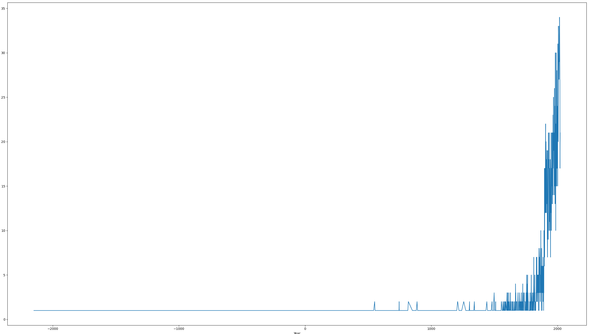</p>

放大观察1600-2020的数据：

<p style="text-align:center;">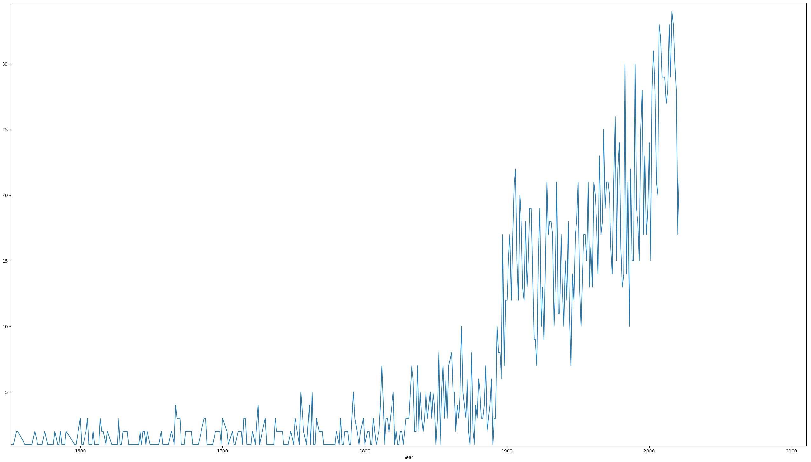</p>

可以发现有记录的地震次数在1900年附近发生了明显的增加，其原因应该是近代以来，人类观测与记录地震的手段和方法不断完善，因此地震记录次数明显地增加了。

按照题目要求对每个国家使用函数 CountEq_LargestEq() 后，将记录保存在文件 **mag_df.csv** 中

按降序记录每个国家地震发生总数以及最大震级地震发生的日期，绘制成如下表格：

|Country|total_eqs|maxMag_date|
|----|----|----|
14|CHINA|610|1668-7-25
32|JAPAN|409|2011-3-11
68|INDONESIA|399|2004-12-26
7|IRAN|380|856-12-22
9|TURKEY|330|1912-8-9
5|ITALY|326|1915-1-13
51|USA|271|1964-3-28
3|GREECE|269|365-7-21
65|PHILIPPINES|221|1897-9-21
57|MEXICO|204|1899-1-24
55|CHILE|198|1960-5-22
48|PERU|185|1716-2-6
15|RUSSIA|150|1952-11-4
8|INDIA|99|1950-8-15
72|TAIWAN|98|1920-6-5
85|PAPUA NEW GUINEA|98|1919-5-6
62|COLOMBIA|79|1826-6-18
98|NEW ZEALAND|71|2021-3-4
50|VENEZUELA|66|1894-4-29
59|ECUADOR|64|1906-1-31
115|SOLOMON ISLANDS|61|1977-4-21
22|AFGHANISTAN|59|1909-7-7
44|ALGERIA|57|1980-10-10
16|ALBANIA|56|1893-6-14
105|VANUATU|54|1913-10-14
20|PAKISTAN|53|1945-11-27
41|CROATIA|49|1667-4-6
27|FRANCE|43|1817-3-11
66|USA TERRITORY|40|1902-9-22
71|NICARAGUA|39|1898-4-29
63|EL SALVADOR|38|1915-9-7
61|GUATEMALA|38|1942-8-6
64|COSTA RICA|35|1950-10-5
80|MYANMAR (BURMA)|33|1912-5-23
1|SYRIA|33|1202-5-20
37|SWITZERLAND|31|1601-9-8
56|AZORES (PORTUGAL)|27|1968-2-28
11|SPAIN|27|881-5-26
13|PORTUGAL|26|-60-nan-nan
119|TAJIKISTAN|26|1907-10-21
31|IRAQ|24|1864-12-2
104|AUSTRALIA|24|1989-5-23
4|ISRAEL|23|-31-9-2
67|PANAMA|23|1882-9-7
102|TONGA|22|1919-4-30
30|SLOVENIA|22|1511-3-26
107|NEW CALEDONIA|21|1875-3-28
77|ARGENTINA|21|1944-1-15
40|MOROCCO|20|2004-2-24
73|CANADA|20|1949-8-22
21|SOUTH KOREA|20|1643-7-25
74|JAMAICA|19|1899-6-14
109|FIJI|19|1919-1-1
17|BULGARIA|18|1904-4-4
52|DOMINICAN REPUBLIC|18|1946-8-4
117|KERMADEC ISLANDS (NEW ZEALAND)|17|1986-10-20
83|BANGLADESH|17|1918-7-8
78|HAITI|17|1842-5-7
36|ICELAND|17|1912-5-6
39|NEPAL|16|1505-6-6
25|AZERBAIJAN|16|1667-11-nan
18|GEORGIA|15|1905-10-21
47|SERBIA|15|1922-3-24
12|EGYPT|15|1995-11-22
54|ROMANIA|15|1977-3-4
6|LEBANON|14|551-7-9
10|KYRGYZSTAN|14|1946-11-2
92|SOUTH AFRICA|14|1942-11-10
35|UZBEKISTAN|14|1976-4-8
75|CUBA|14|2020-1-28
58|HONDURAS|13|1856-8-4
34|UK|13|1580-4-6
33|ARMENIA|13|1988-12-7
23|MACEDONIA|12|1979-5-24
2|TURKMENISTAN|11|1895-7-8
79|MARTINIQUE|10|1906-12-3
28|KAZAKHSTAN|10|1889-7-11
38|YEMEN|10|1982-12-13
45|BOSNIA-HERZEGOVINA|10|1969-10-27
60|MONTENEGRO|9|1979-4-15
53|GERMANY|9|1978-9-3
97|GUADELOUPE|9|1843-2-8
24|TUNISIA|9|1957-2-20
69|ETHIOPIA|9|1906-8-25
125|SAMOA|8|1917-6-26
42|UKRAINE|8|1927-9-11
121|TANZANIA|8|1910-12-13
90|TRINIDAD AND TOBAGO|8|1888-1-10
43|AUSTRIA|7|1590-9-15
130|SOUTH GEORGIA AND THE SOUTH SANDWICH ISLANDS|7|2021-8-12
94|CONGO|7|1992-9-11
116|MONGOLIA|6|1905-7-9
114|BOLIVIA|6|1994-6-9
19|CYPRUS|6|1953-9-10
29|NORTH KOREA|6|1518-7-2
150|POLAND|6|2004-9-21
132|BRAZIL|6|1986-11-30
82|ATLANTIC OCEAN|6|1941-11-25
81|ERITREA|6|1875-11-2
127|VIETNAM|5|1935-11-1
147|BHUTAN|5|2009-9-21
134|ANTARCTICA|5|1998-3-25
146|RWANDA|5|2015-8-7
0|JORDAN|5|-2150-nan-nan
84|HUNGARY|5|1834-10-15
70|GHANA|5|1862-7-10
122|MICRONESIA FED. STATES OF|4|1911-8-16
26|THAILAND|4|2014-5-5
139|MALAWI|4|1989-3-10
123|UGANDA|4|1912-7-9
151|MOZAMBIQUE|3|2006-2-22
149|SAUDI ARABIA|3|2009-5-19
46|SLOVAKIA|3|2004-1-10
142|NETHERLANDS|3|1992-4-13
136|MALAYSIA|3|1976-7-26
76|ANTIGUA AND BARBUDA|3|1690-4-16
129|INDIAN OCEAN|3|1928-3-9
128|KENYA|3|1928-1-6
103|SOUTH SUDAN|3|1990-5-20
88|TOGO|2|1788-nan-nan
91|CANARY ISLANDS|2|1800-nan-nan
145|LAOS|2|2007-5-16
87|SAINT LUCIA|2|1788-10-12
120|CAMEROON|2|1945-9-12
86|FRENCH GUIANA|2|1885-8-4
112|SOLOMON SEA|2|1895-3-6
95|UK TERRITORY|2|1983-11-30
131|PACIFIC OCEAN|2|1932-11-2
108|COTE D'IVOIRE|2|1879-2-11
89|SIERRA LEONE|1|1795-5-20
99|BARBADOS|1|1831-8-11
144|SUDAN|1|1993-8-1
49|IRELAND|1|1490-nan-nan
100|SAINT VINCENT AND THE GRENADINES|1|1844-8-30
148|BURUNDI|1|2004-2-24
110|SRI LANKA|1|1882-1-nan
106|BRITISH VIRGIN ISLANDS|1|1871-9-nan
152|CZECH REPUBLIC|1|2008-11-22
153|MADAGASCAR|1|2017-1-11
154|ZAMBIA|1|2017-2-24
143|WALLIS AND FUTUNA (FRENCH TERRITORY)|1|1993-3-12
137|BELGIUM|1|1983-11-8
141|BERING SEA|1|1991-2-21
140|DJIBOUTI|1|1989-8-20
111|URUGUAY|1|1888-6-5
138|GUINEA|1|1983-12-22
135|GABON|1|1974-9-23
113|MONTSERRAT|1|1897-4-25
133|LIBYA|1|1963-2-21
96|GRENADA|1|1822-12-1
101|FRENCH POLYNESIA|1|1848-7-12
93|NORWAY|1|1819-8-31
126|CENTRAL AFRICAN REPUBLIC|1|1921-9-16
124|PALAU|1|1914-10-23
118|KIRIBATI|1|1905-6-30
155|COMOROS|1|2018-5-15


---


## 2. Wind speed in Shenzhen during the past 10 years

如果直接将csv文件读入会发生如下报错

```python
sys:1: DtypeWarning: Columns (4,8,9,12,15,21,22,24,26,31,33,34) have mixed types.Specify dtype option on import or set low_memory=False.
```

所以应该设置参数 low_memory=False，具体解释可见：[Pandas read_csv low_memory and dtype options](https://stackoverflow.com/questions/24251219/pandas-read-csv-low-memory-and-dtype-options)

```python
Shenzhen_windspeed = pd.read_csv("./2281305.csv", low_memory=False)
```

通过阅读数据集使用说明，可以知道 csv 文件的最后一列 "WND" 即是我们需要的数据，其中 "WND" 又分为 5 列数据，使用 split() 函数可以将使用 ',' 分隔的数据进行分割，我们只需要使用最后两列数据即可，分别表示的意义如下：

<p style="text-align:center;"></p>

<p style="text-align:center;">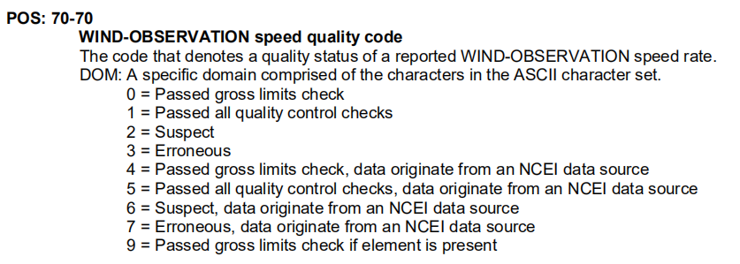</p>

注意到 WIND-OBSERVATION speed rate 的 scale 是 10 ，所以使用的时候需要除以 10 以得到以 米/秒 为单位的数值。另外，对 quality code 做一个统计如下：

<p style="text-align:center;"></p>

因此，需要对数据进行过滤，将 quality code 是 9 的数据丢弃即可，最后绘制出的图形如下：

<p style="text-align:center;">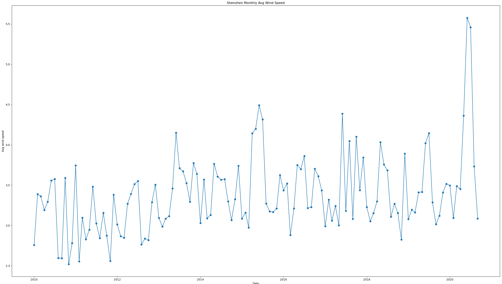</p>

可以观察到一个规律：每年年初以及年中（大概5-9月）的每月平均风速会较大一些


---


## 3. Explore a data set

这里使用 NOAA 提供的气象数据 [Climate Data Online](https://www.ncdc.noaa.gov/cdo-web/datasets)

选择 Climate Data Online 下的 Global Summary of the Year 数据集，该数据集由大量文件（约80000个）构成，所以首先需要进行数据的拼接工作。考虑到数据集特征，使用 outer 连接方法

在拼接过程中发现，如果简单地将两个 csv 文件读入的 DataFrame 进行 merge 操作，随着操作的进行，执行速度会越来越慢，对此现象的我的解释是，每次进行 merge 操作，计算机都需要将原来庞大的 DataFrame 销毁，再生成新的更加庞大的 DataFrame，这无疑是非常耗时的，所以我使用分治的算法思想，简单的将 merge 操作分为若干区块进行，大大加快了文件合并的速度

**文件合并的代码在 PS2_3_preprocess.py 中，如果不想运行该代码（约耗时1h30min），直接使用合并后的文件 gsoy.csv 即可**

**gsoy.csv 文件体积较大，我放在了个人云盘中，连接Sustech校园网后点击链接就可以下载了 [gsoy.csv 下载](http://10.20.94.111:5212/s/MpTV)**

由于该数据集十分庞大，首先需要筛选出少量的数据列用于简单的分析，提取少量数据列的代码如下：

```python
def extractDPData():
    df = pd.read_csv("./gsoy.csv", low_memory=False)

    dp_df = df[['STATION', 'DATE', 'LATITUDE', 'LONGITUDE', 'ELEVATION', 'NAME', 'DP01', 'DP01_ATTRIBUTES', 'DP10', 'DP10_ATTRIBUTES', 'DP1X', 'DP1X_ATTRIBUTES', 'EMXP', 'EMXP_ATTRIBUTES', 'PRCP', 'PRCP_ATTRIBUTES']]

    dp_df.to_csv('./dp_gsoy.csv')
```

提取完毕后，为了减少后续分析的运算量，便将结果直接保存在文件 **dp_gsoy.csv** 中

阅读数据集使用说明文档[Dataset Description Document Global Summary of the Month/Year Dataset](https://www1.ncdc.noaa.gov/pub/data/cdo/documentation/gsom-gsoy_documentation.pdf)

我在本次 assignment 使用的数据是 DP01，DP10，DP1X 和 PRCP，其具体定义如下：

<p style="text-align:center;">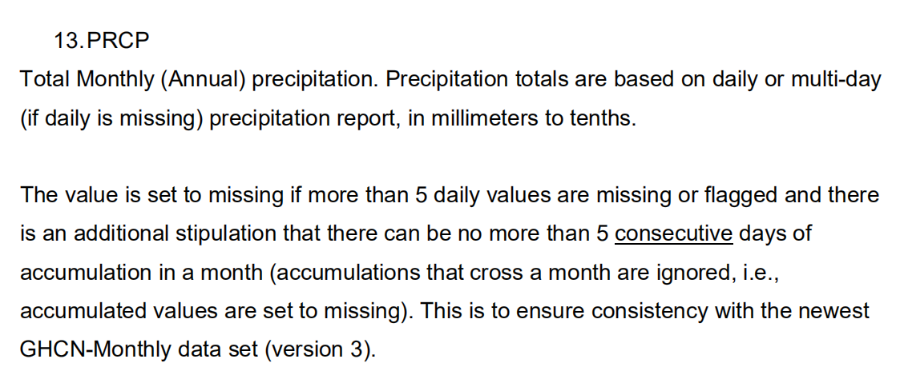</p>

<p style="text-align:center;">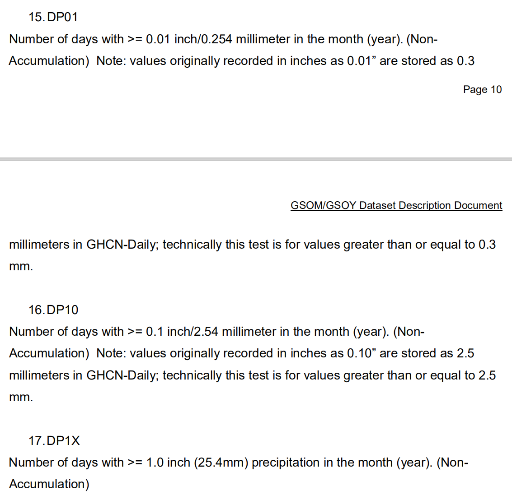</p>

首先绘制站点 **ASN00077034** 的年均总降雨量折线图，这是关于时间序列的：

<p style="text-align:center;">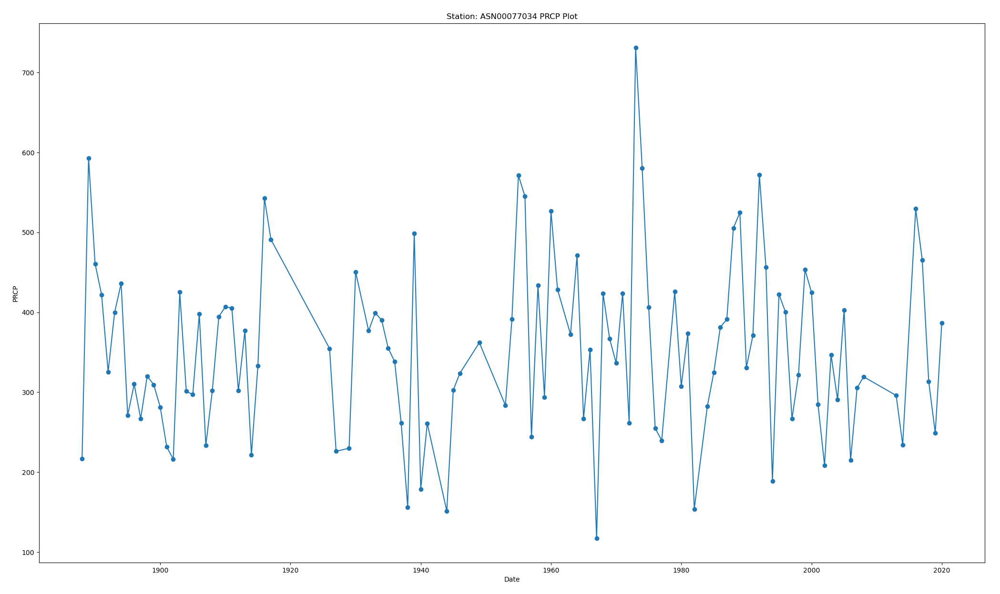</p>

接下来我挑选了 **2020** 这一年份，分别以**经度**，**纬度**为横坐标绘制 2020 年全球各地站点统计得到的DP10，DP1X 和 PRCP

此外为了方便地观察数据趋势，我使用了 numpy 提供的多项式拟合函数（[numpy.polyfit()](https://numpy.org/doc/stable/reference/generated/numpy.polyfit.html)），对数据进行了 **degree=15** 的多项式拟合

最后得到的结果如下：


首先是以经度为基准的：

<p style="text-align:center;">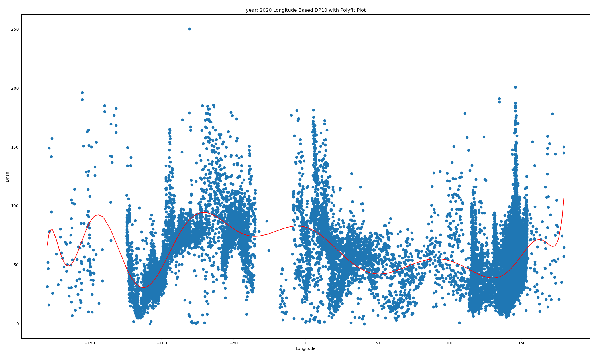</p>

<p style="text-align:center;">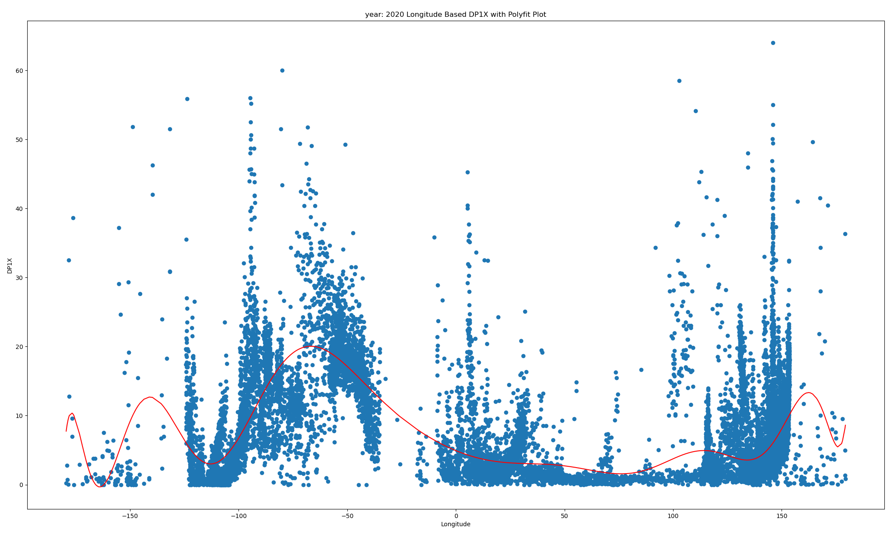</p>

<p style="text-align:center;">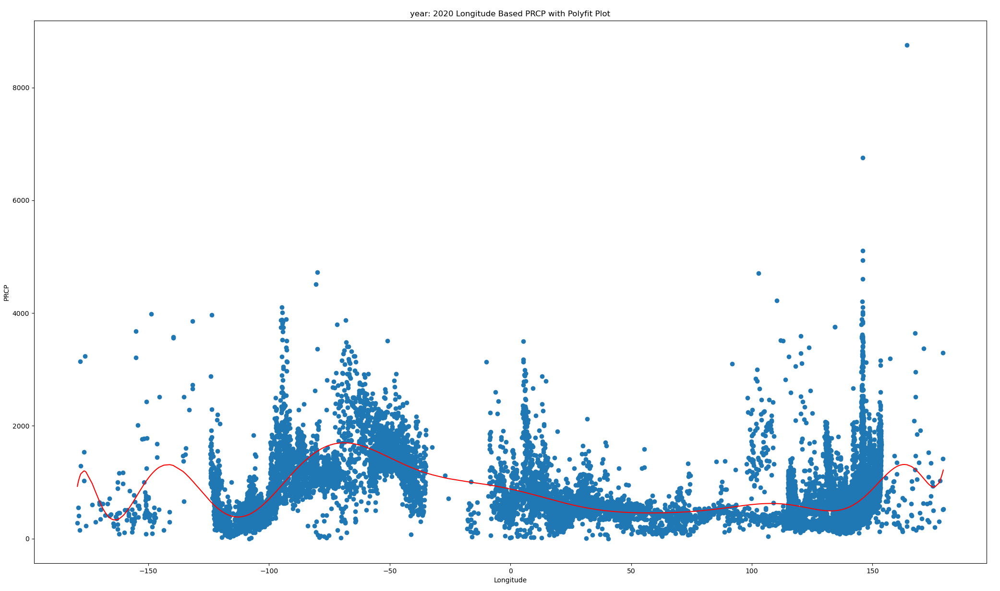</p>

首先是以纬度为基准的：

<p style="text-align:center;">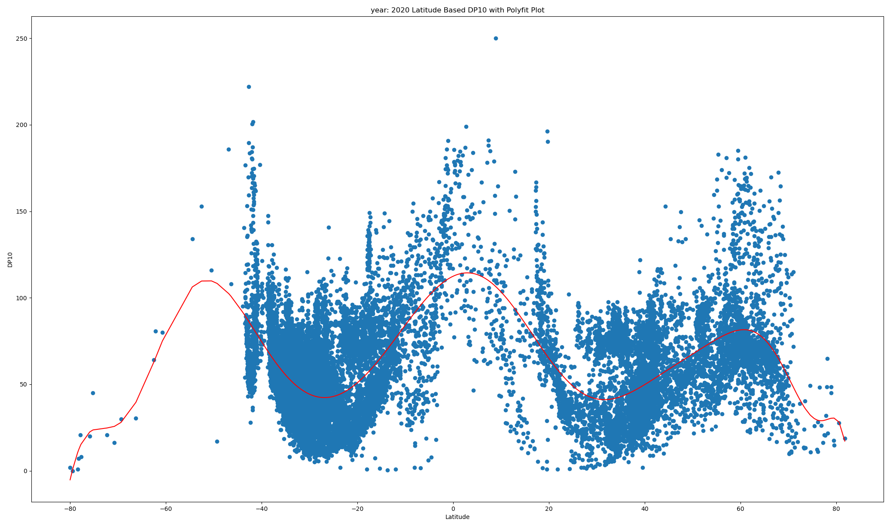</p>

<p style="text-align:center;">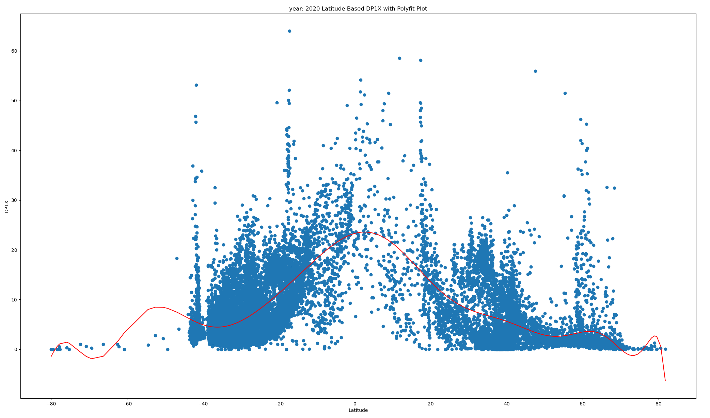</p>

<p style="text-align:center;">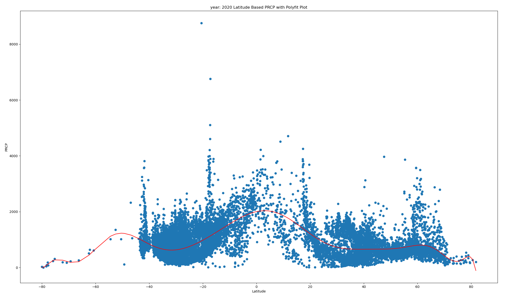</p>

观察上面的图像可以得到几个简单的现象规律（2020年）：


1. 大约西经40°至西经80°的区域，无论降水总量还是有大量降雨的天数（DP1X）都明显高于其他地区，该区域恰好囊括了南美洲，而南美洲拥有世界上最大的雨林生态系统，这应该可以成为该现象的可行解释之一。

   

2. 从纬度来看热带和南北温带全年降雨量适中的天数（DP10）都较多，大致呈现 w 的形态。如果看全年降水总量的话，赤道附近地区的降水总量则明显多于其他地区。