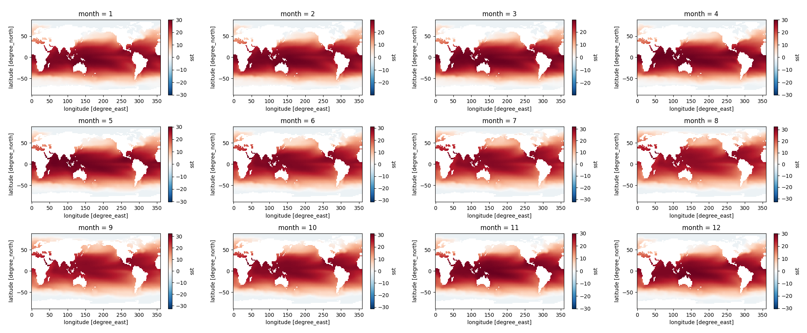
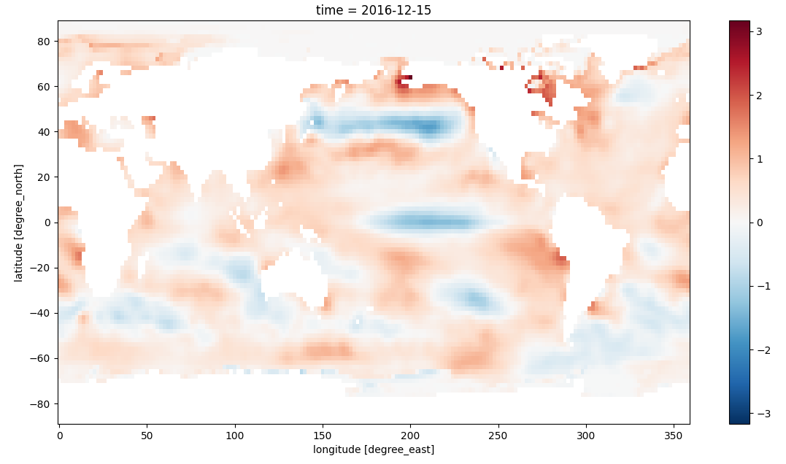
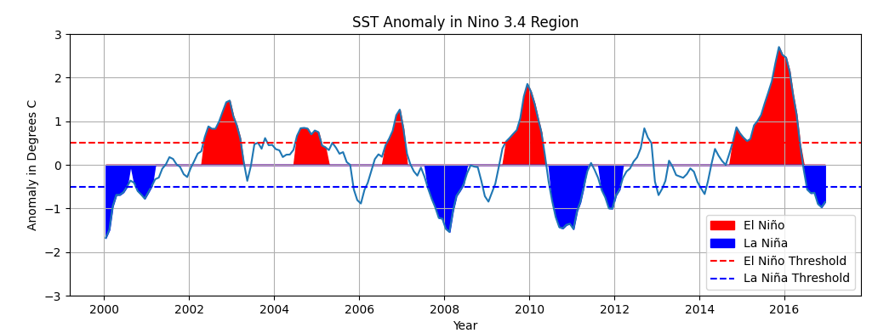

# ESE5023 Assignment 03 Report

李骏垚 12132451

---

## 1. Niño 3.4 index.

计算得到的 Niño 3.4 区域的每月 SST 如下，列出了全部12个月的情况：

计算所有的 anomalies 后，选择最近日期 (2016-12-15) 画一张图：

根据 [El Nino](https://www.ncdc.noaa.gov/teleconnections/enso/sst) 现象的定义，连续5个月或以上 SST 变动量大于或等于 0.5℃ 就可认为发生了El Nino现象，反之 La Nina 现象则小于或等于 0.5℃

画图中用到的部分函数的参考链接：

[matplotlib.pyplot.axhline](https://matplotlib.org/stable/api/_as_gen/matplotlib.pyplot.axhline.html)

[matplotlib.pyplot.fill_between](https://matplotlib.org/stable/api/_as_gen/matplotlib.pyplot.fill_between.html)

## 2. Earth’s energy budget

