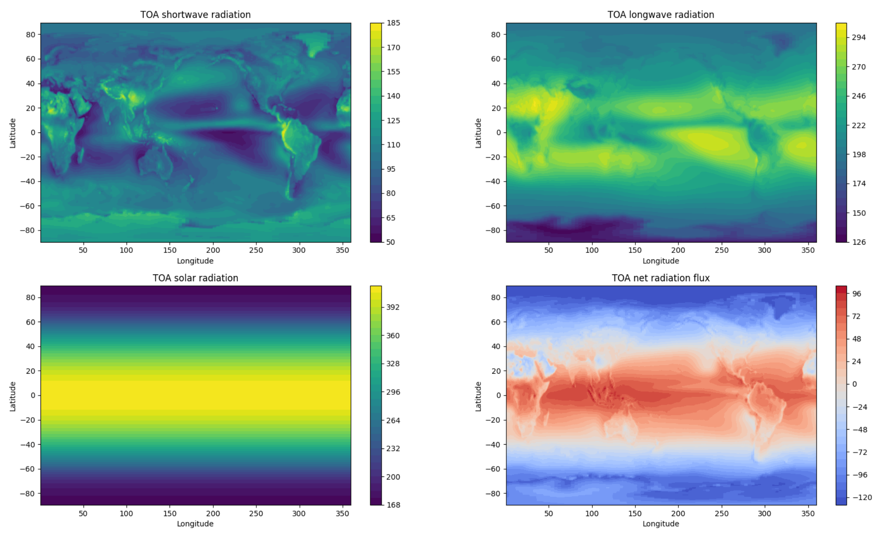
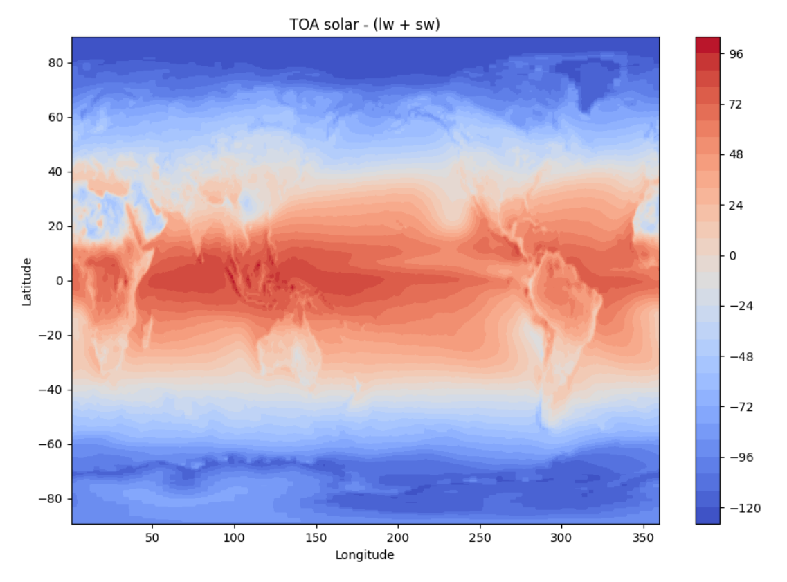
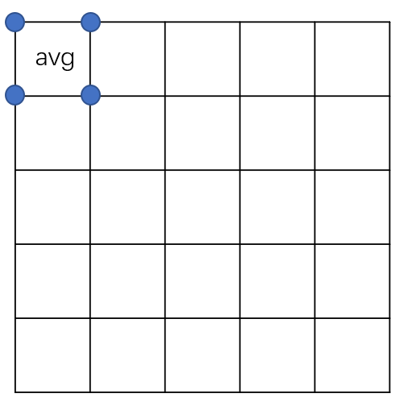
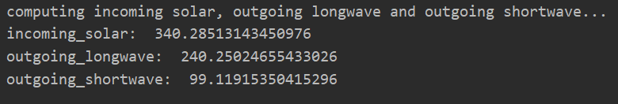
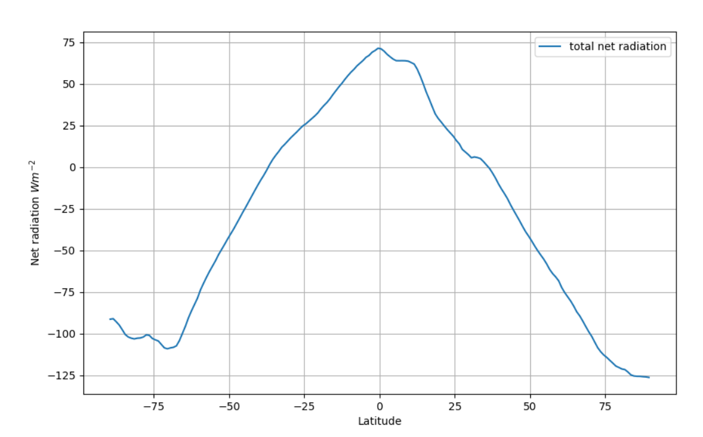
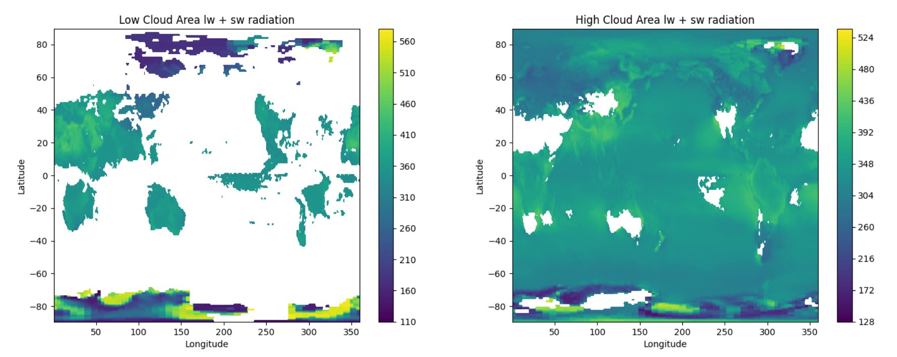
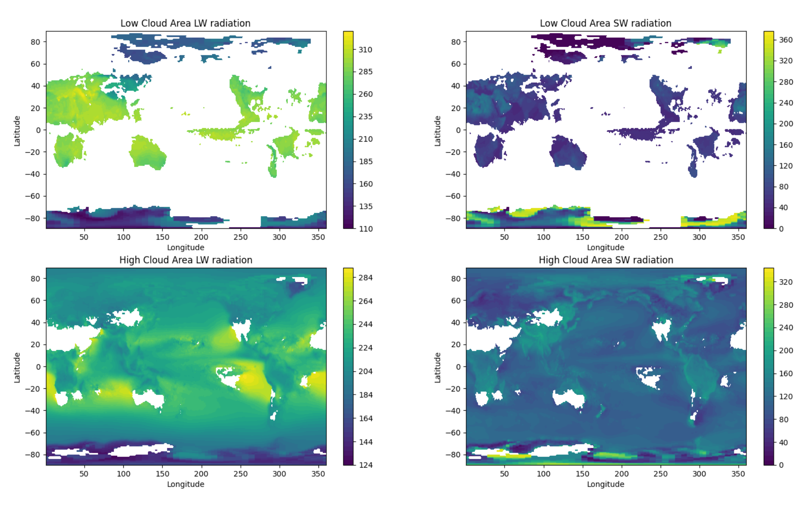

# ESE5023 Assignment 03 Report

李骏垚 12132451

---


## 1. Niño 3.4 index.

**1.1 [5 points] Compute monthly climatology for SST from Niño 3.4 region, and subtract climatology from SST time series to obtain anomalies.**

计算得到的 Niño 3.4 区域的每月 SST 如下，列出了全部12个月的情况：

<p style="text-align:center;"></p>

计算所有的 anomalies 后，选择最近日期 (2016-12-15) 画一张图：

<p style="text-align:center;"></p>

**1.2 [5 points] Visualize the computed Niño 3.4. Your plot should look similar to this one.**

根据 [El Nino](https://www.ncdc.noaa.gov/teleconnections/enso/sst) 现象的定义，连续5个月或以上 SST 变动量大于或等于 0.5℃ 就可认为发生了El Nino现象，反之 La Nina 现象则小于或等于 0.5℃

画图中用到的部分函数的参考链接：

[matplotlib.pyplot.axhline](https://matplotlib.org/stable/api/_as_gen/matplotlib.pyplot.axhline.html)

[matplotlib.pyplot.fill_between](https://matplotlib.org/stable/api/_as_gen/matplotlib.pyplot.fill_between.html)

<p style="text-align:center;"></p>


## 2. Earth’s energy budget

**2.1 [5 points] Make a 2D plot of the time-mean TOA longwave, shortwave, and solar radiation for all-sky conditions. Add up the three variables above and verify (visually) that they are equivalent to the TOA net flux.**

使用下面的语句读入全体数据：

```python
TOA = xr.open_dataset("CERES_EBAF-TOA_200003-201701.nc", engine="netcdf4")
```

将 TOA(Top of Atmosphere) 的 shortwave, longwave, solar and net radiation 绘制在一张图中如下所示：

[绘图参考的matplotlib API 文档链接](https://matplotlib.org/stable/gallery/images_contours_and_fields/irregulardatagrid.html#sphx-glr-gallery-images-contours-and-fields-irregulardatagrid-py)

[画等高线图中 cmap 参数的设置参考链接](https://matplotlib.org/stable/gallery/color/colormap_reference.html)

<p style="text-align:center;"></p>

根据各辐射所表示的意义，计算理论净辐射通量：solar - (shortwave + longwave)，绘制出如下图，可以通过肉眼直观地看出计算值与上图中的TOA net radiation flux 基本一致

<p style="text-align:center;"></p>

**2.2 [10 points] Calculate and verify that the TOA incoming solar, outgoing longwave, and outgoing shortwave approximately match up with the cartoon above.**

[Figure source](https://www.nasa.gov/feature/langley/what-is-earth-s-energy-budget-five-questions-with-a-guy-who-knows)
<p style="text-align:center;"></p>

计算平均单位面积上的 solar radiation, longwave and shortwave radiation 需要考虑到不同经纬线网格的面积是不一样的，使用如下代码可以计算出 $from\ latitude_i\ to\ latitude_{i+1}$ 相距 1 longitude 的网格面积

```python
from scipy import integrate
def lon_func(x):
    return 2 * np.pi * 6371 * math.sin(np.pi / 2 - x / 180 * np.pi) / 360
area, err = integrate.quad(lon_func, float(m_solar[i].lat.values), float(m_solar[i + 1].lat.values))
```

整体代码的思想就是计算经纬线网格四个顶点数据的平均值 $avg$ 代表带区域的辐射强度，然后计算地球上每一个网格的辐射强度的**加权平均值**就可以得到结果了

求加权平均数可以使用 [numpy.average](https://numpy.org/doc/stable/reference/generated/numpy.average.html)

<p style="text-align:center;"></p>

最后计算得到的结果如下(因为运算量较大，算法执行时间约 1min)：

<p style="text-align:center;"></p>

上图中给出的数据：

入射太阳辐射：340.4 

出射长波辐射：239.9 

出射短波辐射：99.9

对比计算得出的结果，可以发现误差很小，可以接受

**2.3 [5 points] Calculate and plot the total amount of net radiation in each 1-degree latitude band. Label with correct units.**

每 1 度纬度带的净辐射总量通过如下代码可以快速得出：

```python
TOA.toa_net_all_mon.mean(dim=['time', 'lon'])
```

绘制出的图形如下：

<p style="text-align:center;"></p>

**2.4 [5 points] Calculate and plot composites of time-mean outgoing shortwave and longwave radiation for low and high cloud area regions. Here we define low cloud area as ≤25% and high cloud area as ≥75%. Your results should be 2D maps.**

使用如下的代码可以分别计算出低云区域和高云区域的出射长短波辐射之和：

```python
low_cld_sw_mean = TOA.where(TOA.cldarea_total_daynight_mon <= 25).toa_sw_all_mon.mean(dim="time")
low_cld_lw_mean = TOA.where(TOA.cldarea_total_daynight_mon <= 25).toa_lw_all_mon.mean(dim="time")
low_cld_comps_mean = low_cld_sw_mean + low_cld_lw_mean

high_cld_sw_mean = TOA.where(TOA.cldarea_total_daynight_mon >= 75).toa_sw_all_mon.mean(dim="time")
high_cld_lw_mean = TOA.where(TOA.cldarea_total_daynight_mon >= 75).toa_lw_all_mon.mean(dim="time")
high_cld_comps_mean = high_cld_sw_mean + high_cld_lw_mean
```

随后绘制出下图：

<p style="text-align:center;"></p>


分别绘制出低云与高云区域的长短波辐射图如下：

<p style="text-align:center;"></p>

对比 2-1 中绘制的全球长短波辐射图可以发现：

1. 云层相比长波辐射，对短波辐射的反射更强
2. 云层可以自发地发射长波辐射