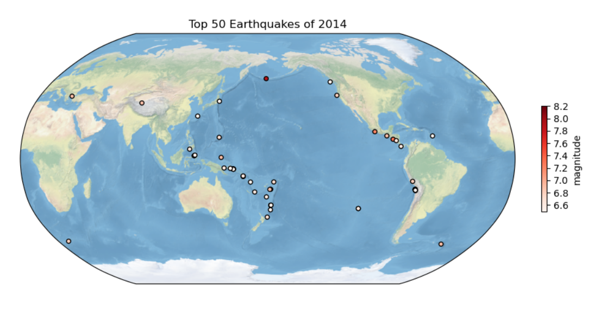
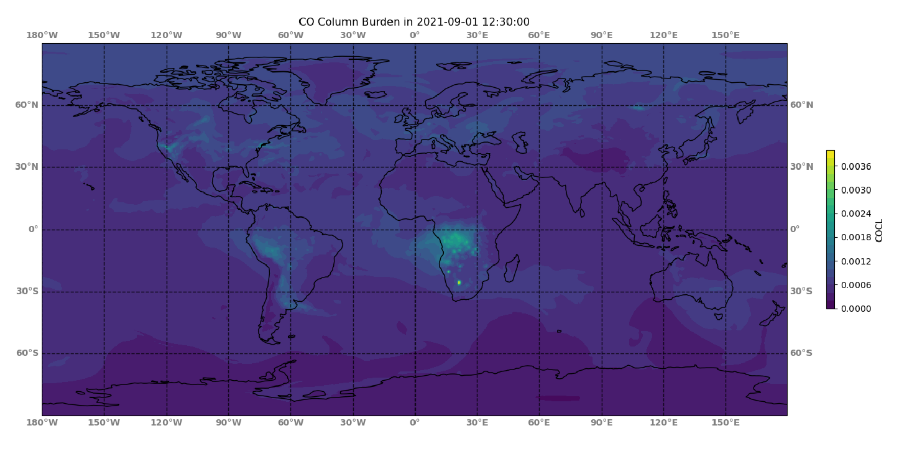
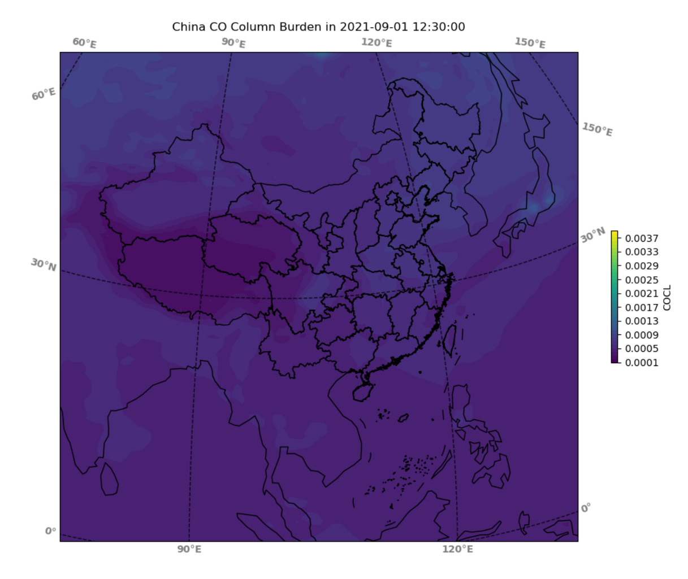

# ESE5023 Assignment 04 Report

李骏垚 12132451

---

## 1. Global Earthquakes

绘图时参考下如下链接：

[python 绘制世界地图，添加海岸线、陆地、投影](https://blog.csdn.net/weixin_44237337/article/details/116032210)

最终绘图结果如下：

---

## 2. Explore a netCDF dataset

数据使用和 Assignment 03 一致

[MERRA-2 tavg1_2d_chm_Nx: 2d,1-Hourly,Time-Averaged,Single-Level,Assimilation,Carbon Monoxide and Ozone Diagnostics V5.12.4 (M2T1NXCHM)](https://disc.gsfc.nasa.gov/datasets/M2T1NXCHM_5.12.4/summary?keywords=carbon)

数据集使用 2021-09-01 一天的数据进行分析，下载链接如下：

[MERRA2_400.tavg1_2d_chm_Nx.20210901.nc4](https://goldsmr4.gesdisc.eosdis.nasa.gov/data/MERRA2/M2T1NXCHM.5.12.4/2021/09/MERRA2_400.tavg1_2d_chm_Nx.20210901.nc4)

下图中画出了在 2021-09-01 12:30:00 时监测到的全球 CO 柱负荷数据：

接下来则使用同样的数据，绘制了中国区域的情况，添加了中国各省份的边界线以及中国国境线

省份边界线与国境线数据来源于：[https://gmt-china.org/data/CN-border-La.dat](https://gmt-china.org/data/CN-border-La.dat)

