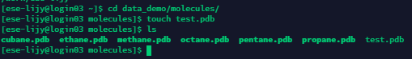
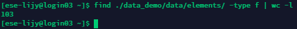
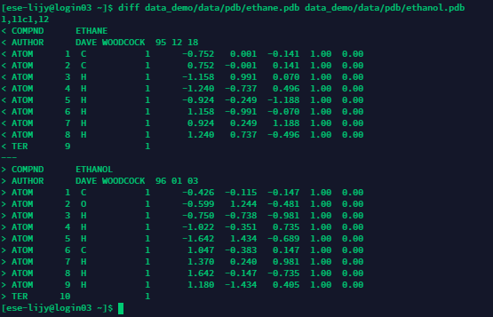
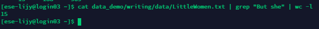
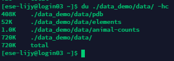
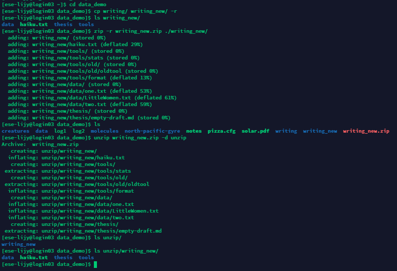
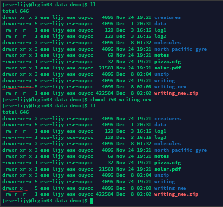
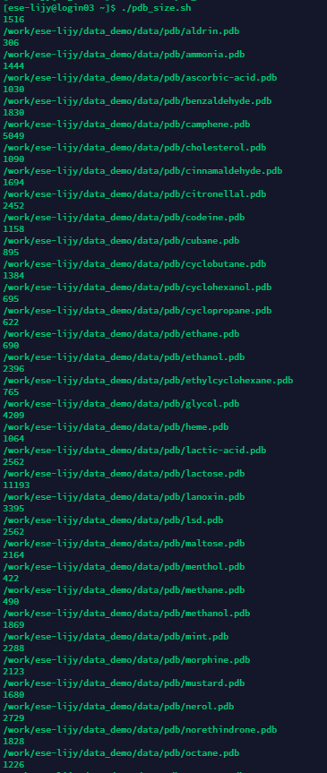
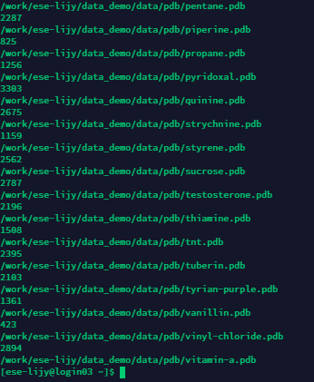

# ESE5023 Assignment 05 Report

李骏垚 12132451

---

## 1. More Linux Commands

### 1.1 [2 points] Make a link called data_demo_link to data_demo folder using ln.

```bash
ln -s data_demo/ data_demo_link
```

<p style="text-align:center;"></p>

### 1.2 [2 points] Print your home directory using echo.

```bash
echo $HOME
```

<p style="text-align:center;"></p>

### 1.3 [2 points] Go to data_demo/molecules/, make an empty file test.pdb with touch.

```bash
cd data_demo/molecules/
touch test.pdb
```

<p style="text-align:center;"></p>

### 1.4 [3 points] Find how many files in data_demo/data/elements/ using find.

```bash
find ./data_demo/data/elements/ -type f | wc -l
```

<p style="text-align:center;"></p>

### 1.5 [2 points] Compare data_demo/data/pdb/ethane.pdb and data_demo/data/pdb/ethanol.pdb with diff.

```bash
diff data_demo/data/pdb/ethane.pdb data_demo/data/pdb/ethanol.pdb
```

<p style="text-align:center;"></p>

### 1.6 [3 points] Count how many But she string appears in data_demo/writing/data/LittleWomen.txt with grep.

```bash
cat data_demo/writing/data/LittleWomen.txt | grep "But she" | wc -l
```

<p style="text-align:center;"></p>

### 1.7 [2 points] Check the total file size of the data_demo/data/ folder using du.

```bash
du ./data_demo/data/ -hc
```

<p style="text-align:center;"></p>

### 1.8 [3 points] Copy the data_demo/writing/ folder to data_demo/writing_new/, compress data_demo/writing_new/ using zip, and decompress the .zip file with unzip.

```bash
cd data_demo
cp writing/ writing_new/ -r
zip -r writing_new.zip ./writing_new/
unzip writing_new.zip -d unzip
```

<p style="text-align:center;"></p>

### 1.9 [3 points] Change the file permissions flags on writing_new to drwxr-x--- using chmod.

```bash
chmod 750 writing_new
```

<p style="text-align:center;"></p>

### 1.10 [3 points] Print the last 10 commands you made using history.

```bash
history | tail -n 10
```

<p style="text-align:center;"></p>


---


## 2. BASH for Loop

```bash
nano pdb_size.sh
```

输入脚本，并保存文件:

```sh
#!/bin/bash

for pdb in $(du -b ~/data_demo/data/pdb/*.pdb)
do
        echo $pdb
done
```
```bash
chmod 750 pdb_size.sh
./pdb_size.sh
```

<p style="text-align:center;"></p>


<p style="text-align:center;"></p>


