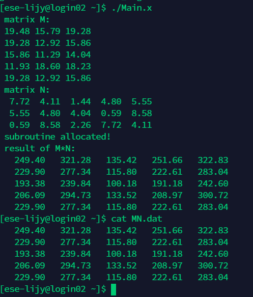
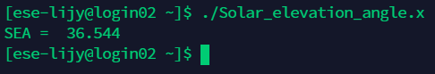
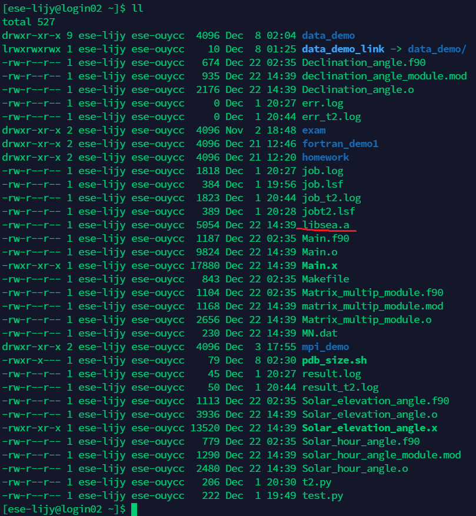

# ESE5023 Assignment 06 Report

李骏垚 12132451

---

为方便源代码编译执行，我编写了 Makefile 文件

使用

```bash
make
```

可以构建可执行文件 Main.x 和 Solar_elevation_angle.x

使用 

```bash
make clean
```

可以清理可执行文件以及构建使用的 .o .a 文件

---

## 1. Matrix multiplication

结果截图：

<p style="text-align:center;"></p>

## 2. Calculate the Solar Elevation Angle

结果截图：

<p style="text-align:center;"></p>

libsea.a 生成结果在目录下：

<p style="text-align:center;"></p>

具体的编译命令可见 Makefile 文件